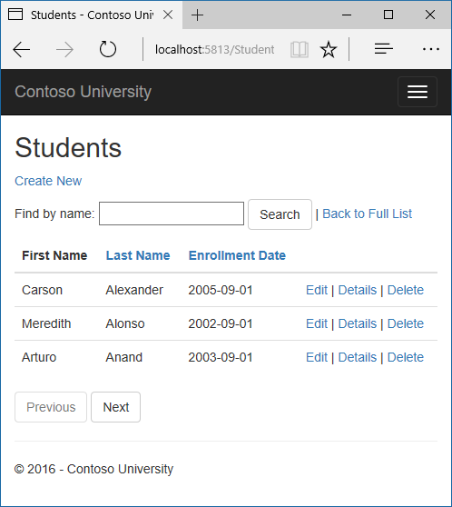
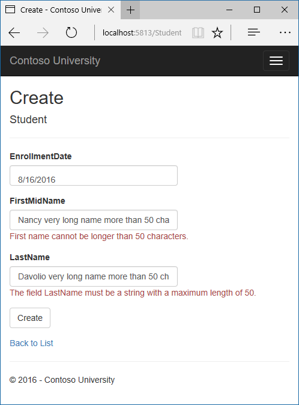
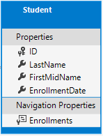
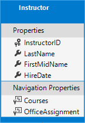
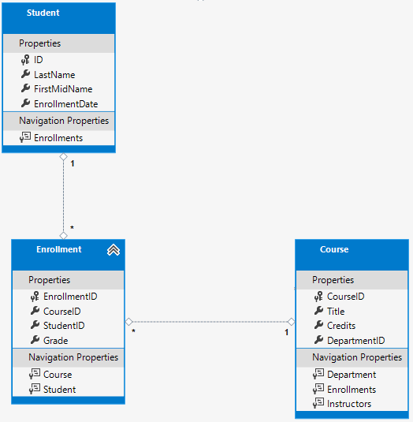

# 创建复杂数据模型 - ASP.NET Core MVC 与 EF Core MVC 教程 (5 of 10)

作者 [Tom Dykstra](https://github.com/tdykstra) 、 [Rick Anderson](https://twitter.com/RickAndMSFT)

翻译 [刘怡(AlexLEWIS/Forerunner)](http://github.com/alexinea) 
 
Contoso 大学 Web应用程序演示了如何使用 Entity Framework Core 1.1 以及 Visual Studio 2017 来创建 ASP.NET Core 1.1 MVC Web 应用程序。更多信息请参考 [第一节教程](intro.md).

在前几篇教程中我们已经接触到由三个实体组成的简单数据模型。本教程中会增加更多的实体，你将接触到它们之间的关系、定制指定格式的数据模型、验证与数据库映射规则。
 
当你完成这些之后，实体类将组成完整的数据模型，如下图所示：


## 通过特性定制数据模型

本节中你能学到如何通过利用特性（Attributes）指定格式、验证和数据库映射规则来定制数据模型。然后在后续几节中，你将通过给既有的或新创建的类增加特性的方式创建完整的 School 数据模型。

### DataType 特性

对于学生入学日期，所有的网页都将时间和日期放在一起显示，尽管你只是考虑这个字段是一个日期。通过使用数据标注特性（data annotation attributes），你可以通过一段代码来改变所有视图中所展示的数据格式。看完如何使用数据标注特性的例子之后，你可以在 `Student` 类的`EnrollmentDate`的属性上增加一个特性了。
 
在 *Model/Student.cs* 中用 `using` 声明添加 `System.ComponentModel.DataAnnotations` 命名空间，然后给 `EnrollmentDate` 属性添加 `DataType` 特性和 `DisplayFormat` 特性，如下例所示：

[!code-csharp[Main](intro/samples/cu/Models/Student.cs?name=snippet_DataType&highlight=3,12-13)]

 `DataType` 特性用于指定比数据库内部类型更为具体的数据类型。在本例中我们只是想跟踪日期，并不关心学生的入学时间。 `DataType` 枚举提供了不少数据类型，例如日期（Date）、时间（Time）、电话号码（PhoneNumber）、货币（Currency）、电子邮件地址（EmailAddress）等。 `DataType` 特性还可以让应用程序自动提供一些类型特有的功能，例如 `mailto:` 链接会因为创建了 `DataType.EmailAddress` 特性而自动出现，日期选择器会因为使用了 `DataType.Date` 特性再出现在浏览器中，而且是支持 HTML5 的。 `DataType` 特性能生成支持 HTML5 的浏览器能理解的带有 `data-` 前缀的 HTML5 属性。不过 `DataType` 特性不提供任何验证功能。

`DataType.Date` 并不指定显示日期的格式。默认情况下数据字段的默认格式显示是基于服务器的 CultureInfo。

 `DisplayFormat` 特性用于显式指定日期格式：
 
```csharp
[DisplayFormat(DataFormatString = "{0:yyyy-MM-dd}", ApplyFormatInEditMode = true)]
```

`ApplyFormatInEditMode` 设置指定了在编辑模式时值在文本框中所显示的格式（对于某些字段你可能并不希望如此，比方说对于货币值，你可能并不希望在文本框中修改货币符号）。

你可以使用 `DisplayFormat` 特性，也可以使用 `DataType` 特性。 `DataType` 特性传递的是数据的语义，而不是如何使其显式于屏幕上，而且还提供了你使用 `DisplayFormat` 时享受不到的好处：

* 浏览器可以启用 HTML5 特性（比如显示日历控件、适配区域设置的货币单位、邮件链接以及一些客户端输入验证功能等）。

* 默认情况下，浏览器使用基于你当前区域设置的正确的格式来渲染数据。

更多信息请查看 [\<input> tag helper documentation](../../mvc/views/working-with-forms.md#the-input-tag-helper).

再次运行 Student 索引页，注意入学日期这一栏不再显示时间了，这同样会是用于所有使用 Student 模型的任何视图。



### StringLength 特性

你也可以通过特性指定数据验证规则和验证错误消息。 `StringLength` 特性可以设置数据在数据库中的最大长度，并为 ASP.NET MVC 提供客户端和服务端验证。你还可以通过这个特性指定最小字符串长度，但最小长度对于数据库架构来说没有任何影响。

假设你希望确保用户输入的名字不超过 50 个字符，那么可以通过在 `LastName` 和 `FirstMidName` 属性上添加 `StringLength` 特性来实现这个限制，如下所示：

[!code-csharp[Main](intro/samples/cu/Models/Student.cs?name=snippet_StringLength&highlight=10,12)]

 `StringLength` 特性并不会阻止用户在名字中输入空格。你需要使用 `RegularExpression` 特性来限制输入的内容。比如下例中的代码要求输入的字符必须都是字母，且首字母必须大写：

```csharp
[RegularExpression(@"^[A-Z]+[a-zA-Z''-'\s]*$")]
```

 `MaxLength` 特性提供了类似于 `StringLength` 特性的功能，但不提供客户端验证。

由于数据库模型已经发生变化，所以也需要相应的改编数据库的架构。你需要使用迁移（migration）来升级数据库架构，这样一来就不会丢由应用程序界面添加到库中的任何数据。

保存并生成项目，然后打开项目文件夹的命令窗口并输入如下命令：

```console
dotnet ef migrations add MaxLengthOnNames
dotnet ef database update
```

`migrations add`  命令会创建一个名为*<timeStamp>_MaxLengthOnNames.cs*的文件。这个文件中的 `Up` 方法将更新数据库使其匹配当前数据模型。使用 `database update` 命令来运行这段代码。

迁移文件的时间戳前缀用于让 Entity Framework 执行迁移时排序。你可以在运行升级数据库命令之前创建多个迁移，然后所有迁移会按它们创建的顺序逐个应用。

运行 Create 页面，然后输入名称长度超过 50 个字符的内容。当你点击 Create 按钮时，客户端验证将显示错误消息：



### Column 特性

你也可以使用特性来控制「类和属性」与「数据库」之间的映射关系。假设你为 first-name 字段准备了个名为 `FirstMidName` 属性（因为该字段可能会包含中间名），但你希望你的数据库列的名字是 `FirstMidName` ，因为用写即席查询（*ad-hoc queries，用户根据自己的需求灵活选择查询条件，系统根据用户的选择生成相应的查询，译者注*）语句的用户可能更习惯于这个名字。那么就可以用 `Column` 特性做一个映射（Mapping）即可。

 `Column` 特性指定了在创建数据库时， `FirstMidName` 属性将映射为 `Student` 表的 `FirstName`字段。换而言之，当你的代码引用 `Student.FirstMidName`时，数据将来自或更新到 `Student` 表的 `FirstName` 字段。如果不指定列名，那么列名将与属性名同名。

在 *Student.cs* 文件中利用 `using` 声明添加 `System.ComponentModel.DataAnnotations.Schema` 命名空间并在 `FirstMidName` 属性上添加列名特性，如下所示：

[!code-csharp[Main](intro/samples/cu/Models/Student.cs?name=snippet_Column&highlight=4,14)]

模型在添加 `Column` 特性后发生了改变，因此 `SchoolContext` 不再匹配数据库。

保存变更并生成项目，然后打开项目文件夹的命令窗口并输入以下命令来创建另一个迁移：

```console
dotnet ef migrations add ColumnFirstName
dotnet ef database update
```

在 **SQL Server Object Explorer** 中双击 **Student** 表打开 Student 表设计器。


在你应用前两个迁移之前，名字一列的类型是 nvarchar(MAX)。它们现在变成了 nvarchar(50)，同时列名也从 FirstMidName 变成了 FirstName。

> [!Note]
> 如果尚未创建完下面章节中的实体类便进行编译，你可能会收到编译器错误。

## 完成 Student 实体的修改



在 *Models/Student.cs* 中，把你早期添加的代码改为以下这段代码，注意两段代码之间的区别。

[!code-csharp[Main](intro/samples/cu/Models/Student.cs?name=snippet_BeforeInheritance&highlight=11,13,15,18,22,24-31)]

### Required 特性

`Required` 特性让名字属性称为必填字段。`Required` 特性对于非可空类型来说并非必要，比如对于值类型（DateTime、int、double、float 等）就不是必须的。类型不可为 null 的都会被作为必填字段自动处理。

你可以移除 `Required` 特性并用 `StringLength` 特性的最小长度参数来代替：

```csharp
[Display(Name = "Last Name")]
[StringLength(50, MinimumLength=1)]
public string LastName { get; set; }
```

### Display 特性

`Display` 特性指定文本框的标题是「First Name」、「Full Name」以及「Enrollment Date」，而不是每个实例中各属性的名称（实例中属性名没有空格来分隔单词）。

### FullName 计算属性

`FullName` 是一个计算属性，它返回两个属性值连接后的结果。因此它只有一个 Getter 访问器，在数据库中也不会生成`FullName` 列。

## 创建 Instructor 实体



创建 *Models/Instructor.cs* 文件，用以下代码代替模板代码：

[!code-csharp[Main](intro/samples/cu/Models/Instructor.cs?name=snippet_BeforeInheritance)]

请注意，在 Student 和 Instructor 这两个实体中有多个属性是相同的。在本系列教程的后续教程中有一篇 [实现继承](inheritance.md)，你将在那篇教程中学习到如何重构这段代码以消除冗余。

你可以把多个特性放在同一行上，所以 `HireDate` 特性也可以这么写：

```csharp
[DataType(DataType.Date),Display(Name = "Hire Date"),DisplayFormat(DataFormatString = "{0:yyyy-MM-dd}", ApplyFormatInEditMode = true)]
```

### Courses 和 OfficeAssignment 导航属性

`CourseAssignments` 和 `OfficeAssignment` 属性是都导航属性。

教师可以教授任何数量的课程，所以 `CourseAssignments` 被定义为一个集合。

```csharp
public ICollection<CourseAssignment> CourseAssignments { get; set; }
```

如若导航属性可以连接多个实体，那么这个类型就必然是一个列表，可以对实体进行增删改。你可以指定其类型为 `ICollection<T>` ，或者类似 `List<T>` 或  `HashSet<T>` 这样的类型。如果你把类型指定为  `ICollection<T>`，EF 则将默认创建 `HashSet<T>` 集合。

之所以是 `CourseAssignment` 实体的原因将在下文多对多关系一节中加以解释。

Contoso University 的业务规则规定，教师最多只能有一个办公室，因此 `OfficeAssignment` 属性连接单个 OfficeAssignment 实体（如果没有办公室，该属性可为 null）。

```csharp
public OfficeAssignment OfficeAssignment { get; set; }
```

## 创建 OfficeAssignment 实体


根据以下代码创建 *Models/OfficeAssignment.cs*：

[!code-csharp[Main](intro/samples/cu/Models/OfficeAssignment.cs)]

### Key 特性

Instructor 实体和 OfficeAssignment 实体之间的关系是一对零或一（one-to-zero-or-one）。办公室的分配仅与分配给它的教师有关，所以对于 Instructor 实体来说它的主键即其外键。但 Entity Framework 不会自动把 InstructorID 识别为该实体的主键，因为其名称并不符合名称约定的「ID」或「类名ID」。所以用 `Key` 特性来标识该实体的主键：

```csharp
[Key]
public int InstructorID { get; set; }
```

还有一种使用 `Key` 特性的场合，就是当你的实体已经有了自己的主键，但你的实体内还存在其他的属性名为「类型ID」或「ID」的。

默认情况下 EF 会将主键视作「非数据库生成（non-database-generated）」，而是将该列用于标识关系。

### Instructor 导航属性

Instructor 实体有一个可空的 `OfficeAssignment` 导航属性（因为有的教师可能没有被分配办公室），OfficeAssignment 实体有一个非可空（non-nullable）的 `Instructor` 导航属性（因为被分配的办公室必须有一个教师——`InstructorID` 是不可为空的）。当 Instructor 实体具有一个与之相关的 OfficeAssignment 实体时，每个实体都会通过其内的导航属性引用另一个。

你可以在 Instructor 实体的导航属性上放一个 `[Required]` 特性用来明确表示此处必须有一个关联的教师，但其实不必这么做，因为外键  `InstructorID` （同时也是这张表的主键）不可为空。

## 修改 Course 实体


用下面这段代码代替你之前在 *Models/Course.cs* 中所增加的：

[!code-csharp[Main](intro/samples/cu/Models/Course.cs?name=snippet_Final&highlight=2,10,13,16,19,21,23)]

Course 实体有一个名为 `DepartmentID` 的外键属性，指向与之相关的 Department 实体，并具有一个 `Department` 导航属性。

当你的关联实体内存在导航属性时，Entity Framework 并不强制要求你在数据模型中添加外键属性。EF 会为你自动在数据库中创建外键——无论它们是否需要——并为它们创建 [影子属性](https://docs.microsoft.com/ef/core/modeling/shadow-properties) 。但在数据模型中使用外键可以使更新更简单高效。比方说当你获取到要编辑的 Course 实体时，如果不去刻意加载的话 Department 实体就是 null，所以当你更新 Course 实体时，你首先需要获取 Department 实体。当你的数据模型中包含了外键属性 `DepartmentID` ，一切就简单了，在你更新数据前你根本不需要去获取 Department 实体。

### DatabaseGenerated 特性

在 `CourseID` 属性上，带有 `None` 参数的 `DatabaseGenerated` 特性指定的主键值由用户提供，而不是有数据库生成。

```csharp
[DatabaseGenerated(DatabaseGeneratedOption.None)]
[Display(Name = "Number")]
public int CourseID { get; set; }
```

默认情况下，Entity Framework 会假设主键值由数据库生成。大多数情况下这也是你所需要的，但对于 Course 实体来讲，你可能会需要由用户来指定课程编号，比如 A 系的编号为 1000 系列的，B 系的编号则是 2000 系列的等等。

`DatabaseGenerated` 特性也可以用于生成默认值，比如用于记录创建或更新一行记录的时间等。更多信息可以查看 [属性生成](https://docs.microsoft.com/ef/core/modeling/generated-properties)。

### 外键与导航属性

在 Course 实体中的外键属性和导航属性反映以下关系：

每门课程都被分配到一个系下，基于这一点在 Course 实体中存在 `DepartmentID` 外键和 `Department` 导航属性。

```csharp
public int DepartmentID { get; set; }
public Department Department { get; set; }
```

每门课程都可以有任意数量的学生来注册，故 `Enrollments` 导航属性是一个集合：

```csharp
public ICollection<Enrollment> Enrollments { get; set; }
```

每门课程都可以有多个教师来教授，所以`CourseAssignments` 导航属性也是一个集合(`CourseAssignment` 的类型会在 [后面](#many-to-many-relationships) 详细解释：

```csharp
public ICollection<CourseAssignment> CourseAssignments { get; set; }
```

## 创建 Department 实体


用下列代码创建 *Models/Department.cs* 文件：

[!code-csharp[Main](intro/samples/cu/Models/Department.cs?name=snippet_Begin)]

### Column 特性

之前你使用 `Column` 特性来改变列名映射。在 Department 实体代码中， `Column` 特性被用于更改 SQL 数据类型映射，因此此处的列将在数据库中被定义为使用 SQL Server money 类型：

```csharp
[Column(TypeName="money")]
public decimal Budget { get; set; }
```

列映射通常并不是必须的，因为 Entity Framework 会根据你为属性定义的 CLR 类型选择合适的 SQL Server 数据类型。CLR 的 `decimal` 类型会被映射为 SQL Server 的 `decimal` 类型。但是在本例中你需要知道该列需要保存的是货币金额，所以在此处使用 SQL Server 的 money 类型更为妥当。

### 外键与导航属性

实体中的外键属性和导航属性反映以下关系：

每个系可以有也可以没有管理员，同时管理员又总是教师。因此 `InstructorID` 属性被包含在 Instructor 实体中并作为外键，同时 `int` 类型后面添加一个问号，这表示该属性被标记为可空。该导航属性命名为  `Administrator` ，但实际上保存的是 Instructor 实体。

```csharp
public int? InstructorID { get; set; }
public Instructor Administrator { get; set; }
```

每个系都可以有很多门课程，所以存在这么一个 Courses 导航属性：

```csharp
public ICollection<Course> Courses { get; set; }
```

> [!NOTE]
> 根据约定，Entity Framework 会对非可空外键和多对多关系启用级联删除。当你尝试添加迁移的时候将引发一场，这是循环级联删除规则所导致的结果。举例来说，如果你没有定义 Department.InstructorID 属性为可空，那么 EF 将配置一个级联删除规则，当你删除系的时候会同时删除教师，这并不是你所希望发生的。如果你的业务规则需要 `InstructorID` 属性为非可空，那么你就需要使用 Fluent API 语句来禁用级联删除了：
> ```csharp
> modelBuilder.Entity<Department>()
>    .HasOne(d => d.Administrator)
>    .WithMany()
>    .OnDelete(DeleteBehavior.Restrict)
> ```

## 修改 Enrollment 实体


用下列代码取代早前在 *Models/Enrollment.cs* 中添加的代码：

[!code-csharp[Main](intro/samples/cu/Models/Enrollment.cs?name=snippet_Final&highlight=1-2,16)]

### 外键与导航属性

实体中的外键属性和导航属性反映以下关系：

学生注册课程的记录是针对单门课程的，所以需要一个 `CourseID` 外键属性和 `Course` 导航属性：

```csharp
public int CourseID { get; set; }
public Course Course { get; set; }
```

学生注册课程的记录又是针对单个学生的，所以同时你也需要一个 `StudentID` 外键属性和 `Student` 导航属性：

```csharp
public int StudentID { get; set; }
public Student Student { get; set; }
```

## 多对多关系

在 Student 和 Course 实体之间存在多对多（many-to-many）关系，这正是 Enrollment 实体在其中起到的作用——在数据库中 Enrollment 实体是 *带有载荷* 的多对多连接表。「带有载荷」的意思是说 Enrollment 表包含了除用于连接表的外键（在本例中，外键是主键和 Grade 属性）之外的额外数据。

下图展示了在实体图表中这些关系所展示的样子（这张图表由 Entity Framework Power Tools for EF 6.x 所生成；本教程不包含如何创建这张图表，此处仅作示例）。



每一根关系线（relationship line）一端有个「1」另一端有个「*」，表示一对多（one-to-many）关系。

如果 Enrollment 表并不包含年级信息，那么就只需要包含两个外键（CourseID 和 StudentID 即可）。那样的话它将是不带有载荷的多对多连接表（或者说它是一张纯粹的连接表）。Instructor 和 Course 实体具有这种多对多关系，你下一步的工作就是创建一个不带有载荷的实体类来连接它们。

(EF 6.x 支持多对多关系的隐式连接表，但 EF Core不支持。 更多信息请参考 [discussion in the EF Core GitHub repository](https://github.com/aspnet/EntityFramework/issues/1368).) 

## CourseAssignment 实体


用下面这段代码创建 *Models/CourseAssignment.cs* 文件：

[!code-csharp[Main](intro/samples/cu/Models/CourseAssignment.cs)]

### 连接实体名称

通常来说用于连接的实体会被命名为类似于 `EntityName1EntityName2` 这样的名次风格，在本例中可以命名为 `CourseInstructor`。不过我们推荐你选择一个能描述两者关系的名称。数据模型一开始会很简单，然后慢慢发展，从没有负载连接发展到后期频繁地获取负载。如果你一开始就用具有描述性的名字来给实体命名，那么后面就不再需要更名了。理想情况下，连接实体在业务域中将具有自己的（可能是单个字）的名称。 例如，图书和客户可以通过评价进行关联。 对于这种关系， `CourseAssignment` 是比`CourseInstructor`更好的选择。

### 复合主键

由于本例中外键是不可为空且唯一标识表中的每一行，所以没有必要再单独设计一个主键。 *InstructorID* 和 *CourseID* 属性可以作为一个复合主键。在 EF 中只有一种办法让 EF 识别复合主键，那就是使用 *fluent API*（这一点使用特性是不能实现的）。下节中你将了解如何配置复合主键。

复合主键能够保证这么一点：当你同一门课程和同一个教师都有多行记录时，不可能存在多行同一门课程与同一个教师在同一行记录中的情况出现。 `Enrollment` 连接实体定义自己的主键，因此这种重复的情况时可能出现的。为了避免这种情况发生，可以在外键字段上添加一个唯一索引，或者给`Enrollment` 实体配置复合索引，类似于 `CourseAssignment`。更多信息可以查看 [Indexes](https://docs.efproject.net/en/latest/modeling/indexes.html)。

## 升级数据库上下文  

添加下面第高亮行的代码到 *Data/SchoolContext.cs* 中：

[!code-csharp[Main](intro/samples/cu/Data/SchoolContext.cs?name=snippet_BeforeInheritance&highlight=15-18,25-31)]

这段代码添加了新实体并配置了 CourseAssignment 实体的复合主键。

## 替代特性的 Fluent API

 `DbContext` 的 `OnModelCreating` 方法中的代码通过使用 *fluent API* 配置 EF 行为。这种 API 之所以被称作「fluent」，是因为其经常被用于将一系列的方法调用串在一起，组成一个单一的语句，就如 [EF Core 文档](https://docs.microsoft.com/en-us/ef/core/modeling/#methods-of-configuration) 中的例子那般：

```csharp
protected override void OnModelCreating(ModelBuilder modelBuilder)
{
    modelBuilder.Entity<Blog>()
        .Property(b => b.Url)
        .IsRequired();
}
```

本教程中你所使用的 fluent API 只用来映射数据库（因为这个工作特性无法完成）。然而你也可以使用 fluent API 来指定之前用特性来指定的定义格式、验证、映射规则等。有些特性（如 `MinimumLength` ）不能用在 fluent API 中。如前所述， `MinimumLength` 不会改变数据库架构，它只会应用在客户端和服务器端的验证规则上。

一些开发者喜欢使用 fluent API，因为认为这样做能保持他们的实体「整洁」。你可以混合使用特性和 fluent API，只要你愿意，当然也有一些定制配置只能用 fluent API 来完成，但一般情况下推荐你尽量选择其中一种来使用。如果你两个都用，那么要注意两者之前的冲突，牢记 Fluent API 配置会重写特性配置。

更多关于特性与 fluent API 之间的对比，请参考 [配置方法](https://docs.microsoft.com/ef/core/modeling/#methods-of-configuration)。

## 显示关系的实体图表

下图展示了 Entity Framework Power Tools 所创建的完整的 School 模型。


除了一对多关系线（1 对 \*），你能发现在 Instructor 和 OfficeAssignment 实体之间有一对零或一关系线（1 对 0..1），在 Instructor 和 Department 实体之间有零或一对多关系线（0..1 对 \*）的存在。

## 用测试数据初始化并填充数据库

<!--
Replace the code in the *Data/DbInitializer.cs* file with the following code in order to provide seed data for the new entities you've created.
-->
用下面这段代码代替 *Data/DbInitializer.cs* 文件中的代码，为你新创建的实体提供初始填充数据。

[!code-csharp[Main](intro/samples/cu/Data/DbInitializer.cs?name=snippet_Final)]

<!--
As you saw in the first tutorial, most of this code simply creates new entity objects and loads sample data into properties as required for testing. Notice how the many-to-many relationships are handled: the code creates relationships by creating entities in the `Enrollments` and `CourseAssignment` join entity sets.
-->
如你在第一篇教程中所见，大多数代码只是简单地创建新实体对象并简单地将数据加载到测试所需的属性中。注意多对多关系是如何处理的：代码通过创建 `Enrollments` 和 `CourseAssignment` 的连接实体集，以此来创建彼此间的关系。

<!-- 
## Add a migration
-->
## 添加迁移

<!-- 
Save your changes and build the project. Then open the command window in the project folder and enter the `migrations add` command (don't do the update-database command yet):
-->
保存变更并生成项目。打开项目文件夹的命令窗口，输入 `migrations add` 命令（先不要使用 update-database 命令）：

```console
dotnet ef migrations add ComplexDataModel
```
<!-- 
You get a warning about possible data loss.
-->
你得到一个警告，显示可能会有数据丢失。

```text
Build succeeded.
    0 Warning(s)
    0 Error(s)

Time Elapsed 00:00:11.58
An operation was scaffolded that may result in the loss of data. Please review the migration for accuracy.
Done. To undo this action, use 'ef migrations remove'
```

<!-- 
If you tried to run the `database update` command at this point (don't do it yet), you would get the following error:
-->
如果你此时尝试运行 ``database update`` 命令（记住先不要这么做），那么你会得到以下错误：

> The ALTER TABLE statement conflicted with the FOREIGN KEY constraint "FK_dbo.Course_dbo.Department_DepartmentID". The conflict occurred in database "ContosoUniversity", table "dbo.Department", column 'DepartmentID'.
 
<!-- 
Sometimes when you execute migrations with existing data, you need to insert stub data into the database to satisfy foreign key constraints. The generated code in the `Up` method adds a non-nullable DepartmentID foreign key to the Course table. If there are already rows in the Course table when the code runs, the `AddColumn` operation fails because SQL Server doesn't know what value to put in the column that can't be null. For this tutorial you'll run the migration on a new database, but in a production application you'd have to make the migration handle existing data, so the following directions show an example of how to do that.
-->
有时当你使用现有的数据执行迁移时，你需要将存根数据茶如到数据库中以满足外键约束。在 `Up`方法中生成的代码在 Course 表中添加了一个不可为空的 DepartmentID 外键。如果当代码运行时 Course 中已经存在数据，那么  `AddColumn` 操作就会失败，因为 SQL Ser贝尔 不知道在那个不可为空的字段中放什么值。在本教程中，你的迁移将在新数据库上运行，但对于生产环境上的应用程序来说你必须迁移现有数据，所以下面将通过例子来介绍如何迁移。

<!-- 
To make this migration work with existing data you have to change the code to give the new column a default value, and create a stub department named "Temp" to act as the default department. As a result, existing Course rows will all be related to the "Temp" department after the `Up` method runs.
-->
为了使迁移与现有数据配合，你必须给新添加的列一个默认值，并创建一个名为「Temp」的存根系作为默认系。因此当 `Up` 方法运行后 Course 将与「Temp」系表关联。

<!-- 
* Open the *{timestamp}_ComplexDataModel.cs* file. 

* Comment out the line of code that adds the DepartmentID column to the Course table.

  [!code-csharp[Main](intro/samples/cu/Migrations/20170215234014_ComplexDataModel.cs?name=snippet_CommentOut&highlight=9-13)]

* Add the following highlighted code after the code that creates the Department table:

  [!code-csharp[Main](intro/samples/cu/Migrations/20170215234014_ComplexDataModel.cs?name=snippet_CreateDefaultValue&highlight=22-32)]
-->
* 打开 *{timestamp}_ComplexDataModel.cs* 文件。 

* 在 Course 表中注释掉添加 DepartmentID 列的哪行代码。

  [!code-csharp[Main](intro/samples/cu/Migrations/20170215234014_ComplexDataModel.cs?name=snippet_CommentOut&highlight=9-13)]

* 然后在它之前添加如下高亮代码:

  [!code-csharp[Main](intro/samples/cu/Migrations/20170215234014_ComplexDataModel.cs?name=snippet_CreateDefaultValue&highlight=22-32)]

<!-- 
In a production application, you would write code or scripts to add Department rows and relate Course rows to the new Department rows. You would then no longer need the "Temp" department or the default value on the Course.DepartmentID column.
-->
在生产环境的应用程序中，你可以编写代码或脚本来添加 Department 行，然后将 Course 行与新的 Department 行进行关联。接着你就不在需要「Temp」系或在 Course.DepartmentID 列中使用默认值了。

<!-- 
Save your changes and build the project.
-->

保存变更并生成项目。

<!-- 
## Change the connection string and update the database
-->
## 修改连接字符串并升级数据库

<!-- 
You now have new code in the `DbInitializer` class that adds seed data for the new entities to an empty database. To make EF create a new empty database, change the name of the database in the connection string in *appsettings.json* to ContosoUniversity3 or some other name that you haven't used on the computer you're using.
-->
此时你在 `DbInitializer` 类中有了一段新代码，这段代码为空数据库的新实体提供初始化种子数据。为使 EF 创建新数空白数据库，需要在 *appsettings.json* 中改变数据库的连接字符串名称，改成 ContosoUniversity3 或者其它名字，只要这个名字你尚未使用即可。
 
```json
{
  "ConnectionStrings": {
    "DefaultConnection": "Server=(localdb)\\mssqllocaldb;Database=ContosoUniversity3;Trusted_Connection=True;MultipleActiveResultSets=true"
  },
```
<!-- 
Save your change to *appsettings.json*.
-->
保存 *appsettings.json*。

<!-- 
> [!NOTE]
> As an alternative to changing the database name, you can delete the database. Use **SQL Server Object Explorer** (SSOX) or the `database drop` CLI command:
> ```console
> dotnet ef database drop
> ```
-->
> [!NOTE]
> 作为更改数据库名称的替代方法，你可以删除数据库。使用 **SQL Serber ObjectExplorer**（SSOX）或使用 `database drop` CLI 命令：
> ```console
> dotnet ef database drop
> ```

<!-- 
After you have changed the database name or deleted the database, run the `database update` command in the command window to execute the migrations.
-->
数据库更名或删除数据库后，在命令窗口中运行 `database update` 命令来执行迁移。

```console
dotnet ef database update
```

<!-- 
Run the app to cause the `DbInitializer.Initialize` method to run and populate the new database.
-->
运行应用程序，使 `DbInitializer.Initialize`  方法运行并填充新数据库。

<!-- 
Open the database in SSOX as you did earlier, and expand the **Tables** node to see that all of the tables have been created. (If you still have SSOX open from the earlier time, click the Refresh button.)
-->
像之前那样在 SSOX 中打开数据库，然后展开 **Tables** 节点，查看是不是创建了所有表（如果你之前已经打开了 SSOX，先点击刷新按钮）。


<!-- 
Run the application to trigger the initializer code that seeds the database.

Right-click the **CourseAssignment** table and select **View Data** to verify that it has data in it.
-->
运行应用程序以便触发包含数据库种子数据（Seeds）的初始化器代码。

右键点击 **CourseInstructors** 表，选择 **View Data** 来验证数据是否存入其中。


<!--
## Summary

You now have a more complex data model and corresponding database. In the following tutorial, you'll learn more about how to access related data.
-->
## 总结

现在你就有了一个更复杂的数据模型和对应的数据库了。在接下来的教程中，你将学习更多有关如何访问相关数据的知识。
 
>[!div class="step-by-step"]
[上一节](migrations.md)
[下一节](read-related-data.md)  
