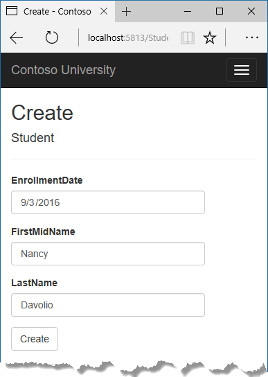
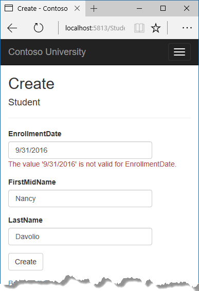

# 创建、读取、更新与删除 - ASP.NET Core MVC 与 EF Core MVC 教程 (2 of 10)

作者 [Tom Dykstra](https://github.com/tdykstra) 、 [Rick Anderson](https://twitter.com/RickAndMSFT)

翻译 [谢炀（Kiler](https://github.com/kiler398/) 

Contoso 大学 Web应用程序演示了如何使用 Entity Framework Core 1.1 以及 Visual Studio 2017 来创建 ASP.NET Core 1.1 MVC Web 应用程序。更多信息请参考 [第一节教程](intro.md).

在之前的教程中，我们使用 Entity Framework 及 SQL Server LocalDB 创建了一个用来存储和显示数据的MVC应用程序。在本教程中，你将审阅并定义 MVC 基架在控制器和视图中自动为您创建的 CRUD (创建、读取、更新、删除)代码。

> [!NOTE] 
> 按照惯例我们应该实现仓储模式，即在你的控制器和数据存取层之间创建一个抽象层来存取数据。但是为了保持教程的简洁并将注意力聚焦在如何使用 Entity Framework 本身，我们在本教程中没有使用仓储模式。更多的信息请参阅 [最后一节教程](advanced.md)。

在本教程中，你将建立以下Web页面：





## 创建一个详细页面

基架代码将 `Enrollments` 属性排除在学生索引页面外，因为该属性是一个集合。在 **详细** 页面中，我们将在 HTML 表格中显示集合中的内容。

在 *Controllers/StudentsController.cs* 代码中，详细视图的 action 方法使用 `SingleOrDefaultAsync` 方法来读取单个 `Student` 实体。 按照下面的高亮代码添加代码调用 `Include`. `ThenInclude`， 以及 `AsNoTracking` 方法。

[!code-csharp[Main](intro/samples/cu/Controllers/StudentsController.cs?name=snippet_Details&highlight=8-12)]

 `Include` 和 `ThenInclude` 方法会导致 context 加载 `Student.Enrollments` 导航属性，并且每个 Enrollment 的 `Enrollment.Course` 导航属性也会加载。 关于这个方法的更多内容请参考 [读取关联数据](read-related-data.md) 教程。

“AsNoTracking” 方法在当前上下文生命周期内返回的实体不会更新的情况下可以提高性能，在本教程最后你可以了解更多关于 `AsNoTracking` 的信息。

### 路由数据

传递给 `Details` 方法的键值来自 **路由数据** ，路由数据是模型绑定器在 URL 段中找到的数据。 例如，默认路由指定controller，action 以及 id段：

[!code-csharp[Main](intro/samples/cu/Startup.cs?name=snippet_RouteAndSeed&highlight=5)]

在下面 URL 中，默认路由将 Instructor 作为控制器，Index 作为 action，将 1 作为 id; 这些就是路由数据的值。

```
http://localhost:1230/Instructor/Index/1?courseID=2021
```
 

URL 的最后一部分 ("?courseID=2021") 是查询字符串值。 如果将它作为查询字符串值传递，模型绑定器也会将 I D的值传递给 `Details` 方法 `id` 参数：

```
http://localhost:1230/Instructor/Index?id=1&CourseID=2021
```

在索引页面中，超链接 URL 由 Razor 视图中的 tag helper 语法创建。 在以下 Razor 代码中， `id` 参数与默认路由匹配，所以 `id` 被添加到路由数据中。

```html
<a asp-action="Edit" asp-route-id="@item.ID">Edit</a>
```

当 `item.ID` 为6时，会生成以下HTML：

```html
<a href="/Students/Edit/6">Edit</a>
```
在以下的 Razor 代码中， `studentID` 与默认路由中的参数不匹配，因此它被添加为查询字符串。
In the following Razor code, `studentID` doesn't match a parameter in the default route, so it's added as a query string.

```html
<a asp-action="Edit" asp-route-studentID="@item.ID">Edit</a>
```

当 `item.ID` 为6时，会生成以下HTML：

```html
<a href="/Students/Edit?studentID=6">Edit</a>
```

更多关于 tag helpers 的信息， 请参考 [ASP.NET Core 的 Tag helpers](xref:mvc/views/tag-helpers/intro).

### 添加 enrollments 到详细视图

打开 *Views/Students/Details.cshtml*，每个字段都是使用 `DisplayNameFor` 以及 `DisplayFor` helper 来呈现的，如下面的代码所示：

[!code-html[](intro/samples/cu/Views/Students/Details.cshtml?range=13-18&highlight=2,5)]

在最后一个字段之后，并且在关闭 `</dl>` 标记之前，添加以下代码以来显示 enrollments 列表：

[!code-html[](intro/samples/cu/Views/Students/Details.cshtml?range=31-52)]

粘贴代码后，如果代码出现缩进错误，请使用 CTRL-K-D 快捷键进行更正。

这段代码遍历 `Enrollments` 导航属性中的实体。 对于每个 enrollment，它将显示课程标题和成绩。 课程标题是从存储在 Enrollments 实体中的 `Course` 导航属性中的课程实体中检索出来的。

运行应用程序，选择 **Students** 选项卡，然后单击学生的 **Details** 链接。 您会看到所选学生的课程和成绩列表：


## 更新创建页面

在  *StudentsController.cs* 中，通过添加一个 try-catch 代码块并从 `Bind` 属性中移除 ID 来修改 HttpPost `Create` 方法。

[!code-csharp[Main](intro/samples/cu/Controllers/StudentsController.cs?name=snippet_Create&highlight=4,6-7,14-21)]

这段代码将由 ASP.NET MVC 模型绑定器创建的 Student 实体添加到 Students 实体集，然后将更改保存到数据库。 （模型绑定器是指 ASP.NET MVC 功能，使您更容易处理表单提交的数据;模型绑定器将发布的表单值转换为 CLR 类型，并将这些值传递给操作方法中的参数，在这种情况下， 模型绑定器使用 Form 集合中的属性值实例化您的 Student 实体。）

您从 `Bind` 属性中删除了 `ID` ，因为 ID 是当插入行时 SQL Server 数据库将被自动设置的主键值。 用户的无需输入或者设置 ID 值。

除了 `Bind` 属性之外，你只需要修改基架代码中的 try-catch 代码块。 如果在保存更改时捕获 `DbUpdateException` 的异常，则会显示一般的错误消息。 `DbUpdateException` 异常有时由应用程序外部因素引起，而不是程序本身错误，所以建议用户再试一次。 虽然在此示例中未实现，但生产环境的应用程序将记录异常。 更多信息，请参阅
[监控和遥测 (在 Azure 构建真实世界云应用程序)](http://www.asp.net/aspnet/overview/developing-apps-with-windows-azure/building-real-world-cloud-apps-with-windows-azure/monitoring-and-telemetry)中的 **日志洞察** 章节。

`ValidateAntiForgeryToken` 属性有助于防止跨站点请求伪造（CSRF）攻击。 令牌会由 [FormTagHelper](xref:mvc/views/working-with-forms#the-form-tag-helper) 自动注入到视图中，并在用户提交表单时包含该令牌。 令牌会被 `ValidateAntiForgeryToken` 属性验证。 有关CSRF的更多信息，请参阅 [🔧 反请求伪造](../../security/anti-request-forgery.md).

<a id="overpost"></a>
### 关于 overpost（过度提交）的安全说明

 基架代码中的 `Create` 方法中包含的 `Bind` 属性是在创建方案中防止overpost（过度提交）的一种方法。 例如，假设学生实体包含一个 `Secret` 属性，但是您又不希望此属性在网页进行设置。

```csharp
public class Student
{
    public int ID { get; set; }
    public string LastName { get; set; }
    public string FirstMidName { get; set; }
    public DateTime EnrollmentDate { get; set; }
    public string Secret { get; set; }
}
```

即使您的网页上没有 `Secret` 字段，黑客也可以使用诸如 Fiddler 之类的工具，或者写一些 JavaScript 来 Post 一个 `Secret` 表单值。 没有 `Bind` 属性限制模型绑定器创建 Student 实例时使用的字段，模型绑定器将抓取 `Secret` 表单值，并使用它来创建学生实体实例。不管黑客为 `Secret` 表单域指定的什么值都将在数据库中被更新。 以下图像显示了Fiddler工具将 `Secret` 字段（带有“OverPost”）添加到发布的表单值。


然后"OverPost" 的值将成功添加到插入到数据行的 `Secret` 属性，尽管您从未打算通过网页可以设置该属性。
 
您可以先通过先从数据库中读取实体，然后调用 `TryUpdateModel` 方法，显式的传递一个允许的属性列表，从而防止编辑场景中的overpost（过度提交）。 这是这些教程中使用的方法。

许多开发人员首选的防止overpost（过度提交）的另一种方法是使用视图模型，而不是使用模型绑定的实体类。 在视图模型中仅包含要更新的属性。 一旦 MVC 模型绑定完成，将视图模型属性复制到实体实例，可选地使用诸如   AutoMapper 之类的工具。 在实体实例上使用 `_context.Entry` 将其状态设置为 `Unchanged`，然后在视图模型中包含的每个实体属性上设置 `Property("PropertyName").IsModified` 为true。 此方法适用于编辑和创建场景。

### 测试创建页面

*Views/Students/Create.cshtml* 中 中的代码为每个字段使用 `label`， `input`， 以及 `span` (用于验证消息) tag helpers。

运行页面选择 **Students** 选项开并点击 **Create New**。

输入姓名和非法日期点击 **Create** 会出现错误信息。



这是您的应用程序默认的服务器端验证; 在后面的教程中，您将看到如何添加将生成客户端验证代码的属性。 以下高亮显示的代码显示了 `Create` 方法中的模型验证检查。

[!code-csharp[Main](intro/samples/cu/Controllers/StudentsController.cs?name=snippet_Create&highlight=8)]

将日期更改为有效值，然后单击 **Create** 并在**Index** 页面中查看新添加学生。

## 更新编辑页面

在 *StudentController.cs*中，HttpGet `Edit` 方法(没有 `HttpPost` 特性的那一个)使用 `SingleOrDefaultAsync`方法来检索所选择的 Student 实体，正如你在 `Details` 方法中看到的一样。您不需要更新此方法。

### 推荐 HttpPost Edit 代码：读取并且更新

用下列代码替换 HttpPost Edit action 方法。

[!code-csharp[Main](intro/samples/cu/Controllers/StudentsController.cs?name=snippet_ReadFirst)]

这个改动是实现防止overpost（过度提交）的最佳实践。 基架生成一个 `Bind` 属性，并将由模型绑定器创建的实体添加到具有 `Modified` 标志的实体集中。 该代码不推荐用于所有场景，因为 `Bind` 属性会清除未包含在 `Include` 参数中的任何预先存在的数据。  

新的代码读取现有实体，并调用 `TryUpdateModel` 方法来更新用户在提交表单数据中输入的数据对应到实体中的字段。 Entity Framework 自动更改跟踪在通过表单输入更改的字段上设置 `Modified` 标志。 当调用`SaveChanges`方法时，Entity Framework会创建SQL语句来更新数据库行。 忽略并发冲突，只有用户更新的表列在数据库中更新。 （稍后的教程将显示如何处理并发冲突。）

作为防止overpost（过度提交）的最佳实践，您可以通过把 **Edit** 页面更新的字段列入 `TryUpdateModel` 参数的白名单列表。 （参数列表中的字段列表之前的空字符串是用于定义表单字段名称的前缀的。）目前没有要保护的额外字段，但列出了您希望模型绑定器绑定的字段 这样可以确保您将来为数据模型添加字段的时候，它们将自动受到保护，直到您在此处显式添加。

作为更改的结果，因为HttpPost `Edit` 方法的方法签名与HttpGet `Edit` 方法相同; 所以需要把方法重命名为 `EditPost`的方法。

### 另一个 HttpPost Edit 代码：创建并附加

推荐的 HttpPost 编辑代码可以确保仅仅更新更改过的列，并保留不需要包含在模型绑定的属性中的数据。 然而，首先读取的方法需要额外的数据库读取操作，并且可能会导致需要加入处理并发冲突的更复杂的代码。 另一种方法是将由模型绑定器创建的实体附加到 EF 上下文并将其标记为已修改。 （不要使用此代码更新项目，这仅仅是可选方案。）

[!code-csharp[Main](intro/samples/cu/Controllers/StudentsController.cs?name=snippet_CreateAndAttach)]

当网页 UI 包含实体中的所有字段并且允许更新它们时，可以使用此方法。

The scaffolded code uses the create-and-attach approach but only catches `DbUpdateConcurrencyException` exceptions and returns 404 error codes.  The example shown catches any database update exception and displays an error message.
基架代码使用 create-and-attach 方式，但只能捕获 `DbUpdateConcurrencyException` 异常并返回 404 错误代码。 示例展示捕获数据库更新异常并显示错误消息。


### 实体状态
 
数据库上下文会跟踪内存中的实体是否与数据库中的数据行保持同步。并根据同步的信息来确定调用`SaveChanges` 方法时会发生什么。例如，让你传递一个新实体给 `Add` 方法，该实体的状态设置为 `Added`。然后您调用 `SaveChanges` 方法时，数据库上下文会生成一个 SQL Insert 命令以插入数据。

一个实体可能处于以下状态：

* `Added`. 实体尚未在数据库中。 `SaveChanges` 方法将产生一个 Insert 语句。 

* `Unchanged`. `SaveChanges` 对该实体什么都不需要做。当你从数据库读出一个实体时，该实体就为这一状态。 

* `Modified`. 某些或所有实体的属性值已都被更改。 `SaveChanges` 将产生一个Update语句。 

* `Deleted`. 该实体已经被标志为删除。 `SaveChanges` 将产生一个Delete语句。 

* `Detached`. 该实体没有被数据库上下文所跟踪。

在桌面应用程序中，状态变化通常是自动设置的。在桌面型的应用程序中，你看到一个实体并更改它的一些属性值，将导致它的实体状态自动更改为 `Modified`。然后你调用 `SaveChanges`，实体框架生成一个 SQL Update 来更新你进行了变更的属性。

Web应用程序的断开连接性质不允许这种连续序列。 `DbContext` 在读取到实体并将其呈现在页面上，之后便被销毁。当 HttpPost `Edit` action方法被调用时，一个新请求被处理，你将获取一个新的 `DbContext` 的实例。所以你必须手动设置实体状态为Modified，然后你调用SaveChanges，实体框架更新数据库中的所有的数据行，因为上下文没有办法知道那个属性是你进行了变更的。

在 Web 应用程序中， `DbContext` 初始化读取实体并显示其要编辑的数据并在页面渲染之后自动施放。 当调用 HttpPost `Edit` action 方法时，会创建一个新的 Web请 求，对应包含一个新的 `DbContext` 实例。 如果您在新的上下文中重新读取了实体，则可以参考桌面处理。

但是，如果您不想执行额外的读取操作，则必须使用由模型绑定器创建的实体对象。 最简单的方法是将实体状态设置为 Modified，就像前面所示的 HttpPost Edit 代码中所做的那样。 然后当您调用`SaveChanges`时，Entity Framework 将更新数据库行的所有列，因为上下文无法知道您更改了哪些属性。

如果你不想用预先读取的方式，你想在 SQL Update 语句只更新用户实际更改的字段，代码会比较复杂，你不得不以某种方式保存原来的值(比如隐藏字段)，这样在调用 HttpPost  `Edit`  方法时就可以使用它们。然后，你可以使用原值来创建一个 Student 实体，调用原始版本的 `Attach` 方法更新实体的值到新值，然后调用 `SaveChanges`。

### 测试编辑页面

运行应用程序并选择 **Students** 选项卡，然后点击 **Edit** 链接。


修改部分数据并且点击 **Save**。 重新打开 **Index** 页面查看修改过的数据。

## 更新删除页面

在 *StudentController.cs*中，HttpGet Delete 方法的模板代码使用 `SingleOrDefaultAsync` 方法检索所选的Student实体，正如你在 Details 和 Edit 方法中看到的那样。然而，调用 `SaveChanges` 失败时的自定义错误信息需要修正，您将为此方法及其对应视图添加一些功能。

正如您所看到的更新和创建操作一样，删除操作需要两个操作方法。 响应 GET 请求的调用方法显示一个视图，给予用户批准或取消删除操作的机会。 如果用户批准，则会创建 POST 请求。 当这种情况发生时，HttpPost `Delete` 方法被调用，然后该方法实际执行删除操作。

您将添加一个 try-catch 代码块到 HttpPost `Delete` 方法来处理数据库更新时可能发生的任何错误。 如果发生错误，HttpPost Delete 方法调用 HttpGet Delete 方法，传递一个指示发生错误的参数。 HttpGet Delete方法然后重新显示确认页面以及错误消息，为用户提供取消或再次尝试的机会。
 
使用以下代码替换 HttpGet `Delete` action 方法，该代码管理错误报告。

[!code-csharp[Main](intro/samples/cu/Controllers/StudentsController.cs?name=snippet_DeleteGet&highlight=1,9,16-21)]

这段代码接受一个可选参数，指示方法是否在保存更改失败后被调用。 当 HttpGet `Delete` 方法被调用而没有先前的失败时，此参数为false。 当 HttpPost `Delete` 方法响应于数据库更新错误调用该参数时，该参数为true，并将错误消息传递给该视图。

###  read-first approach 模式来 HttpPost 删除

使用以下代码替换 HttpPost `Delete` action方法（命名为 `DeleteConfirmed`），该代码执行实际的删除操作并捕获任何数据库更新错误。

[!code-csharp[Main](intro/samples/cu/Controllers/StudentsController.cs?name=snippet_DeleteWithReadFirst&highlight=6,8-11,13-14,18-23)]

此代码检索所选实体，然后调用 `Remove` 方法将实体的状态设置为 `Deleted`。 当调用 `SaveChanges` 方法时，会生成一个 SQL DELETE 命令。

###  create-and-attach 模式来 HttpPost 删除

如果在大数据应用程序中提高性能是优先级，则可以通过仅使用主键值实例化 Student 实体，然后将实体状态设置为 `Deleted`来避免不必要的SQL查询。 这就是实体框架为了删除实体而需要的。 （不要把这段代码放在你的项目中;这里仅仅为了说明一个选择方案）

[!code-csharp[Main](intro/samples/cu/Controllers/StudentsController.cs?name=snippet_DeleteWithoutReadFirst&highlight=7-8)]

如果实体有相关数据也应该被删除，请确保在数据库中配置了级联删除。 通过这种实体删除方法，EF 可能无法意识到有关联的实体应该被删除。

### 测试删除页面

在 *Views/Student/Delete.cshtml* 中，在h2标题和h3标题之间添加错误信息，按照如下代码所示：

[!code-html[](intro/samples/cu/Views/Students/Delete.cshtml?range=7-9&highlight=2)]

运行页面选择 **Students** 选项卡并点击 **Delete** 链接：


点击 **Delete**。Index 页面显示未被删除的学生。 （您将在并发教程中看到如何处理代码的示例。）

## 关闭数据库连接

要确保数据库连接正确的关闭并释放所占用的资源，当你使用完数据库上下问候，需要将其销毁。这就是为什么脚手架代码在Student控制器类的最后部分提供了一个Dispose方法，如下面的代码：

要确保施放数据库连接占用的资源，数据库上下文实例必须在你用完以后立即释放。ASP.NET Core 内置[依赖注入](../../fundamentals/dependency-injection.md) 可以帮助你解决这个问题。

在 *Startup.cs* 你可以调用 [AddDbContext 扩展方法](https://github.com/aspnet/EntityFramework/blob/03bcb5122e3f577a84498545fcf130ba79a3d987/src/Microsoft.EntityFrameworkCore/EntityFrameworkServiceCollectionExtensions.cs) 在 ASP.NET DI 容器中设置 `DbContext` 类。方法默认把服务生命周期设置为 `Scoped`、 `Scoped` 意味着上下文对象生命周期和 web 请求生命周期是一致的， 在请求结束的时候会自动调用 `Dispose` 方法。

## 处理事务

默认情况下，Entity Framework 隐式的实现事务处理。当你对多个表或行进行了更改后调用 `SaveChanges`，Entity Framework 会自动确保你的所有更改全部成功保存到数据库或全部保存失败。如果某些更新完成，之后发生了一个错误，那之前完成的更新将自动全部回滚。当你需要对事务的更多的控制权时——比如您想要在一次事务中包含在 Entity Framework 之外的操作——参见[事务](https://docs.microsoft.com/ef/core/saving/transactions)。

## No-tracking 查询

当数据库上下文检索数据库表行并创建对应的的实体对象时，默认情况下，它将跟踪内存中的实体是否与数据库中的实体同步。 内存中的数据充当缓存，并在更新实体时使用。 这种缓存在 Web 应用程序中通常是不必要的，因为上下文实例通常是短暂的（为每个请求创建一个新的实例），并且上下文通常会在再次读取该实体之前自动施放。

您可以通过调用 `AsNoTracking` 方法来禁用对内存中实体对象的跟踪。 您可以以下典型场景中使用：

* 在上下文生命周期内，您不需要更新任何实体，并且您不需要 EF [通过单独检索的实体自动加载导航属性](read-related-data.md)。 这些条件通常在控制器的 HttpGet 操作方法中得到满足。
 
* 如果您正在运行一个检索大数据的查询，但是只有很小的一部分返回的数据将被更新。 这个时候关闭大数据查询的跟踪可能会更有效，并且稍后单独为需要更新的几个实体再次运行查询。
 
* 您想要附加一个实体来更新它，但是之前您因为不同的目的检索了同一个实体。 因为实体已被数据库上下文跟踪，所以您不能附加要更改的实体。 处理这种情况的一种方法是在之前的查询中调用 `AsNoTracking` 。

更多信息请参考 [Tracking 对比 No-Tracking](https://docs.microsoft.com/en-us/ef/core/querying/tracking).

## 总结

您现在拥有一套针对 Student 实体完成的 CRUD 操作的页面。在下一节教程中，我们会扩展 **Index** 页面增加排序，分组，过滤以及分页的功能。

>[!div class="step-by-step"]
[上一节](intro.md)
[下一节](sort-filter-page.md)  
