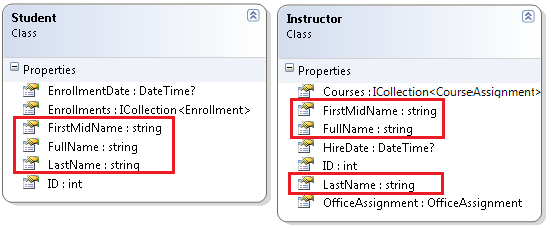
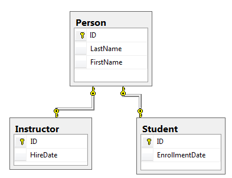

# 继承 - EF Core 与 ASP.NET Core MVC 教程 (9 of 10)

作者 [Tom Dykstra](https://github.com/tdykstra) 、 [Rick Anderson](https://twitter.com/RickAndMSFT)

翻译 [刘怡(AlexLEWIS/Forerunner)](http://github.com/alexinea) 

<!--The Contoso University sample web application demonstrates how to create ASP.NET Core 1.1 MVC web applications using Entity Framework Core 1.1 and Visual Studio 2017. For information about the tutorial series, see [the first tutorial in the series](intro.md).-->
Contoso 大学 Web应用程序演示了如何使用 Entity Framework Core 1.1 以及 Visual Studio 2017 来创建 ASP.NET Core 1.1 MVC Web 应用程序。更多信息请参考 [第一节教程](intro.md).

<!--In the previous tutorial you handled concurrency exceptions. This tutorial will show you how to implement inheritance in the data model.-->
在之前的教程中你已经学习了如何更新数据。本教程将指导你当多个用户同时更新同一实体时如何处理冲突。

<!--In object-oriented programming, you can use inheritance to facilitate code reuse. In this tutorial, you'll change the `Instructor` and `Student` classes so that they derive from a `Person` base class which contains properties such as `LastName` that are common to both instructors and students. You won't add or change any web pages, but you'll change some of the code and those changes will be automatically reflected in the database.-->
在面向对象编程（OOP，object-oriented programming）中，可以利用继承来方便代码复用。在本教程中你将改变 `Instructor` 和 `Student` 类，以使其派生自 `Person`  基类，该基类包含了诸如 `LastName` 等同时存在于教师与学生中的属性。你不需要添加或改变你现有的任何网页，只需要改变代码并使这些改变自动反映到数据库之中。

<!--## Options for mapping inheritance to database tables-->
## 为数据库表配置映射继承

<!--The `Instructor` and `Student` classes in the School data model have several properties that are identical:-->
School 数据模型中的 `Instructor`  和 `Student` 具有如下几个共同属性：



<!--Suppose you want to eliminate the redundant code for the properties that are shared by the `Instructor` and `Student` entities. Or you want to write a service that can format names without caring whether the name came from an instructor or a student. You could create a `Person` base class that contains only those shared properties, then make the `Instructor` and `Student` classes inherit from that base class, as shown in the following illustration:-->
假设你希望消除 `Instructor` 和 `Student` 实体之间共有属性的冗余代码，或者你想编写一个无关教师或学生的服务。你可以创建一个 `Person` 基类来包含这些共有的属性，然后把 `Instructor` 和 `Student` 类改为从该基类派生，如下图所示：


<!--There are several ways this inheritance structure could be represented in the database. You could have a Person table that includes information about both students and instructors in a single table. Some of the columns could apply only to instructors (HireDate), some only to students (EnrollmentDate), some to both (LastName, FirstName). Typically, you'd have a discriminator column to indicate which type each row represents. For example, the discriminator column might have "Instructor" for instructors and "Student" for students.-->
这一继承结构在数据库中的表示可能有多种方式。你可以有一张包含学生与教师共有信息的单一表格 Person 表。一些列可能只适合用于教师（HireDate时间），一些列可能只适合用于学生（EnrollmentDate），也有一些两者都适用（LastName 和 FirstName）。通常来说你可以有一个鉴别列用来指示每一行属于哪种类型。比如用「Instructor」表示这行是教师数据，用「Student」表示这是学生数据。


<!--This pattern of generating an entity inheritance structure from a single database table is called table-per-hierarchy (TPH) inheritance.-->
生成从单个数据库表结构继承而来的实体的模式叫做 TPH（table-per-hierarchy） 继承。

<!--An alternative is to make the database look more like the inheritance structure. For example, you could have only the name fields in the Person table and have separate Instructor and Student tables with the date fields.-->
另一个方式是让数据库更像是继承结构。比如可以有一个只有姓名字段的 Person 表，以及两个相互独立的带有日期字段的 Instructor 和 Student 表。



<!--This pattern of making a database table for each entity class is called table per type (TPT) inheritance.-->
为每个实体类创建数据库表的模式叫做 TPT（table-per-type）继承。

<!--Yet another option is to map all non-abstract types to individual tables. All properties of a class, including inherited properties, map to columns of the corresponding table. This pattern is called Table-per-Concrete Class (TPC) inheritance. If you implemented TPC inheritance for the Person, Student, and Instructor classes as shown earlier, the Student and Instructor tables would look no different after implementing inheritance than they did before.-->
另一种可以选择的方法时映射所有非抽象类型（non-abstract types）为单张表。类的每一个属性（包括它所继承到的属性）都映射到表的相应字段。这一模式被叫做 TPC（table-per-concrete）。如果你为 Person、Student 和 Instructor 类实现 TPC 继承（如前所示），实现了继承的 Student 和 Instructor 表看起来和先前的不会有什么不同。

<!--TPC and TPH inheritance patterns generally deliver better performance than TPT inheritance patterns, because TPT patterns can result in complex join queries.-->
生成从单个数据库表结构继承而来的实体的模式叫做 TPH（table-per-hierarchy） 继承。

<!--This tutorial demonstrates how to implement TPH inheritance. TPH is the only inheritance pattern that the Entity Framework Core supports.  What you'll do is create a `Person` class, change the `Instructor` and `Student` classes to derive from `Person`, add the new class to the `DbContext`, and create a migration.-->
本教程演示如何实现 TPH 继承。TPH 是 Entity Framework Core 所支持的唯一一种继承模式。你所需要做的是创建 `Person` 类，然后将 `Instructor` and和`Student` 类改为派生自  `Person` ，在 `DbContext`中添加新类，然后创建一个迁移。

<!--> [!TIP] 
> Consider saving a copy of the project before making the following changes.  Then if you run into problems and need to start over, it will be easier to start from the saved project instead of reversing steps done for this tutorial or going back to the beginning of the whole series.-->
> [!TIP] 
>在进行以下更改之前，请考虑保存项目的副本。 然后，如果遇到问题并需要重新开始，从保存的项目开始更容易，而不是反向本教程完成的步骤或回到整个系列的开始。

<!--## Create the Person class-->
## 创建 Person 类

<!--In the Models folder, create Person.cs and replace the template code with the following code:-->、
在 Models 文件夹中创建 Person.cs 文件，并用下列代码替换模板代码：

[!code-csharp[Main](intro/samples/cu/Models/Person.cs)]

<!--## Make Student and Instructor classes inherit from Person-->
## 使 Student 与 Instructor 类继承自 Person 类

<!--In *Instructor.cs*, derive the Instructor class from the Person class and remove the key and name fields. The code will look like the following example:-->
在 *Instructor.cs* 中，将 Instructor 改为派生自 Person 类，并移除键和名称字段。代码看上去如下所示：

[!code-csharp[Main](intro/samples/cu/Models/Instructor.cs?name=snippet_AfterInheritance&highlight=8)]

<!--Make the same changes in *Student.cs*.-->
在 *Student.cs* 中做一样的修改：

[!code-csharp[Main](intro/samples/cu/Models/Student.cs?name=snippet_AfterInheritance&highlight=8)]

<!--## Add the Person entity type to the data model-->
## 在数据模型中添加 Person 实体类型

<!--Add the Person entity type to *SchoolContext.cs*. The new lines are highlighted.-->
将 Person 实体类型添加到 *SchoolContext.cs* 中。高亮处为新代码。

[!code-csharp[Main](intro/samples/cu/Data/SchoolContext.cs?name=snippet_AfterInheritance&highlight=19,30)]

<!--This is all that the Entity Framework needs in order to configure table-per-hierarchy inheritance. As you'll see, when the database is updated, it will have a Person table in place of the Student and Instructor tables.-->
这就是 Entity Framework 需要为配置 TPH 继承所做的全部工作。如你所见，当数据库更新，将有一个 Person 表来取代 Student 和 Instructor 表。

<!--## Create and customize migration code-->
## 创建并定制迁移代码

<!--Save your changes and build the project. Then open the command window in the project folder and enter the following command:-->
保存变更并构建项目。从项目文件夹中打开命令窗口，然后输入以下命令：

```console
dotnet ef migrations add Inheritance
```

<!--Run the `database update` command:.-->
运行 `database update` 命令：

```console
dotnet ef database update
```

<!--The command will fail at this point because you have existing data that migrations doesn't know how to handle. You get an error message like the following one:-->
命令将会失败在这一点上，因为你有一些存在的数据，而迁移并不知道该如何处理它们。你会获得类似如下遮掩的错误信息：

> The ALTER TABLE statement conflicted with the FOREIGN KEY constraint "FK_CourseAssignment_Person_InstructorID". The conflict occurred in database "ContosoUniversity09133", table "dbo.Person", column 'ID'.

<!--Open *Migrations\<timestamp>_Inheritance.cs* and replace the `Up` method with the following code:-->
打开 *Migrations\<timestamp>_Inheritance.cs* ，并用下列代码替换 `Up` 方法：

[!code-csharp[Main](intro/samples/cu/Migrations/20170216215525_Inheritance.cs?name=snippet_Up)]

<!--This code takes care of the following database update tasks:-->
这段代码聚焦于以下数据库更新任务：

<!--* Removes foreign key constraints and indexes that point to the Student table.-->
* 移除指向 Student 表的外键约束和索引。

<!--* Renames the Instructor table as Person and makes changes needed for it to store Student data:-->
* 重命名 Instructor 表为 Person，并根据需要更新存储在 Student 的数据：

<!--* Adds nullable EnrollmentDate for students.-->
* 在 Students 表中增加可空的 EnrollmentDate。

<!--* Adds Discriminator column to indicate whether a row is for a student or an instructor.-->
* 添加 Discriminator 列用于明确这行记录时学生还是教师。

<!--* Makes HireDate nullable since student rows won't have hire dates.-->
* 将 HireDate 设置为可空，因为学生记录中不会有雇用时间。

<!--* Adds a temporary field that will be used to update foreign keys that point to students. When you copy students into the Person table they'll get new primary key values.-->
* 增加一个临时字段用于更新指向学生的外键。当你复制学生的数据到 Person 表时，它们会获取新的主键值。

<!--* Copies data from the Student table into the Person table. This causes students to get assigned new primary key values.-->
* 从 Student 表中复制数据到 Person 表。这将会导致学生获取新的被分配的主键值。

<!--* Fixes foreign key values that point to students.-->
* 修复指向学生的外键值。

<!--* Re-creates foreign key constraints and indexes, now pointing them to the Person table.-->
* 重新创建外键约束和索引，现在它们指向 Person 表。

<!--(If you had used GUID instead of integer as the primary key type, the student primary key values wouldn't have to change, and several of these steps could have been omitted.)-->
（如果你的铸件类型是 GUID 而不是整形数字，那么学生的主键值并不需要更新，那么这些步骤也就能省了。）

<!--Run the `database update` command again:-->
再次运行 `database update` 命令：

```console
dotnet ef database update
```

<!--(In a production system you would make corresponding changes to the `Down` method in case you ever had to use that to go back to the previous database version. For this tutorial you won't be using the `Down` method.)-->
（在生产系统中，你需要对 `Down` 方法做相应的变更，这样万一需要，你可以用它回滚到之前的数据库版本。在本教程中你不会用到 `Down` 方法。）

<!--> [!NOTE] 
> It's possible to get other errors when making schema changes in a database that has existing data. If you get migration errors that you can't resolve, you can either change the database name in the connection string or delete the database. With a new database, there is no data to migrate, and the update-database command is more likely to complete without errors. To delete the database, use SSOX or run the `database drop` CLI command.-->
> [!NOTE] 
> 有可能在给一个已存在数据的数据库架构做更新时会获得其他错误。如果你得到了解决不了的迁移错误，你可以修改连接字符串中的数据库名称，或者删除数据库。在新数据库中，没有数据需要被迁移，update-database 命令更多的会无错完成。要删除数据库，可以使用 SSOX 或者使用 `database drop` 这个 CLI 命令。


测试继承实现

<!--## Test with inheritance implemented-->
## 测试继承实现

<!--Run the site and try various pages. Everything works the same as it did before.-->
运行站点，然后尝试访问不同的页面。现在一切正常如故。

<!--In **SQL Server Object Explorer**, expand **Data Connections/SchoolContext** and then **Tables**, and you see that the Student and Instructor tables have been replaced by a Person table. Open the Person table designer and you see that it has all of the columns that used to be in the Student and Instructor tables.-->
在 **SQL Server Object Explorer** 中依次展开 **Data Connections/SchoolContext** 和 **Tables**，然后你能看到 Student 与 Instructor 表已被 Person 表所取代。打开 Person 表设计器，你可以发现它的所有列之前被用于 Student 和 Instructor 表。


<!--Right-click the Person table, and then click **Show Table Data** to see the discriminator column.-->
右键点击 Person 表，然后点击 **Show Table Data** 来辨别列。


<!--## Summary-->
## 总结

<!--You've implemented table-per-hierarchy inheritance for the `Person`, `Student`, and `Instructor` classes. For more information about inheritance in Entity Framework Core, see [继承](https://docs.microsoft.com/en-us/ef/core/modeling/inheritance). In the next tutorial you'll see how to handle a variety of relatively advanced Entity Framework scenarios.-->
你已经给 `Person`, `Student`, 以及 `Instructor` 类实现了 TPH（table-per-hierarchy，每个层次结构一张表）。更多有关 Entity Framework 继承的资料请阅读 [继承](https://docs.microsoft.com/en-us/ef/core/modeling/inheritance)。在下一篇教程中，我们将介绍如何处理各种 Entity Framework 高级场景。

>[!div class="step-by-step"]
[上一节](concurrency.md)
[下一节](advanced.md)  
