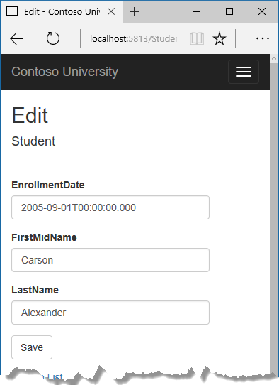
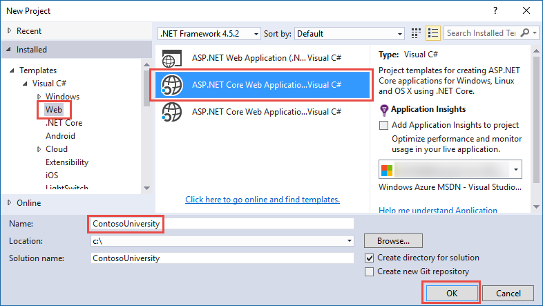
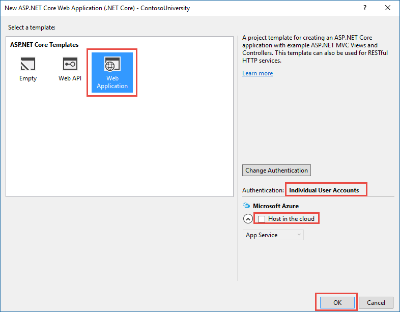
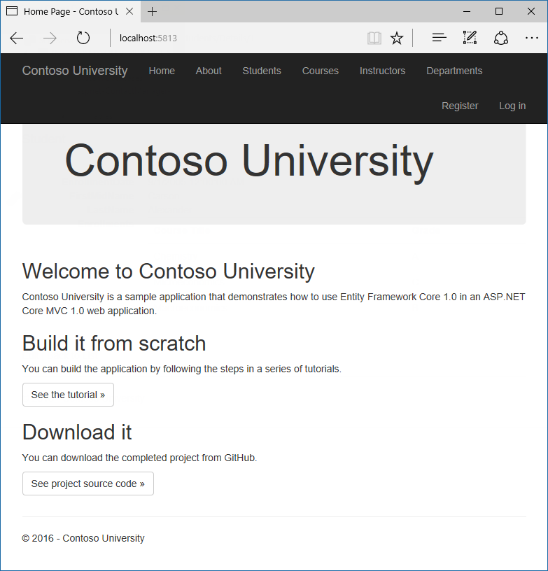
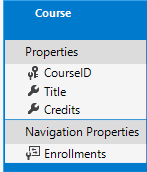
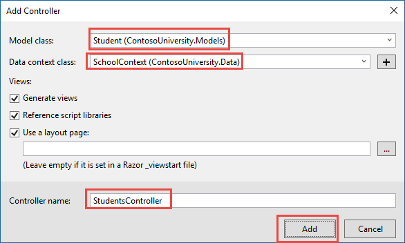
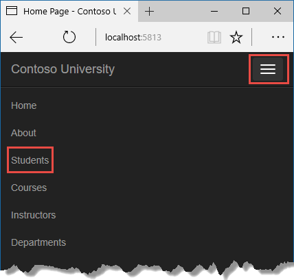
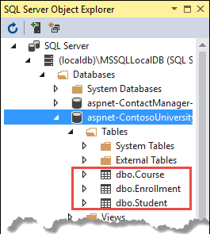
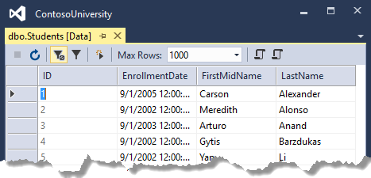

# 使用 Visual Studio 开发 ASP.NET Core MVC 以及 Entity Framework Core 入门教程

作者 [Tom Dykstra](https://github.com/tdykstra) 、 [Rick Anderson](https://twitter.com/RickAndMSFT)

翻译 [谢炀（Kiler）](https://github.com/kiler398/) 

Contoso 大学 Web应用程序演示了如何使用 Entity Framework Core 1.1 以及 Visual Studio 2017 来创建 ASP.NET Core 1.1 MVC Web 应用程序。

本演示程序是为虚拟的 Contoso 大学创建了一个网站。 包含诸如学生管理，课程创建，教师指派等功能。 本系列教程展示了如何从基架创建 Contoso 大学演示网站。这是本系列教程中的第一节，介绍了如何从基架创建 Contoso 大学演示网站。  


[下载或者查看完整的应用程序。](https://github.com/aspnet/Docs/tree/master/aspnetcore/data/ef-mvc/intro/samples/cu-final)

EF Core 1.1 是 EF 的最新版本，但是并未包括所有EF 6.X的所有功能。关于如何选择 EF 6.x 还是 EF Core 1.1 的信息，请参看[EF Core vs. EF6.x](https://docs.microsoft.com/ef/efcore-and-ef6/)。如果你选择EF 6.X，请参看[上一个版本的教程](https://docs.microsoft.com/aspnet/mvc/overview/getting-started/getting-started-with-ef-using-mvc/creating-an-entity-framework-data-model-for-an-asp-net-mvc-application)。

> [!NOTE]
> 需要 Visual Studio 2015 版本的教程， 请参考 [VS 2015 版本的 ASP.NET Core PDF 格式文档](https://github.com/aspnet/Docs/blob/master/aspnetcore/common/_static/aspnet-core-project-json.pdf).

## 先决条件

[Visual Studio 2017](https://docs.microsoft.com/visualstudio/install/install-visual-studio) 包含 **ASP.NET and web development** 以及 **.NET Core cross-platform development workloads** 模块安装。

## Troubleshooting（故障排查）

如果在演练的过程中遇到了不能解决的问题，你通常可以通过比对你自己写的代码和下载的[完整项目代码](https://github.com/aspnet/Docs/tree/master/aspnetcore/data/ef-mvc/intro/samples/cu-final)来解决。对于一些常见的错误及其解决方法，请参看[the Troubleshooting section of the last tutorial in the series](advanced.md#common-errors)。如果没有发现你所需要的，你可以在 StackOverflow.com 发帖咨询 [ASP.NET Core](http://stackoverflow.com/questions/tagged/asp.net-core) 或者 [EF Core](http://stackoverflow.com/questions/tagged/entity-framework-core) 相关问题。

> [!TIP] 
> 这是一个包含10个章节的系类教程， 教程的每一个章节都是前后关联的。注意每成功的完成一个章节以后，将项目做一个完整的复制备份。当你遇到问题的时候， 当你遇到问题的时候又可以回到原来教程的程序版本而不需要从头走一遍教程。

## Contoso 大学网站应用程序

在本教程中你将构建一个简单的大学网站应用程序。

用户可以查看更新学生、课程、教师信息。 下面是你将要创建的用户界面。




网站UI风格和内置生成站点的风格保持一致, 这样的话教程可以着重关注如何使用 Entity Framework本身。

## 创建 ASP.NET Core MVC web应用程序

打开 Visual Studio 2015 传建一个新的名为 "ContosoUniversity" 的 ASP.NET Core C# Web项目。

* 从 **File** 菜单， 选择 **New > Project**。

* 从右侧面板， 选择 **Templates > Visual C# > Web**。

* 选择 **ASP.NET Core Web Application (.NET Core)** 项目模版。

* 输入 **ContosoUniversity** 作为项目名点击 **OK**。

  

* 等待 **New ASP.NET Core Web Application (.NET Core)** 对话框出现

* 选择 **ASP.NET Core 1.1** 以及 **Web Application** 模版。

  **Note:** 本教程要求 ASP.NET Core 1.1 以及 EF Core 1.1 或者更高版本 -- 请确认 **ASP.NET Core 1.0** 没有被选中。

* 确认 **Authentication** 被设置为 **No Authentication**.

* 点击 **OK**

  

## 设置站点样式

在网站的菜单、布局和首页中设置有一些简单的变化。

开打Views/Shared/_Layout.cshtml，并作如下修改：

* 把每处 "ContosoUniversity" 修改为 "Contoso University"。 一共三个地方。

* 添加菜单入口 **Students**， **Courses**，**Instructors**， 以及 **Departments**， 删除菜单 **Contact**。

改动之处会被高亮显示。

[!code-html[](intro/samples/cu/Views/Shared/_Layout.cshtml?highlight=7,31,37-40,49)]

在 *Views/Home/Index.cshtml* 视图中，使用以下代码替换文件中关于此应用程序的有关ASP.NET和MVC的文本。

[!code-html[](intro/samples/cu/Views/Home/Index.cshtml)]

按下 CTRL+F5 运行项目在菜单中选择 **Debug > Start Without Debugging** 。你会看到你在本教程创建的首页在tab页中显示。



## Entity Framework Core NuGet 包管理

如果你希望添加 EF Core 支持到一个新的项目，首先所需要指定包的数据库提供者。在本教程中，我们选择安装 SQL Server provider:  [Microsoft.EntityFrameworkCore.SqlServer](https://www.nuget.org/packages/Microsoft.EntityFrameworkCore.SqlServer/). 


为了安装包，在 **Package Manager Console (PMC 包管理控制台)** 中输入一下命令行. (在 **Tools** 菜单， 选择 **NuGet Package Manager > Package Manager Console**。)

```
Install-Package Microsoft.EntityFrameworkCore.SqlServer
```
  
这个安装包以及他的依赖包(`Microsoft.EntityFrameworkCore` 和 `Microsoft.EntityFrameworkCore.Relational`)为 EF 提供运行时支持。你将在后续 [Migrations](migrations.md) 教程的操作里面添加工具包。

## 创建数据模型

下面你将建立用于 Contoso 大学网站的实体类。你将从以下三个类开始：


注意 `Student` 和 `Enrollment` 存在一对多的关联关系。同样 `Course` 和 `Enrollment` 也是如此。换句话说，一个学生可以参加任意数量的课程，而一门课程也被任意数量的学生参加。

在下面的章节中，你将为每一个实体创建一个类。

### The Student entity（学员实体类）


在项目文件夹中，创建一个名为 *Models* 的目录。

在 *Models* 文件夹中，创建名为 *Student.cs* 的类并使用以下的代码替换模版代码：

[!code-csharp[Main](intro/samples/cu/Models/Student.cs?name=snippet_Intro)]

 `ID` 属性将成为数据表中对应该类的主键字段。默认情况下，Entity Framework 将命名为 `ID` 或 `classnameID` 的属性用作主键字段。

 `Enrollments` 属性是一个导航属性。导航属性建立本实体类相关的其他实体类之间的关联。在本例中，一个 `Student entity` 的 `Enrollments` 属性将容纳所有与 `Student` 实体相关联 `Enrollment`实体。换而言之，如果一个 `Student` 在数据库中有两个相关的 `Enrollment`行(字段使用使用该学生的主键值作为外键)，即 `Student` 实体的 `Enrollments` 属性将包含这两个关联的 `Enrollment` 实体类。

如果导航属性持有多个实体（如在多对多或者1对多关系中），其类型必须是一个集合，以便实现实体的增加、删除和更新，例如 `ICollection<T>` .。你可以指定 `ICollection<T>` .或者诸如``List<T>``、 `HashSet<T>`的类型。如果你指定了 `ICollection<T>` ，EF会缺省创建一个 `HashSet<T>`集合。

### The Enrollment entity（排课实体类）


在 *Models* 目录中， 创建 *Enrollment.cs* 代码文件并使用下列代码做替换：

[!code-csharp[Main](intro/samples/cu/Models/Enrollment.cs?name=snippet_Intro)]

 `EnrollmentID` 属性将作为主键，它使用了 `classnameID` 模式而不是你在 `Student` 中直接使用 `ID` 本身的方法。通常情况下你应当在这两种方式中选择一种作为整个项目的统一命名方式，在这里我们只是演示了这两种方式的使用。在后面的教程中你将看到如何使用不带类名的 ID 从而更容易地在数据模型中实现继承。

 `Grade` 属性是一个 `枚举```。属性后的问号表示这是一个可为空的属性。Null 表示一个未知或没有分配的级别。

 `StudentID` 是一个外键，相应的导航属性是 `StudentID` 。一个 `Enrollment` 实体关联到一个Student实体。所以属性只能容纳一个 `Student` 实体(而不像之前的 `Student.Enrollments` 导航属性，它可以容纳多个 `Enrollment` 实体)。

同样 `CourseID` 也是一个外键，导航属性 `Course` 是并关联到一个 `Enrollment` 实体。

如果一个属性的命名方式为 `<导航属性名><主键属性名>` ，Entity Framework 便会将该属性视为外键属性。(例如， `StudentID` 实体的主键为 `ID` ，则 `StudentID` 被视为为 `Student` 导航属性的外键)。外键的属性也可以命名为简单的 `<主键属性名>` (例如， `Course` 实体的主键为 `CourseID`)。

### The Course entity（课程实体类）



在 *Models* 目录中， 创建 *Course.cs* 类并用下面的代码做替换：

[!code-csharp[Main](intro/samples/cu/Models/Course.cs?name=snippet_Intro)]

`Enrollments` 属性是导航属性。 `Course` 实体可与任意数量的 `Enrollment` 实体相关联

我们将在[后续的课程](complex-data-model.md)中讨论更多的e `DatabaseGenerated` 属性。基本上，该属性让你为 course 生成主键而不是让数据库生成它。

## 创建数据库上下文

在一个数据模型中负责协调 Entity Framework 功能的主类被称为数据库上下文类。您可以通过派生自 `Microsoft.EntityFrameworkCore.DbContext` 类来创建。你可以在代码中指定那些实体被包含在数据模型中。您可以可以自定义某些 Entity Framework 的行为。在本项目中，上下文类被命名为 `SchoolContext`。

在项目文件夹中，创建一个名为 *Data* 的目录。

在 *Data* 目录中创建一个名为 *SchoolContext.cs* 的类， 使用下面的代码替换模版代码：

[!code-csharp[Main](intro/samples/cu/Data/SchoolContext.cs?name=snippet_Intro)]

每个实体类里面会创建一个 `DbSet` 属性。在 Entity Framework 术语中。实体 set 一般对应于数据库表，实体记录对应于表中的行。 

你可以省略 `DbSet<Enrollment>`和 `DbSet<Course>`语句，但是代码依然可以工作 ，Entity Framework 会将自动把它们包含进来。因为 `Student` 实体引用了 `Enrollment` 实体类，并且 `Enrollment` 实体类引用了 `Course` 实体类。

当创建数据库时，EF创建了与 `DbSet` 属性名相同的表。集合的属性名通常使用复数形式（使用Students而不是Student），但是是由开发者同意是否将表名使用复数形式。在本教程中，你将用 DbContext 中表名的单数形式覆盖缺省的行为。为此，在最新的 DbSet 属性后增加下列高亮代码。

[!code-csharp[Main](intro/samples/cu/Data/SchoolContext.cs?name=snippet_TableNames&highlight=16-21)]

## 依赖注入中注册上下文

ASP.NET默认使用[依赖注入](../../fundamentals/dependency-injection.md)。在应用启动期间，启动依赖注入等服务（例如EF数据库上下文）。通过构造器参数提供了需要这些服务（例如 MVC 控制器）的组件。本教程后续内容中，你将看到取得上下文实例的控制器构造代码。

为了把 `SchoolContext` 注册为一个服务， 打开 *Startup.cs*文件，添加高亮行到 `ConfigureServices` 方法。

[!code-csharp[Main](intro/samples/cu/Startup.cs?name=snippet_SchoolContext&highlight=4-5)]

通过调用 `DbContextOptionsBuilder` 对象的一个方法，将连接字符串的名称传递给上下文。本地开发时，[ASP.NET Core 配置系统](../../fundamentals/configuration.md) 从 *appsettings.json* 文件读取连接字符串。连接字符串高亮显示于下面的 *appsettings.json* 例子中。

添加 `ContosoUniversity.Data` 和 `Microsoft.EntityFrameworkCore` 名称空间 `using` 语句，并且编译项目。

[!code-csharp[Main](intro/samples/cu/Startup.cs?name=snippet_Usings&highlight=1,4)]

打开 *appsettings.json* 文件添加连接字符串如下示例所示。

[!code-json[](./intro/samples/cu/appsettings1.json?highlight=2-4)]

### SQL Server Express LocalDB

链接字符串指定一个SQL Server LocalDB 数据库，LocalDB是SQL Server Express的一个轻量版本，非常适合用来进行本地测试，但不建议在生产中使用。LocalDB 并以用户模式的方式按需启动运行，因此默认没有复杂的配置。 LocalDB 在目录 `C:/Users/<user>` 里面创建 *.mdf* 数据库文件。

## 添加代码给数据库初始化测试数据

Entity Framwork 将为你创建一个空数据库。本节中，你要编写一个方法，以便实现对包含测试数据的数据库的调用。

在这里，你将使用 `EnsureCreated` 方法自动创建数据库。在[后面的教程](migrations.md)中，你将看到如何使用 Code Frist 迁移功能来变更数据库 schema，而不是采用删除、再重建数据库的发布，最终实现模型变更的处理。

在 *Data* 文件夹中，创建一个名为 *DbInitializer.cs* 的类文件，然后用下面的代码替换模板内容，以便需要时可以加载新的数据库。

[!code-csharp[Main](intro/samples/cu/Data/DbInitializer.cs?name=snippet_Intro)]

这段代码检测数据库中是否有学生的记录，如果没有，将假定数据库是新的，后然用测试数据初始化。将测试数据加载到数组中，而不是`List<T>`集合中，这可优化性能。

在 *Startup.cs* 文件中，修改 `Configure` 方法，以便应用启动时调用这些初始化方法。首先，向方法中增加上下文，以便ASP.NET依赖注入可向你的 `DbInitializer` 类提供该上下文。

[!code-csharp[Main](intro/samples/cu/Startup.cs?name=snippet_ConfigureSignature&highlight=1)]

接着，在 `Configure` 方法结尾处调用 `DbInitializer.Initialize`方法。

[!code-csharp[Main](intro/samples/cu/Startup.cs?name=snippet_RouteAndSeed&highlight=8)]

现在第一次运行应用，数据库将被创建，测试数据将被初始化。修改数据模型时，你可删除数据库、更新seed方法，并且用同样的方法开始刷新新的数据库。在后续的教程中，当数据模型变化时，你将看到如何修改数据库，而不是用删除再重建的方法。

## 创建控制器和视图

接下来，你将使用 Visual Studio 的基架引擎来增加 MVC 的控制器和视图，以实现通过 EF 进行查询和存储数据。

自动创建 CRUD 方法和视图的功能被称为基架。基架模式不同于直接编写代码的方式，通过基架生成的代码是一个开端，基于此你可以进一步修改代码以适合自己的应用，然而典型情况下你也可不修改生成的代码。当需要定制生成的代码时，你可使用部分的类，或者当业务变化的时候重新生成代码。

* 在 **Solution Explorer** 面板右击 **Controllers** 并且选择 **Add > New Scaffolded Item**.

* 在 **Add MVC Dependencies** 对话框中， 选择 **Minimal Dependencies**，并且选择 **Add**.

  

  Visual Studio 会添加基架控制器所需的依赖，包括 EF 设计时功能包(`Microsoft.EntityFrameworkCore.Design`)。再从已经存在的数据基架 DbContext 需要包含 (`Microsoft.EntityFrameworkCore.SqlServer.Design`)。 *ScaffoldingReadMe.txt* 会被自动创建，你也可以删除掉它。

* 再来一次， 在 **Solution Explorer** 中右击 **Controllers** 目录并且选择 **Add > New Scaffolded Item**.

* 在 **Add Scaffold** 对话框中：

  * 选择 **MVC controller with views, using Entity Framework**。

  * 点击 **Add**。

* 在 **Add Controller** 对话框中：

  * 在 **Model class** 中选择 **Student**。

  * 在 **Data context class** 中选择 **SchoolContext**。

  * 接受 **StudentsController** 默认值为名称。

  * 点击 **Add**。

  

  当你点击 **Add* *时，VS基架引擎创建一个 *StudentsController.cs* 文件，并且创建了一套视图（*.cshtml*/files），该套视图与这个控制器一同工作。

（如果你没有像该教程前面要求的创建上下文的话，基架引擎也会为你创建一个数据库上下文。你可在 **Add Controller**对话框内点击 **Data context class** 后面的加号，从而指定一个新的上下文类。VS然后将会你自己定义的  `DbContext` 类，以及控制器和视图）

你会注意到控制器将 `SchoolContext` 作为一个构造参数。

[!code-csharp[Main](intro/samples/cu/Controllers/StudentsController.cs?name=snippet_Context&highlight=5,7,9)]

ASP.NET依赖注入将会考虑向控制器传递一个 `SchoolContext` 实例。前面，你将其配置进 *Startup.cs* 。

控制器包含了一个 `Index` 方法，该方法显示数据库中所有的 `Students` 数据。通过读取Students属性，该方法从 `Students` 实体中得到一个 Students 集合。

[!code-csharp[Main](intro/samples/cu/Controllers/StudentsController.cs?name=snippet_ScaffoldedIndex&highlight=3)]

你将在该教程的后面，学习异步编程的方法。

视图 *Views/Students/Index.cshtml* 在表格中显示一个列表：

[!code-html[](intro/samples/cu/Views/Students/Index1.cshtml)]

按下 CTRL+F5 运行项目，选择 **Debug > Start Without Debugging** 菜单。

点击学员选项卡查看 `DbInitializer.Initialize` 方法插入的测试数据。根据浏览器窗口的实际宽度，您将在页面顶部看 `Student（学员）` 选项卡链接，或者您需要点击右上角的导航图标以查看链接。




## 查看数据库

当启动该应用时， `DbInitializer.Initialize` 方法调用 `EnsureCreated`。EF看到没有数据库，进而创建了一个数据库，接着 `Initialize` 方法中剩余的代码使用提供的数据发布了数据库。你可以在VS中使用 **SQL Server Object Explorer** (SSOX)浏览该数据库。

关闭浏览器。

如果 SSOX 窗体已经打开了，在 Visual Studio 里面选择 **View** 菜单。

在 SSOX 中， 点击 **(localdb)\\MSSQLLocalDB > Databases**， 点击你在 *appsettings.json* 文件的连接字符串中配置好数据库名。

展开 **Tables** 节点查看数据库中的表。



右击 **Student** 表点击 **View Data** 菜单查看我们创建的数据库列以及插入的数据。 



数据文件 *.mdf* 以及 *.ldf* 位于 `C:\Users\<yourusername>` 目录下。

因为在应用启动时调用了 initializer 方法中的 `EnsureCreated` ，你现在可以修改 `Student 类`，然后删除数据库，再次运行应用，数据库将按照改动自动再次创建了。例如，如果你向 `Student 类`中增加了 `EmailAddress` 属性，你将看到在重新创建的表中多了 `EmailAddress` 列。

## 约定

为了 Entity Framework 能创建一个完整的数据库，你已经写了一定数量的代码，但是这些代码量是非常少的，因为使用了一些约定，或者说是 Entity Framework 承担了一部分工作。

 
* `DbSet` 属性的名字被用于表名。因为实体没有引用 `DbSet` 属性，实体类名被用于表名。

* 实体属性名被用于字段名。

* 被命名为 ID 或者 classnameID 的实体属性被当作主键属性。

如果一个属性被命名为*<navigation property name><primary key property name>*，则该属性被当作外键。（例如：例如：`StudentID`对于 `Student` 导航属性，因为 `Student` 实体的主键是 `ID`）。外键属性也可被命名为相同的简单的*<primary key property name>*（例如： `EnrollmentID` ，因为 `Enrollment` 实体的主键是 `EnrollmentID` 。）

约束的行为可以被覆盖。 比如， 你可以显示指定表名，如同你在先前的教程里面看到的一样。 你也可以设置列名设置属性名作为主键或者外键， 你在 [后续的系列教程](complex-data-model.md) 里面将会看到如何这样做。

## 异步代码

异步编程是 Asp.net Core 和 EF Core 的默认模式。

一个WEB服务器只有很有限的可用线程资源，并且在高负载的情况下，可能所有的线程都会在使用中。当发生这种情况时，服务器将无法处理新的请求，直到有线程被释放。在同步代码的情况下，多个线程可能会关联起来，但实际上它们并不作任何工作而只是在等待IO完成。使用异步代码，当一个进程正在等待IO完成时，它的线程可以服务器腾出从而用于处理其他请求。因此，异步代码可以更高效地使用服务器资源，并且服务器能够在不延迟的情况下处理更多的流量。

异步代码在运行时引入系统开销比较小，但是在低流量情况下，性能的提升是可以忽略不计的，而对于高流量情况，潜在的系统性能改进是巨大的。

下面的代码里， `async` 关键字， `Task<T>` 返回值，`await` 关键字， 以及 `ToListAsync` 方法将会使得代码异步执行。

[!code-csharp[Main](intro/samples/cu/Controllers/StudentsController.cs?name=snippet_ScaffoldedIndex)]


* 关键字 `async` 通知编译器将方法体的代码生成回调并且自动创建 `Task<IActionResult>` 对象返回。

* 返回类型 `Task<IActionResult>` 把即将执行操作的结果作为 `IActionResult` 返回。

* `await` 关键字使编译器将方法分成两个部分。第一个部分以开始异步为结尾。第二个部分被放进一个回调方法，当操作完成时该方法被调用。

* `ToListAsync` 方法是 `ToList` 方法的异步扩展版本。

在使用 Entity Framework 编写异步代码时需要注意一些事情：

* 只有导致查询或SQL语句发送到数据库的代码是异步执行的。 包括，例如，`ToListAsync`， `SingleOrDefaultAsync`和`SaveChangesAsync`。 不包括，例如，只是更改 `IQueryable`的语句，如 `var students = context.Students.Where(s => s.LastName == "Davolio")`。

* EF上下文不是线程安全的：不要尝试并行执行多个操作。 当你调用一个异步EF方法时，总是使用 `await` 关键字。

* 如果您想利用异步代码的性能优势E，请确保您正在使用的任何库包（如分页），如果他们调用任何导致查询的 Entity Framework 方法发送到 数据库。

更多关于.NET异步编程的信息吗，请参考 [异步概览](https://docs.microsoft.com/en-us/dotnet/articles/standard/async)。

## 总结

现在，您已经创建了一个使用 Entity Framework Core 和SQL Server Express LocalDB 来存储和显示数据的简单 Web 应用程序，在后面的教程中，您将学习如何执行基本的 CRUD (创建, 读取, 更新, 删除)操作。

>[!div class="step-by-step"]
[下一节](crud.md)  
