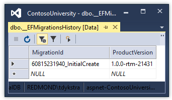
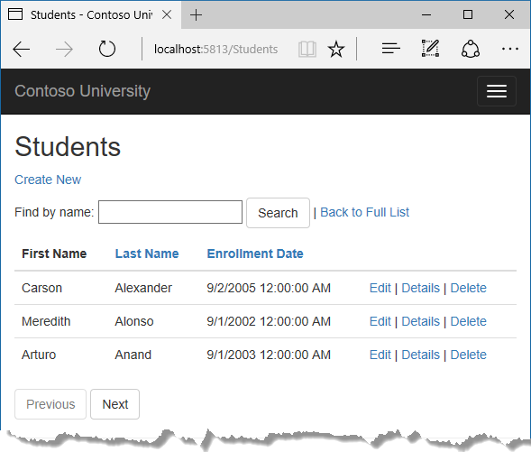

# 迁移 - ASP.NET Core MVC 与 EF Core 教程 (4 of 10)

作者 [Tom Dykstra](https://github.com/tdykstra) 、 [Rick Anderson](https://twitter.com/RickAndMSFT)

Contoso 大学 Web应用程序演示了如何使用 Entity Framework Core 1.1 以及 Visual Studio 2017 来创建 ASP.NET Core 1.1 MVC Web 应用程序。更多信息请参考 [第一节教程](intro.md).

在本教程中，你将开始使用 EF Core 数据迁移功能来管理数据模型的变动。在后续的教程中，会根据数据模型的变动添加更多的迁移。

## 数据迁移介绍

当你在开发一个新的应用时数据模型是经常变化的，每次数据模型的变动都会与数据库的实际结构产生差异。下面的教程里面，从EF创建新数据库（如果不存在）开始本节的教程。然后，每次增加、删除或者改变实体类以及DbContext类时，你可以先删除数据库，然后EF都会创建按照新要求创建一个新数据库，并且用测试数据进行初始化。

直到应用部署到生产环境前，该方法都会很好地保持数据库与数据模型建的同步。当应用运行到生产环境中时，通常都会存储大量数据，而你通常期望保留这些数据。例如：当增加一个新列时，你不想失去任何数据。EF Core 迁移功能通过升级数据库 Schema 的方法解决该问题，而不是创建一个新的数据库。

## Entity Framework Core 迁移的 NuGet 包

 
要使用迁移，可以使用 **Package Manager Console** (PMC) 或者 command-line interface (CLI)。 下面教程显示如何使用CLI命令。 有关PMC的信息是[在本教程的末尾](#pmc).。


命令行界面（CLI）的EF工具在 [Microsoft.EntityFrameworkCore.Tools.DotNet](https://www.nuget.org/packages/Microsoft.EntityFrameworkCore.Tools.DotNet) 包中提供。 要安装此软件包，请将其添加到 *.csproj* 文件中的 `DotNetCliToolReference` 集合中，如图所示。 **Note:** 您必须通过编辑 *.csproj* 文件来安装此软件包。 您不能使用 `install-package` 命令或包管理器GUI。 您可以通过在 **Solution Explorer**  中右键单击项目名称并选择**Edit ContosoUniversity.csproj**文件。

[!code-xml[](intro/samples/cu/ContosoUniversity.csproj?range=23-26&highlight=3)]
  
(本示例中的版本号是教程编写时的最新版本。) 

## 修改连接字符串

在 *appsettings.json* 文件中, 把连接字符串中的数据库名改为 ContosoUniversity2 或者其他你本机没有使用过的数据库名。

[!code-json[Main](intro/samples/cu/appsettings2.json?range=1-4)]

这个修改会促使项目初始化时创建一个新数据库。我们在学习迁移时这样做其实并不需要，但是接下来你会看到这样做的好处的。


> [!NOTE]
> 除了数据库改名以外， 你也可以直接删除数据库。 使用 **SQL Server Object Explorer** (SSOX) 或者 `database drop` CLI 命令：
> ```console
> dotnet ef database drop
> ```
> 后面的章节会展示如何使用 CLI 命令。

## 创建初始化迁移

保存并编译项目。 打开命令行窗口并跳转到项目目录。下面有个便捷的方法：

* 在 **Solution Explorer** 中， 右击项目右键菜单中选择 **Open in File Explorer** 。

  

* 在地址栏输入 "cmd" 按下回车。

  

在命令行窗口中输入下述命令：

```console
dotnet ef migrations add InitialCreate
```

命令行窗口将会产生以下输出：

```console
Build succeeded.
    0 Warning(s)
    0 Error(s)

Time Elapsed 00:00:15.63
Done. To undo this action, use 'ef migrations remove'
```

> [!NOTE]
> 如果你遇到错误信息 *No executable found matching command "dotnet-ef"*, 参考 [this blog post](http://thedatafarm.com/data-access/no-executable-found-matching-command-dotnet-ef/) 获取问题解决方案。

如果你遇到错误信息 "*cannot access the file ... ContosoUniversity.dll because it is being used by another process.*"，在系统托盘找到 IIS Express 图标，右键点击， 选择 **ContosoUniversity > Stop Site**。

## Examine the Up and Down methods（测试上下方法）

当执行 `migrations add` 命令时，EF将从基架生成创建数据库的代码。这些代码位于 *Migrations* 文件夹内的*<timestamp>_InitialCreate.cs*文件内。 `InitialCreate` 类的 `Up` 方法负责创建与数据模型实体集相关的数据库表， `Down` 方法负责删除这些表，具体代码如下：

[!code-csharp[Main](intro/samples/cu/Migrations/20170215220724_InitialCreate.cs?range=92-120)]

迁移调用 `Up` 方法实现数据模型的变化。当你输入命令回滚更新时，则调用 `Down` 方法。

这段代码在您输入 `migrations add InitialCreate` 命令时用于实现初始化迁移。 迁移名称参数（示例中的“InitialCreate”）用于文件名，该文件可以改为任何名称。 最好是选择一个表明具体用途的词语说明迁移的目的。例如，可以将后面一个迁移命名为 "AddDepartmentTable"。

如果创建初始化迁移的时候数据库已经存在了，创建数据库的代码也会生成，但是并没有实际运行，因为数据库已与数据模型相匹配。当向其它环境实际部署应用时，该部分代码将运行创建数据库，所以首先做一个测试是一个好的方法。这就是早前变更连接字符串中数据库名称的原因，这样就可以迁移工作就可以从基架创建一个新的数据库。

## 查看数据模型快照

迁移操作的同时也会创建一个现有数据库的 "快照" ，将数据库的结构脚本存储到 *Migrations/SchoolContextModelSnapshot.cs* 文件中。 代码如下所示：

[!code-csharp[Main](intro/samples/cu/Migrations/SchoolContextModelSnapshot1.cs?name=snippet_Truncate)]

由于当前数据库结构以代码的形式表示，因此 EF Core 不必与数据库进行交互以创建迁移。 添加迁移时，EF 通过将数据模型与快照文件进行比较来确定更改的内容。 EF 只有在必须更新数据库时才与数据库进行交互。

因为这些代码反映了最后一次迁移之后的数据库状态，所以不能仅通过删除  `<timestamp>_<migrationname>.cs` 文件来取消一个迁移操作。如果删除了该文件，剩余的迁移将于数据库快照文件失去同步。要删除最后一次迁移，请使用 [dotnet ef migrations remove](https://docs.microsoft.com/en-us/ef/core/miscellaneous/cli/dotnet#dotnet-ef-migrations-remove) 命令。

## 应用迁移到数据库

在命令行窗口输入以下命令来创建数据库对应的表。

```console
dotnet ef database update
```

命令行窗体的输出与 `migrations add` 命令的输出相似。

```text
Build succeeded.
    0 Warning(s)
    0 Error(s)

Time Elapsed 00:00:17.34
Done.
```

和第一个教程一样，使用 **SQL Server Object Explorer** 来查看数据库。你会注意到多了一个 __EFMigrationsHistory 表，该表保存了数据库迁移的踪迹。查看看该表的数据，你将会看到第一次迁移的入口。




运行应用以测试程序是否正常工作。



<a id="pmc"></a>
## 命令行界面（CLI）与程序包控制台（PMC）的对比

在 .NET Core CLI 命令行和 Visual Studio  **Package Manager Console** PMC中的 PowerShell cmdlets 中都可以使用管理迁移的EF工具。在早期版本的工具中，使用 CLI 命令较后者更稳定，所以该教程展示如何使用前者。
 
如果你想使用 PMC 命令，请安装 [Microsoft.EntityFrameworkCore.Tools](https://www.nuget.org/packages/Microsoft.EntityFrameworkCore.Tools) 包，与 CLI 工具不同，你不需要编辑 *.csproj* 文件；你可以通过 **Package Manager Console** 或者 **NuGet Package Manager** GUI界面安装。注意，与您为 CLI 安装的包不是一样的：它的名称以 `Tools`结尾，而不是以 `Tools.DotNet`结尾的 CLI包名称。

更多关于 CLI 命令的信息，请参看 [.NET Core CLI](https://docs.microsoft.com/en-us/ef/core/miscellaneous/cli/dotnet). 

更多关于 PMC 命令的信息，请参看 [Package Manager Console (Visual Studio)](https://docs.microsoft.com/en-us/ef/core/miscellaneous/cli/powershell).

## 总结

在本教程中，你已经看到如何创建并应用首次迁移。在后续教程中，你将开始看到更多关于数据模型更高级的主题。你将创建并应用其他的迁移。

>[!div class="step-by-step"]
[上一节](sort-filter-page.md)
[下一节](complex-data-model.md)  
