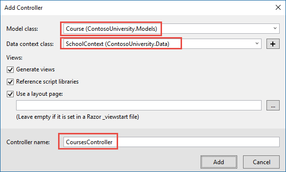
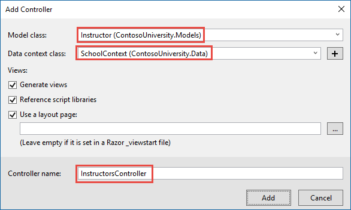
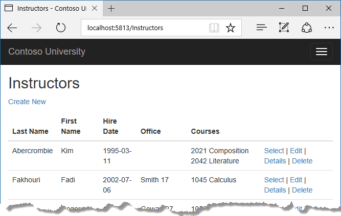
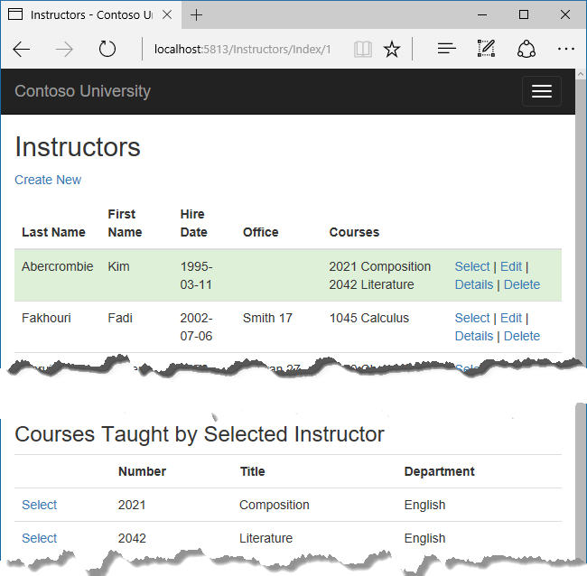

# 读取关联数据 - ASP.NET Core MVC 与 EF Core 教程 (6 of 10)

作者 [Tom Dykstra](https://github.com/tdykstra) 、 [Rick Anderson](https://twitter.com/RickAndMSFT)

翻译 [刘怡(AlexLEWIS/Forerunner)](http://github.com/alexinea) 

<!--The Contoso University sample web application demonstrates how to create ASP.NET Core 1.1 MVC web applications using Entity Framework Core 1.1 and Visual Studio 2017. For information about the tutorial series, see [the first tutorial in the series](intro.md).-->
Contoso 大学 Web应用程序演示了如何使用 Entity Framework Core 1.1 以及 Visual Studio 2017 来创建 ASP.NET Core 1.1 MVC Web 应用程序。更多信息请参考 [第一节教程](intro.md).

<!--In the previous tutorial you completed the School data model. In this tutorial you'll read and display related data -- that is, data that the Entity Framework loads into navigation properties.-->
在上一篇教程中，你已经完成了 School 数据模型的设计。在本教程中你将读取并显示关联数据——也就是说由 Entity Framework 加载到导航属性中的数据。
 
<!--The following illustrations show the pages that you'll work with.-->
下图展示了你将使用的页面。


<!--## Eager, explicit, and lazy Loading of related data-->
## 对关联数据的预加载、显式加载与延迟加载

<!--There are several ways that Object-Relational Mapping (ORM) software such as Entity Framework can load related data into the navigation properties of an entity:-->
对象关系映射（ORM）软件（例如 Entity Framework）可以通过多种途径加载关联数据到某实体的导航属性中：

<!--* Eager loading. When the entity is read, related data is retrieved along with it. This typically results in a single join query that retrieves all of the data that's needed. You specify eager loading in Entity Framework Core by using the `Include` and `ThenInclude` methods.

  

  You can retrieve some of the data in separate queries, and EF "fixes up" the navigation properties.  That is, EF automatically adds the separately retrieved entities where they belong in navigation properties of previously retrieved entities. For the query that retrieves related data, you can use the `Load` method instead of a method that returns a list or object, such as `ToList` or `Single`.

  

* Explicit loading. When the entity is first read, related data isn't retrieved. You write code that retrieves the related data if it's needed. As in the case of eager loading with separate queries, explicit loading results in multiple queries sent to the database. The difference is that with explicit loading, the code specifies the navigation properties to be loaded. In Entity Framework Core 1.1 you can use the `Load` method to do explicit loading. For example:

  

* Lazy loading. When the entity is first read, related data isn't retrieved. However, the first time you attempt to access a navigation property, the data required for that navigation property is automatically retrieved. A query is sent to the database each time you try to get data from a navigation property for the first time. Entity Framework Core 1.0 does not support lazy loading.-->

* 预加载（Eager Loading）。当实体被读取时，关联数据与其一道被检索。这通常会出现在通过单个连接查询检索所有所需数据的情况中。你在使用 Entity Framework Core 的  `Include` 和 `ThenInclude` 方法时就会指定使用预加载。

  

  你可以在单独的查询中检索一些数据，这样 EF 会「修复」导航属性。这句话的意思是说，在之前检索得出的实体中，EF 会自动为其中的导航属性单独检索，并将所得实体添加到这些导航属性中。对于检索关联数据的查询，你可以使用 `Load` m方法来代替 `ToList` 或 `Single`方法（后者会返回一组或单个结果）。

  

* 显示加载（Explicit Loading）。当实体首次读取时，关联数据并没有被检索出来。关联数据由你自己编写代码来检索。与预加载中加载单独查询相比，显式加载通过向数据库发送多个查询来加载结果。两者的区别在于，在使用显式加载时，需要用代码将数据加载到导航属性中。Entity Framework Core 1.0 不提供显式加载 API。

  

* 延迟加载（Lazy Loading）。当实体首次读取时，关联属性不会被检索。当首次尝试访问导航属性时，将自动检索该导航属性所需的数据。每次尝试获取数据时，只要是首次获取数据都将向数据库发出一次查询。Entity Framework Core 1.0 不支持延迟加载。

<!--### Performance considerations-->
### 性能问题
 
<!--If you know you need related data for every entity retrieved, eager loading often offers the best performance, because a single query sent to the database is typically more efficient than separate queries for each entity retrieved. For example, suppose that each department has ten related courses. Eager loading of all related data would result in just a single (join) query and a single round trip to the database. A separate query for courses for each department would result in eleven round trips to the database. The extra round trips to the database are especially detrimental to performance when latency is high.-->
如果你知道你每个检索的得到的实体都需要关联数据，那么使用预加载（Eager Loading）会性能更好，因为向数据库发送单个查询总比每个检索所得的实体单独向数据库发送请求来得高效。举个例子，假设每个部门有十个与之关联的课程。所有关联数据使用预加载去检索的话，只需要一次（连接）查询、往返数据库一次即可。如果是针对每门课程单独查询，那么将导致十一次往返。当延迟较高时，对数据库的额外往返会对访问性能产生不利影响。

<!--On the other hand, in some scenarios separate queries is more efficient. Eager loading of all related data in one query might cause a very complex join to be generated, which SQL Server can't process efficiently. Or if you need to access an entity's navigation properties only for a subset of a set of the entities you're processing, separate queries might perform better because eager loading of everything up front would retrieve more data than you need. If performance is critical, it's best to test performance both ways in order to make the best choice.-->
另一方面，在某些情况下单独查询效率则会更高。在一个查询中预加载所有关联数据会导致生成非常复杂的、连 SQL Server 对此的处理都不甚高效的连接语句。或者如果你只需要查询某个实体（正在处理的实体集）的导航属性（该实体集的子集），单独查询的执行效率可能会更好一些，因为事先加载所有数据的预加载对你而言显然数据量显得有些多。如果性能对你很重要，最好对两种方式进行对比测试，选出性能最佳者。

<!--## Create a Courses page that displays Department name-->
## 创建显示 Department 名称的 Courses 页

<!--The Course entity includes a navigation property that contains the Department entity of the department that the course is assigned to. To display the name of the assigned department in a list of courses, you need to get the Name property from the Department entity that is in the `Course.Department` navigation property.-->

Course 实体所包含的导航属性中含有课程所分配到的部门的 Department 实体。为了显示这些课程所分配到的部门的名称，你需要从 Department 实体中获取 Name 属性，该属性位于 `Course.Department` 导航属性之中。

<!--Create a controller named CoursesController for the Course entity type, using the same options for the **MVC Controller with views, using Entity Framework** scaffolder that you did earlier for the Students controller, as shown in the following illustration:-->

为 Course 实体类型创建名为 CoursesController 的控制器，使用与先前你为 Students 控制器一样配置的**使用 Entity Framework、带有视图的 MVC 控制器**基架，如下图所示：



<!--Open *CoursesController.cs* and examine the `Index` method. The automatic scaffolding has specified eager loading for the `Department` navigation property by using the `Include` method.-->
打开 *CourseController.cs* 文件，检查 `Index` 方法。自动化的基架使用 `Include` 方法来指定针对 `Department` 导航属性的加载为预加载方式。

<!--Replace the `Index` method with the following code that uses a more appropriate name for the `IQueryable` that returns Course entities (`courses` instead of `schoolContext`):-->
用以下代码替换 `Index` 方法，并使用一个更合适的名称为 `IQueryable` 回 Course 实体（用 `courses` 代替 `schoolContext`）：

[!code-csharp[Main](intro/samples/cu/Controllers/CoursesController.cs?name=snippet_RevisedIndexMethod)]

<!--Open *Views/Courses/Index.cshtml* and replace the template code with the following code. The changes are highlighted:-->
打开 *Views/Courses/Index.cshtml* 文件，用以下代码代替模板代码。改动高亮部分：

[!code-html[](intro/samples/cu/Views/Courses/Index.cshtml?highlight=4,7,15-17,34-36,44)]

<!--You've made the following changes to the scaffolded code:-->
如此，你针对基架代码做了如下变更：

<!--* Changed the heading from Index to Courses.

* Added a **Number** column that shows the `CourseID` property value. By default, primary keys aren't scaffolded because normally they are meaningless to end users. However, in this case the primary key is meaningful and you want to show it.

* Changed the **Department** column to display the department name. The code displays the `Name` property of the Department entity that's loaded into the `Department` navigation property:-->
* 将标题从 Index 改成了 Courses。

* 增加了一个用于显示 `CourseID` 属性值的 **Number** 列。默认情况下，并不显示主键，因为通常情况下队最终用户无意义。不过在本例中主键是有意义的，所以你想把它显示出来。

* 添加 **Department** 列。注意 **Department** 列显示的是被加载到 `Department` 导航属性的 Department 实体的 `Name` 属性：

  ```html
  @Html.DisplayFor(modelItem => item.Department.Name)
  ```

<!--Run the page (select the Courses tab on the Contoso University home page) to see the list with department names.-->
运行页面（在 Contoso University 首页选择 Courses 标签），查看部门名称列表。


<!--## Create an Instructors page that shows Courses and Enrollments-->
## 创建展示 Courses 和 Enrollments  的 Instructors 页

<!--In this section you'll create a controller and view for the Instructor entity in order to display the Instructors page:-->
在本节中你将学习为 Instructor 实体创建控制器和视图，用于显示 Instructor 页面：


<!--This page reads and displays related data in the following ways:-->
该页面以以下方式读取并显示关联数据：

<!--* The list of instructors displays related data from the OfficeAssignment entity. The Instructor and OfficeAssignment entities are in a one-to-zero-or-one relationship. You'll use eager loading for the OfficeAssignment entities. As explained earlier, eager loading is typically more efficient when you need the related data for all retrieved rows of the primary table. In this case, you want to display office assignments for all displayed instructors.

* When the user selects an instructor, related Course entities are displayed. The Instructor and Course entities are in a many-to-many relationship. You'll use eager loading for the Course entities and their related Department entities. In this case, separate queries might be more efficient because you need courses only for the selected instructor. However, this example shows how to use eager loading for navigation properties within entities that are themselves in navigation properties.

* When the user selects a course, related data from the Enrollments entity set is displayed. The Course and Enrollment entities are in a one-to-many relationship. You'll use separate queries for Enrollment entities and their related Student entities.-->
* 教师列表中显示来自 OfficeAssignment 实体的关联数据。Instructor 和 OfficeAssignment 实体之间的关系是一对零或一的关系。你需要为 OfficeAssignment 使用预加载的方式。如前所述，在你需要为所有从主表中检索出的结果添加关联数据的时候，预加载方式通常会比较高效。在本例中，你希望显示所有教师分配的办公室。

* 当用户选择教师时，与之相关的 Course 实体就会被显示。Instructor 和 Course 实体之间是多对多的关系。你将使用预加载的方式加载 Course 实体以及它相关的 Department 实体。在本例中，单独查询的性能会更好一些，因为你需要的课程信息只是为了选择教师。不过在本例中演示了如何利用预加载的方法加载自己就在当行属性的实体内的导航属性的数据

* 当用户选择一门课程后，来自 Enrollments 实体的关联数据被显示出来。Course 和 Enrollment 实体之间是一对多的关系。你将使用单独查询的方法检索 Enrollment 实体以及与之相关的 Student 实体。

<!--### Create a view model for the Instructor Index view-->
### 创建用于 Instructor 索引视图的视图模型

<!--The Instructors page shows data from three different tables. Therefore, you'll create a view model that includes three properties, each holding the data for one of the tables.-->
Instructors 页面中显示的数据来自三张不同的表。因此，你需要创建一个包含三个属性的视图，每一个属性对用一张表的数据。

<!--In the *SchoolViewModels* folder, create *InstructorIndexData.cs* and replace the existing code with the following code:-->
在 *SchoolViewModels* 文件夹中创建 *InstructorIndexData.cs* 文件，并用以下代码替换已存在的代码：

[!code-csharp[Main](intro/samples/cu/Models/SchoolViewModels/InstructorIndexData.cs)]

<!--### Create the Instructor controller and views-->
### 创建 Instructor 控制器和视图

<!--Create an Instructors controller with EF read/write actions as shown in the following illustration:-->
创建一个带有 EF 读写操作的 Instructors 控制器，如下图所示：



<!--Open *InstructorsController.cs* and add a using statement for the ViewModels namespace:-->
打开 *InstructorsController.cs* 文件并添加添加一句 using 语句来启用视图模型的命名空间：

[!code-csharp[Main](intro/samples/cu/Controllers/InstructorsController.cs?name=snippet_Using)]

<!--Replace the Index method with the following code to do eager loading of related data and put it in the view model.-->
用以下代码替换 Index 方法中的代码，这段代码将预加载关联数据并将之放入视图模型中。

[!code-csharp[Main](intro/samples/cu/Controllers/InstructorsController.cs?name=snippet_EagerLoading)]

<!--The method accepts optional route data (`id`) and a query string parameter (`courseID`) that provide the ID values of the selected instructor and selected course. The parameters are provided by the **Select** hyperlinks on the page.-->
方法接受可选的代表所选教师 ID 值的路由数据（`id`）以及代表所选课程 ID 值的查询字符串参数（`courseID`）。这些参数都由页面上的 **Select** 超链所提供。

<!--The code begins by creating an instance of the view model and putting in it the list of instructors. The code specifies eager loading for the `Instructor.OfficeAssignment` and the `Instructor.CourseAssignments` navigation properties. Within the `CourseAssignments` property, the `Course` property is loaded, and within that, the `Enrollments` and `Department` properties are loaded, and within each `Enrollment` entity the `Student` property is loaded.-->
这段代码首选创建了一个视图模型的示例，而后将教师列表放入其中。代码为 `Instructor.CourseAssignments` 和`Instructor.OfficeAssignment` 导航属性指定了预加载的方法。在 `CourseAssignments` 属性中， `Enrollments`  和 `Department` 属性都被加载了，在每一个 `Enrollment` 实体中e `Student` 属性也同样被加载了。

[!code-csharp[Main](intro/samples/cu/Controllers/InstructorsController.cs?name=snippet_ThenInclude)]

<!--Since the view always requires the OfficeAssignment entity, it's more efficient to fetch that in the same query. Course entities are required when an instructor is selected in the web page, so a single query is better than multiple queries only if the page is displayed more often with a course selected than without.-->
由于视图一直需要 OfficeAssignment 实体，因此在同一个请求中提取它会更有效率。当在页面中选中一个教师时需要 Course 实体，所以当页面会比较频繁地需要显示课程数据，那么单一查询明显优于多个查询。

The code repeats `CourseAssignments` and `Course` because you need two properties from `Course`. The first string of `ThenInclude` calls gets `CourseAssignment.Course`, `Course.Enrollments`, and `Enrollment.Student`.

[!code-csharp[Main](intro/samples/cu/Controllers/InstructorsController.cs?name=snippet_ThenInclude&highlight=3-6)]

At that point in the code, another `ThenInclude` would be for navigation properties of `Student`, which you don't need. But calling `Include` starts over with `Instructor` properties, so you have to go through the chain again, this time specifying `Course.Department` instead of `Course.Enrollments`.

[!code-csharp[Main](intro/samples/cu/Controllers/InstructorsController.cs?name=snippet_ThenInclude&highlight=7-9)]

The following code executes when an instructor was selected. The selected instructor is retrieved from the list of instructors in the view model. The view model's `Courses` property is then loaded with the Course entities from that instructor's `CourseAssignments` navigation property.

[!code-csharp[Main](intro/samples/cu/Controllers/InstructorsController.cs?range=54-60)]

The `Where` method returns a collection, but in this case the criteria passed to that method result in only a single Instructor entity being returned. The `Single` method converts the collection into a single Instructor entity, which gives you access to that entity's `CourseAssignments` property. The `CourseAssignments` property contains `CourseAssignment` entities, from which you want only the related `Course` entities.

You use the `Single` method on a collection when you know the collection will have only one item. The Single method throws an exception if the collection passed to it is empty or if there's more than one item. An alternative is `SingleOrDefault`, which returns a default value (null in this case) if the collection is empty. However, in this case that would still result in an exception (from trying to find a `Courses` property on a null reference), and the exception message would less clearly indicate the cause of the problem. When you call the `Single` method, you can also pass in the Where condition instead of calling the `Where` method separately:

```csharp
.Single(i => i.ID == id.Value)
```

Instead of:

```csharp
.Where(I => i.ID == id.Value).Single()
```

Next, if a course was selected, the selected course is retrieved from the list of courses in the view model. Then the view model's `Enrollments` property is loaded with the Enrollment entities from that course's `Enrollments` navigation property.

[!code-csharp[Main](intro/samples/cu/Controllers/InstructorsController.cs?range=62-67)]

### Modify the Instructor Index view

In *Views/Instructors/Index.cshtml*, replace the template code with the following code. The changes are highlighted.

[!code-html[](intro/samples/cu/Views/Instructors/Index1.cshtml?range=1-64&highlight=1,3-7,18-19,41-54,56)]

You've made the following changes to the existing code:

* Changed the model class to `InstructorIndexData`.

* Changed the page title from **Index** to **Instructors**.

* Added an **Office** column that displays `item.OfficeAssignment.Location` only if `item.OfficeAssignment` is not null. (Because this is a one-to-zero-or-one relationship, there might not be a related OfficeAssignment entity.)

  ```html
  @if (item.OfficeAssignment != null)
  {
      @item.OfficeAssignment.Location
  }
  ```

* Added a **Courses** column that displays courses taught by each instructor.

* Added code that dynamically adds `class="success"` to the `tr` element of the selected instructor. This sets a background color for the selected row using a Bootstrap class.

  ```html
  string selectedRow = "";
  if (item.ID == (int?)ViewData["InstructorID"])
  {
      selectedRow = "success";
  }
  ```

* Added a new hyperlink labeled **Select** immediately before the other links in each row, which causes the selected instructor's ID to be sent to the `Index` method.

  ```html
  <a asp-action="Index" asp-route-id="@item.ID">Select</a> |
  ```

Run the application and select the Instructors tab. The page displays the Location property of related OfficeAssignment entities and an empty table cell when there's no related OfficeAssignment entity.



In the *Views/Instructors/Index.cshtml* file, after the closing table element (at the end of the file), add the following code. This code displays a list of courses related to an instructor when an instructor is selected.

[!code-html[](intro/samples/cu/Views/Instructors/Index1.cshtml?range=66-101)]

This code reads the `Courses` property of the view model to display a list of courses. It also provides a **Select** hyperlink that sends the ID of the selected course to the `Index` action method.

Run the page and select an instructor. Now you see a grid that displays courses assigned to the selected instructor, and for each course you see the name of the assigned department.



After the code block you just added, add the following code. This displays a list of the students who are enrolled in a course when that course is selected.

[!code-html[](intro/samples/cu/Views/Instructors/Index1.cshtml?range=103-125)]

This code reads the Enrollments property of the view model in order to display a list of students enrolled in the course.

Run the page and select an instructor. Then select a course to see the list of enrolled students and their grades.


## Explicit loading

When you retrieved the list of instructors in *InstructorsController.cs*, you specified eager loading for the `CourseAssignments` navigation property.

Suppose you expected users to only rarely want to see enrollments in a selected instructor and course. In that case, you might want to load the enrollment data only if it's requested. To see an example of how to do explicit loading, replace the `Index` method with the following code, which removes eager loading for Enrollments and loads that property explicitly. The code changes are highlighted.

[!code-csharp[Main](intro/samples/cu/Controllers/InstructorsController.cs?name=snippet_ExplicitLoading&highlight=25-31)]

The new code drops the *ThenInclude* method calls for enrollment data from the code that retrieves instructor entities. If an instructor and course are selected, the highlighted code retrieves Enrollment entities for the selected course, and Student entities for each Enrollment.
 

<!--Run the Instructor Index page now and you'll see no difference in what's displayed on the page, although you've changed how the data is retrieved.-->
运行 Instructor 索引页，你能看到页面山显示的内容没啥区别，但实际上你已经改变了检索数据的方式。

<!--## Summary-->
## 总结

<!--You've now used eager loading with one query and with multiple queries to read related data into navigation properties. In the next tutorial you'll learn how to update related data.-->
你现在已经对单一查询和多查询使用预加载来读取关联数据到导航属性。下一篇教程你讲学习如何更新关联数据。

>[!div class="step-by-step"]
>[上一节](complex-data-model.md)
>[下一节](update-related-data.md)  
