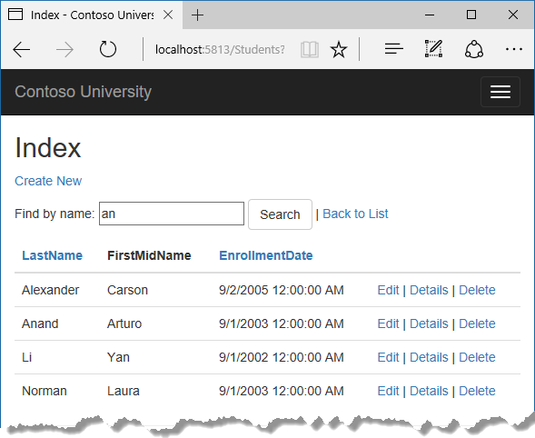
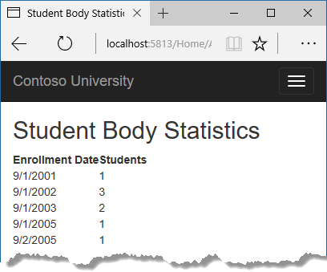

# 排序， 过滤， 分页与分组 - EF Core 与 ASP.NET Core MVC 教程 (3 of 10)

作者 [Tom Dykstra](https://github.com/tdykstra) ， [Rick Anderson](https://twitter.com/RickAndMSFT)

翻译 [谢炀（Kiler）](https://github.com/kiler398/) 

Contoso 大学 Web应用程序演示了如何使用 Entity Framework Core 1.1 以及 Visual Studio 2017 来创建 ASP.NET Core 1.1 MVC Web 应用程序。更多信息请参考 [第一节教程](intro.md).

在之前的教程中你实现了一套对 Student实体进行基本 CRUD 操作的 Web 页面。在本教程中，您将为 Index 页添加排序、筛选和分页的功能。您还会创建一个简单的分组页面。

下图显示了当你完成本教程后的页面截屏。用户可以点击行标题来进行排序，并且多次点击标题可以让你在升序和降序之间切换。


## 将排序链接添加到学生的 Index 页

要为学生 Index 页添加排序功能，你需要往学生控制器中的 `Index` 方法和学生 Index 视图添加代码。

### 在 Index 方法中添加排序功能

在 *StudentsController.cs* 代码中，使用下面的代码替换 `Index` 方法：

[!code-csharp[Main](intro/samples/cu/Controllers/StudentsController.cs?name=snippet_SortOnly)]

这段代码从 URL 中接收 `sortOrder` 查询字符串，该字符串是由 ASP.NET MVC 作为参数传递给动作方法的。该参数可以是 ”Name” 或 ”Date” 之一，默认的排序规则是升序。还可以有一条下划线和 ”desc” 来指示这是一个降序排序。

Index 页面第一次请求时，没有任何查询字符串被传递，学生们按照 LastName 升序排序显示。这是由 `switch` 语句中的 default 条件指定的，当用户点击某列的标题超链接时，相应的 `sortOrder` 值通过查询字符串传递到控制器中。

两个 `ViewData` 变量 (NameSortParm and DateSortParm)被用于为视图提供合适的查询字符串值

[!code-csharp[Main](intro/samples/cu/Controllers/StudentsController.cs?name=snippet_SortOnly&highlight=3-4)]


这里使用了三元表达式。第一个指定假如 `sortOrder` 参数为null或为空，则 NameSortParm 应设置为 ”name_desc” ，否则将其设置为空字符串。这两个语句为视图中列标题的超链接提供下列排序规则：

|  当前排序规则         | Last Name 链接       | Date 链接      |
|:--------------------:|:-------------------:|:--------------:|
| Last Name ascending  | descending          | ascending      |
| Last Name descending | ascending           | ascending      |
| Date ascending       | ascending           | descending     |
| Date descending      | ascending           | ascending      |


该方法使用 LINQ to Entities 来指定要作为排序依据的列。代码在switch语句前创建了一个 `IQueryable` 变量，然后在 switch 语句中修改它，并在 `switch` 语句后调用 `ToListAsync` 方法。当您创建和修改 `IQueryable` 变量时，没有查询被实际发送到数据库执行。直到您将 `IQueryable` 对象通过调用一种方法如 `ToListAsync` 转换为一个集合时才进行真正的查询。因此，直到`return View` 语句之前，这段代码的查询都不会执行。

本代码可能会有大量的列。 [本系列的最后一个教程](advanced.md#dynamic-linq) 显示了如何编写代码，让您传递字符串变量中的 `OrderBy` 列的名称。

### 为学生 Index 视图添加行标题超链接

在 *Views/Students/Index.cshtml*中，使用下面高亮的代码添加列标题链接。

[!code-html[](intro/samples/cu/Views/Students/Index2.cshtml?highlight=16,22)]

这段代码使用 `ViewData` 的属性来设置超链接和查询字符串值。

运行该页面，点击 **Last Name** 和 **Enrollment Date** 行标题，观察排序的变化。


## 向学生 Index 页中添加搜索框

要在 Index 页中增加搜索功能，你需要向视图中添加一个文本框及一个提交按钮并在 `Index`方法中做相应的修改。文本框允许你输入要在名字和姓氏中检索的字符串。

### 向 Index 方法中添加筛选功能

在 *StudentsController.cs* 代码中，使用下面的代码替换 `Index` 方法（高亮部分）：

[!code-csharp[Main](intro/samples/cu/Controllers/StudentsController.cs?name=snippet_SortFilter&highlight=1,5,9-13)]

您已经将 `searchString` 参数添加到e `Index` 方法，搜索字符串是从你将添加到 Index 视图的搜索文本框中输入的，您也已经添加用于在姓名中搜索指定字符串的 Linq 语句。只有在搜索字符串有值时，搜索部分的语句才会执行。
 
> [!NOTE]
> 在这里你调用了 `IQueryable` 对象的 `Where` 方法，服务器上会执行筛选操作. 在某些场景你可以在内存对象中作为一个扩展方法调用 `Where` 。 (例如， 假设您将引用更改为 `_context.Students` ，而不是使用一个 EF `DbSet`，它引用一个返回 `IEnumerable` 集合的存储库方法。) 。一般来说结果是相同的，但在某些情况下可能会有所不同.
>
>例如，.Net框架中的 `Contains` 方法默认实现不区分大小写的字符串比对。但是 SQL Server 则是由排序规则决定的。默认不区分大小写。你可以调用 `ToUpper` 方法来明确的测试区分大小写*Where(s => s.LastName.ToUpper().Contains(searchString.ToUpper())* 。这将确保结果保持不变，，如果稍后更改代码以使用返回 `IEnumerable` 集合而不是 `IQueryable` 对象的存储库。 （当您在 `IEnumerable` 集合中调用 `Contains` 方法时，您将获得 .NET Framework 实现;当您在 `IQueryable` 对象上调用它时，可以获取数据库提供程序的实现。）但是，这个解决方案有性能损失。 `ToUpper` 代码会把一个函数放在 TSQL SELECT 语句的 WHERE 子句中。 这将阻止优化器使用索引。 鉴于 SQL 主要是不区分大小写的实现，因此最好避免使用 `ToUpper` 代码，直到您迁移到区分大小写的数据存储。

### 向学生 Index 视图中添加一个搜索框

在 *Views/Student/Index.cshtml*中，在table元素之前添加下面高亮的代码以创建一个标题、一个文本框及一个 **搜索** 按钮。

[!code-html[](intro/samples/cu/Views/Students/Index3.cshtml?range=9-23&highlight=5-13)]

这段代码使用 `<form>` [tag helper](https://docs.asp.net/en/latest/mvc/views/tag-helpers/intro.html)添加搜索文本框和按钮。 默认情况下， `<form>` tag helper 使用 POST 提交表单数据，这意味着参数在HTTP消息正文中传递，而不是作为查询字符串传递。 当您指定 HTTP GET 时，表单数据将以 URL 的形式作为查询字符串传递，从而使用户能够将 URL 加入书签。 W3C 指南建议您在操作不会导致更新时使用 GET 。

运行索引页面，输入搜索字符串并提交，检查搜索功能是否正常工作。



注意该 URL 中包含搜索字符串

```html
http://localhost:5813/Students?SearchString=an
```

如果你把页面加入书签，当你打开书签的时候你会重新获取过滤列表，在 `form` 标签中添加 `method="get"` 会导致生成查询字符串。

在现阶段，如果你点击表头标题排序链接你会丢失你在 **Search** 输入框中输入的过滤值。你将会在下一节修复这个问题。

## 向学生 Index 页中添加分页功能

要向 Index 页面添加分页，您需要创建一个 `PaginatedList` 类并使用它的 `Skip` 和 `Take` 语句来过滤服务器上的数据，而不是始终检索数据库表里面的所有行。 然后，您将在 `Index` 方法中进行其他更改，并将分页按钮添加到 `Index` 视图。 下图显示了分页按钮。


在项目目录创建 `PaginatedList.cs` 类， 并把模版代码替换为以下代码。

[!code-csharp[Main](intro/samples/cu/PaginatedList.cs)]

这段代码中的 `CreateAsync`方法将使用页面大小和页码，并将适当的 `Skip` 以及 `Take` 语句应用于 `IQueryable`对象。 当 `ToListAsync`方法 在 `IQueryable`对象上被调用时，它将返回一个仅包含请求的页面的列表。 属性 `HasPreviousPage` 和 `HasNextPage` 用于启用或禁用 **Previous** 和 **Next** 分页按钮。

使用 `CreateAsync` 方法代替构造函数来创建 `PaginatedList<T>` 对象，因为构造函数不能运行异步代码。

## 在 Index 方法中添加分页功能

在 *StudentsController.cs* 中，使用以下代码替换`Index`方法。

[!code-csharp[Main](intro/samples/cu/Controllers/StudentsController.cs?name=snippet_SortFilterPage&highlight=1-5,7,11-18,45-46)]

此代码向方法签名添加页码参数、当前排序参数和当前过滤参数。

```csharp
public async Task<IActionResult> Index(
    string sortOrder,
    string currentFilter,
    string searchString,
    int? page)
```


 
页面第一次显示的时候，或者如果用户没有点击分页或排序链接，则所有参数都将为空。 如果点击分页链接，分页变量将包含要显示的页码。

视图里面的名为 CurrentSort 的 `ViewData` 变量保存具有当前排序信息，因为这个变量必须包含在分页链接中，以便在分页时保持相同排序。

视图里面的名为 CurrentFilter 的 `ViewData` 变量保存当前当前过滤字符串信息。 此值必须包含在分页链接中，以便在分页期间保留过滤字符串，而且并且在重新显示页面时必须将其还原到文本框。

如果在分页的过程中更改了搜索字符串，则页面当前页码必须重置为1，因为新的过滤字符串可能导致显示不同的数据。 当在文本框中输入值并按下提交按钮时，搜索字符串将被更改。 在这种情况下，`searchString` 参数不为空。

```csharp
if (searchString != null)
{
    page = 1;
}
else
{
    searchString = currentFilter;
}
```

在 `Index` 方法的末尾， `PaginatedList.CreateAsync` 方法将学生查询转换为支持分页的集合类型的单页学生数据。 然后当前页的学生数据被传递给视图。

```csharp
return View(await PaginatedList<Student>.CreateAsync(students.AsNoTracking(), page ?? 1, pageSize));
```


 
 `PaginatedList.CreateAsync` 方法需要一个页码参数。 这两个问号表示合并运算符。 合并运算符定义可空类型的默认值; 表达式 `(page ?? 1)`表示如果具有值，则返回 `page` 的值，如果 `page` 为空，则返回1。

## 向学生 Index 视图添加分页链接

在 *Views/Students/Index.cshtml* 中，使用下面的代码替换原来的代码，高亮部分显示了我们所做的更改：

[!code-html[](intro/samples/cu/Views/Students/Index.cshtml?highlight=1,27,30,33,61-79)]

页面顶部的 `@model` 语句指示视图现在获取的是 `PaginatedList<T>` 对象而不是 `List<T>` 对象。

列标题链接使用查询字符串将当前搜索字符串传递给控制器，以便用户可以对过滤查询结果进行排序：
 
```html
<a asp-action="Index" asp-route-sortOrder="@ViewData["DateSortParm"]" asp-route-currentFilter ="@ViewData["CurrentFilter"]">Enrollment Date</a>
```

分页按钮由 tag helpers 生成：

```html
<a asp-action="Index"
   asp-route-sortOrder="@ViewData["CurrentSort"]"
   asp-route-page="@(Model.PageIndex - 1)"
   asp-route-currentFilter="@ViewData["CurrentFilter"]"
   class="btn btn-default @prevDisabled btn">
   Previous
</a>
```

运行页面。


点击不同排序中的分页链接以确保分页功能工作。 然后输入搜索字符串，然后再次尝试分页，以验证分页也可以正确排序和过滤。

## 创建一个显示学生统计信息的 About 页面

对于 Contoso 大学网站的 **About** 页面，将显示每个报名日期有多少学生报名。 这需要对学员进行分组和简单统计计算。 要完成此操作，您将执行以下操作：

* 为需要传递给视图的数据创建视图模型类。

* 修改 Home 控制器中的 About 方法。

* 修改 About 视图。

### 创建视图模型

在 *Models*  目录中创建 *SchoolViewModels* 目录。

在新目录中，添加类文件 EnrollmentDateGroup.cs 用下列代码替换掉模版代码。

[!code-csharp[Main](intro/samples/cu/Models/SchoolViewModels/EnrollmentDateGroup.cs)]

### 修改 Home 控制器

在 *HomeController.cs* 文件中，在文件顶部添加一下 Using 语句：

[!code-csharp[Main](intro/samples/cu/Controllers/HomeController.cs?name=snippet_Usings1)]

 
在该类的开放大括号之后立即为数据库上下文添加一个类变量，并从ASP.NET Core DI获取上下文的实例：
Add a class variable for the database context immediately after the opening curly brace for the class, and get an instance of the context from ASP.NET Core DI:

[!code-csharp[Main](intro/samples/cu/Controllers/HomeController.cs?name=snippet_AddContext&highlight=3,5,7)]

使用下列代码替换掉 `About` 方法：

[!code-csharp[Main](intro/samples/cu/Controllers/HomeController.cs?name=snippet_UseDbSet)]

LINQ 语句通过报名日期对学生实体进行分组，计算每个组中的实体数，并将结果存储在 `EnrollmentDateGroup` 视图模型对象的集合中。

> [!NOTE] 
> 在 1.0 版本的 Entity Framework Core 中，会将整个结果集返回给客户端，并在客户端上进行分组。 这在某些情况下可能会导致性能问题。 确保使用生产数据量测试性能，并在必要时侯使用原始 SQL 在服务器上进行分组。 有关如何使用原始 SQ L的信息，请参阅 [本系列的最后一个教程](advanced.md).
 
### 修改 About 视图

使用下列代码替换掉 *Views/Home/About.cshtml* 中的代码：

[!code-html[](intro/samples/cu/Views/Home/About.cshtml)]

运行应用程序，然后单击 **About** 链接。 每个报名日期的学生总数显示在表格中。



## 总结

在本教程中，你学会了编写排序、筛选、分页及分组功能，下一节中我们将通过迁移来处理数据模型的变化。

>[!div class="step-by-step"]
[上一节](crud.md)
[下一节](migrations.md)  
