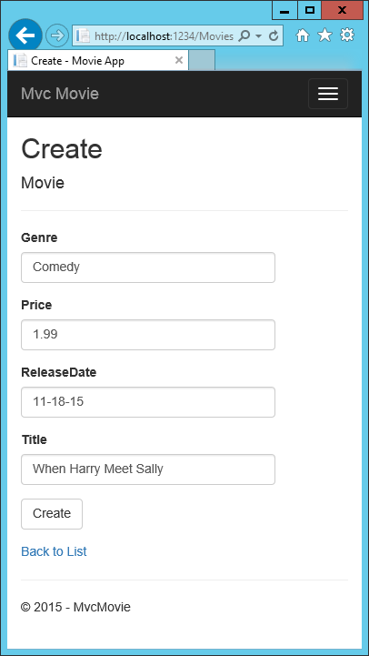
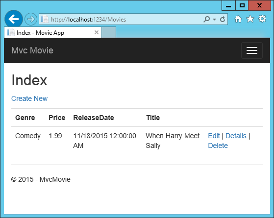

## 测试一下

* 运行应用程序并点击 **Mvc Movie** 链接。
* 点击 **Create New** 链接并创建电影记录。

  

* 你也许不能在 `Price` 字段中输入小数点或逗号。为了实现对非英语环境中用逗号(",")来表示小数点，以及非美国英语日期格式的 [jQuery 验证](http://jqueryvalidation.org/) ，你必须采取措施国际化你的应用程序。查看 [额外的资源](#additional-resources) 获取更多的信息。现在仅仅输入完整的数字，比如10。

<a name=displayformatdatelocal></a>

* 在某些地区你需要指定日期格式。查看下方高亮代码。

[!code-csharp[Main](../../tutorials/first-mvc-app/start-mvc/sample/MvcMovie/Models/MovieDateFormat.cs?name=snippet_1&highlight=2,10)]

我们在后续的教程会谈到 `DataAnnotations`。

点击 **Create** 提交表单到服务器，将电影数据保存到数据库中。然后重定向到 */Movies* URL ，你可以在列表中看到新创建的电影。



再创建几个电影条目。尝试 **Edit** 、 **Details** 、 **Delete** 链接来执行各个功能。

## 依赖注入

打开 *Startup.cs* 类文件查看 `ConfigureServices`:

[!code-csharp[Main](../../tutorials/first-mvc-app/start-mvc/sample/MvcMovie/Startup.cs?name=snippet_cs&highlight=7-8)]

上面高亮代码显示 movie 数据库上下文已经倍添加到 [依赖注入](xref:fundamentals/dependency-injection) 容器。 代码 `services.AddDbContext<MvcMovieContext>(options =>` 后面的没有被现实(查看代码)，使用连接字符串来指定数据库。`=>` is a [lambda 操作](https://docs.microsoft.com/dotnet/articles/csharp/language-reference/operators/lambda-operator).

打开 *Controllers/MoviesController.cs* 文件查看构造器：

<!-- l.. Make copy of Movies controller because we comment out the initial index method and update it later  -->

[!code-csharp[Main](../../tutorials/first-mvc-app/start-mvc/sample/MvcMovie/Controllers/MC1.cs?name=snippet_1)] 

构造器使用 [依赖注入](xref:fundamentals/dependency-injection) 来注入数据库上下文 (`MvcMovieContext `) 到控制器， 数据库上下文在控制器的所有的 [CRUD](https://en.wikipedia.org/wiki/Create,_read,_update_and_delete) 方法中使用。

<a name=strongly-typed-models-keyword-label></a>

## 强类型模型与 @model 关键字

在之前的教程中，你看到了控制器（Controller）如何通过 `ViewData` 字典传递数据到一个视图（View）。 `ViewData` 字典是一个动态类型对象，它提供了一种便捷的后期绑定方式将信息传递给视图。

MVC 也提供了传递强类型数据给视图的能力。这种强类型的方式可以提供给你更好的代码编译时检查，并在 Visual Studio（VS） 中具有更丰富的 [智能感知](https://msdn.microsoft.com/en-us/library/hcw1s69b.aspx) 。VS 中的基架机制在为 `MoviesController` 类创建方法（Action）和视图（View）的时候就采用了这种方式（即，传递强类型模型）。

检查在 *Controllers/MoviesController.cs* 文件中生成的 `Details` 方法：

[!code-csharp[Main](../../tutorials/first-mvc-app/start-mvc/sample/MvcMovie/Controllers/MoviesController.cs?name=snippet_details)]

`id` 参数一般作为路由数据传递，例如 `http://localhost:5000/movies/details/1` 将：

* 设置为 `movies`（对应第一个 URL 段）
* Action 设置为 `details`（对应第二个 URL 段）
* id 设置为 1（对应最后一个 URL 段）

你也可以向下面一样通过查询字符串（Query String）传递 `id` ：

`http://localhost:1234/movies/details?id=1`

`id` 参数被定义为 [可空类型](https://docs.microsoft.com/dotnet/csharp/programming-guide/nullable-types/index) (`int?`) 来对应没有ID值的情况。
 
[lambda 表达式](https://docs.microsoft.com/dotnet/articles/csharp/programming-guide/statements-expressions-operators/lambda-expressions) 传给 `SingleOrDefaultAsync` 方法来选择匹配路由数据以及查询字符串的电影实体类。

```csharp
var movie = await _context.Movie
    .SingleOrDefaultAsync(m => m.ID == id);
```

如果电影被找到了， `Movie` 模型（Model）的实例将被传递给 `Details` 视图（View）。

```csharp
return View(movie);
   ```

查看  *Views/Movies/Details.cshtml* 文件的内容：

[!code-html[Main](../../tutorials/first-mvc-app/start-mvc/sample/MvcMovie/Views/Movies/DetailsOriginal.cshtml)]

通过在视图（View）文件顶部加入一个 `@model` 语句，你可以指定视图（View）所期望的对象类型。当你创建这个 MoviesController 时， Visual Studio 自动在 *Details.cshtml* 顶部加入了 `@model` 语句后面的部分。

```HTML
@model MvcMovie.Models.Movie
   ```

`@model` 指令允许你访问从控制器（Controller）传递给视图（View）的这个强类型电影 `Model` 对象。例如，在 *Details.cshtml* 视图中，代码用强类型 `Model` 对象传递所有的电影字段到 `DisplayNameFor` 和 `DisplayFor`  HTML 帮助类（HTML Helper）里。 `Create` 和 `Edit` 方法和视图（View）也传递一个 `Movie` 模型（Model）对象。

检查 *Index.cshtml* 视图（View）和 MoviesController 里的 `Index`方法。注意观察代码在调用 `View` 方法时，是如何创建一个 `列表（List）`  对象的。这段代码将s `Movies` 列表从 `Index` Action 方法传递给视图（View）：

[!code-csharp[Main](../../tutorials/first-mvc-app/start-mvc/sample/MvcMovie/Controllers/MC1.cs?name=snippet_index)]

当你创建这个 MoviesController 时，Visual Studio 自动在 *Index.cshtml* 顶部加入以下 `@model` 语句:

<!-- Copy Index.cshtml to IndexOriginal.cshtml -->

[!code-html[Main](../../tutorials/first-mvc-app/start-mvc/sample/MvcMovie/Views/Movies/IndexOriginal.cshtml?range=1)]

 `@model` 指令允许你访问电影列表这个从控制器（Controller）传递给视图（View）的强类型 `Model` 对象。例如，在 *Index.cshtml* 视图中，代码通过 `foreach` 语句遍历了电影列表这个强类型的  `模型（Model）` 对象。

[!code-html[Main](../../tutorials/first-mvc-app/start-mvc/sample/MvcMovie/Views/Movies/IndexOriginal.cshtml?highlight=1,31,34,37,40,43,46-48)]

因为 `模型（Model）` 对象是强类型的（作为 `IEnumerable<Movie>` 对象），循环中的每一个 item 的类型被类型化为 `Movie` 。除了其他好处外，这意味着你将获得代码的编译时检查以及在代码编辑器里得到完整的 [智能感知](https://msdn.microsoft.com/en-us/library/hcw1s69b.aspx) 支持：
 
