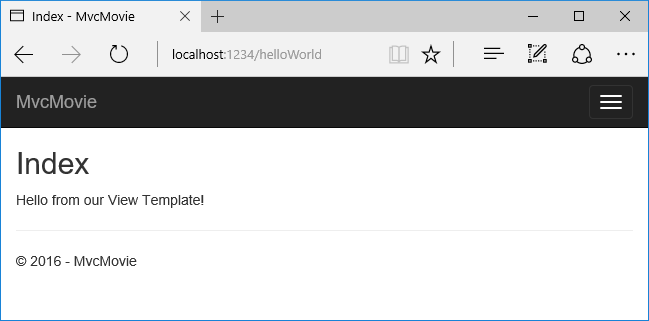
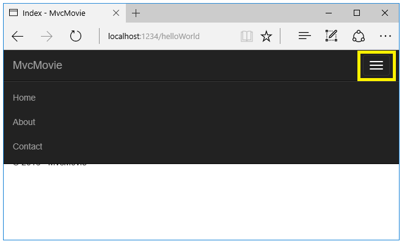
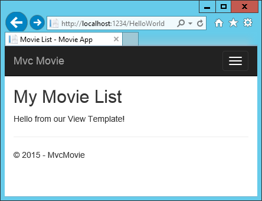
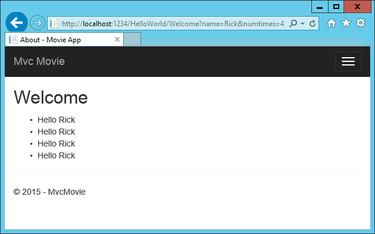

用以下代码替换 Razor 视图文件 *Views/HelloWorld/Index.cshtml* :

[!code-HTML[Main](../../tutorials/first-mvc-app/start-mvc/sample/MvcMovie/Views/HelloWorld/Index.cshtml)]

导航到 `http://localhost:xxxx/HelloWorld`。 `HelloWorldController`   的 `Index` 方法只干一件事——运行 `return View();` 语句来引导控制器方法使用指定的视图模板文件，为浏览器渲染最终的响应结果。 因为没有明确指定所使用视图模板的文件名，MVC 默认使用 */Views/HelloWorld* 文件夹中的 *Index.cshtml* 视图文件。下图显示了在视图中硬编码的字符串 "Hello from our View Template!" 。



If your browser window is small (for example on a mobile device), you might need to toggle (tap) the [Bootstrap navigation button](http://getbootstrap.com/components/#navbar) in the upper right to see the **Home**, **About**, and **Contact** links.
如果浏览器窗体比较小（比如在手机设备上），可能需要切换（点击）右上方的  [Bootstrap navigation button](http://getbootstrap.com/components/#navbar) 才能看到 **Home**、 **About** 以及 **Contact** 这些链接。



## 改变视图和布局页

点击菜单链接 (**MvcMovie**, **Home**, **About**)。每个页面都显示相同的菜单布局。菜单布局在 *Views/Shared/_Layout.cshtml* 文件中实现。打开 *Views/Shared/_Layout.cshtml* 文件。

[布局](xref:mvc/views/layout) 模板允许你在一处指定网站的 HTML 容器布局，然后在网站下的多个页面中使用。找到 `@RenderBody()` 那行。 `@RenderBody()` 是一个占位符，是你所有指定视图的显示位置，“包裹在”布局页内。例如，点击 **About** 链接， **Views/Home/About.cshtml**  视图就会在 `@RenderBody()` 方法内渲染。

## 在布局文件中修改菜单标题

改变标题元素的内容。在布局模板中将锚(*即 A 标签,译者注*)文本改成 "MVC Movie" ，控制器将 `Home`  改成 `Movies` ，如下列高亮显示的：

[!code-html[Main](../../tutorials/first-mvc-app/start-mvc/sample/MvcMovie/Views/Shared/_Layout.cshtml?highlight=7,31)]

>[!WARNING]
> 我们尚未实现 `Movies` 控制器，故若你点击该链接，将会得到404错误（文件未找到）。

保存修改并且点击 **About** 链接。注意浏览器选项卡标题都会显示 **About - Movie App** 而不是  **About - Mvc Movie** ，点击 **Contact** 链接，注意到还是显示 **Movie App**。我们只在布局模板中改变一次，网站中的所有页面都显示新的链接和新的标题。

查看一下 *Views/_ViewStart.cshtml* 文件：
 
```HTML
@{
    Layout = "_Layout";
}
```
 
 *Views/_ViewStart.cshtml* 文件将 *Views/Shared/_Layout.cshtml* 文件引入每个视图中。可以利用 `Layout` 属性设置不同的布局视图，或者将其设置成 `null` 这样就不会使用布局视图了。

现在，让我们改变 `Index` 视图的标题。

打开 *Views/HelloWorld/Index.cshtml* 。这里有2个地方需要改变：

   * 出现在浏览器上的标题文本
   * 二级标题 (`<h2>` 元素)。

你可以一点点改，这样就可以看到哪些代码改变了应用程序的哪些地方。


```HTML
@{
    ViewData["Title"] = "Movie List";
}

<h2>My Movie List</h2>

<p>Hello from our View Template!</p>
```

在以上代码中`ViewData["Title"] = "Movie List";` 将  `ViewData` 字典数据的 Title 属性设置为 "Movie List"。 `Title` 属性被用在布局页的 `<title>` Html元素中：


```HTML
<title>@ViewData["Title"] - Movie App</title>
   ```
 
保存更改并浏览 `http://localhost:xxxx/HelloWorld` 页面。注意浏览器标题、主标题和副标题都变化了（如果你没看到变化，可能因为缓存的缘故，在浏览器中按下 Ctrl+F5 强制刷新）。浏览器标题由我们设置在 **Index.cshtml** 视图模板中的 ``ViewData["Title"]`` 以及位于布局页的 "- Movie App" 组合构成。

同时注意， *Index.cshtml* 视图模板的内容是怎样和 *Views/Shared/_Layout.cshtml* 视图模板合并的，和一个HTML响应是怎样被发送到浏览器的。布局模板非常易于进行作用于应用程序中所有页面的修改。了解更多请参考 [布局](../../mvc/views/layout.md)。


 
不过，我们的这点“数据”（本例中的消息 "Hello from our View Template!"）还是硬编码的。MVC 应用程序里已经有了个“V”（View），我们也已经创建了一个“C”（Controller），但现在还没有“M”（Model）。接下来我们将快速展示如何创建数据库并从中搜索模型数据。

## 从控制器传递数据到视图

在谈到数据库和模型之前，让我们先讨论从控制器传递信息到视图。控制器类在响应传入的 URL 请求时被调用。控制器类是编写代码处理传入的浏览器请求，从数据库中检索数据，并最终决定发送什么类型的响应返回给浏览器的地方。然后可以在控制器中使用视图模板生成和格式化 HTML 来响应给浏览器。

控制器负责提供所需要的任何数据或者对象，以便视图模板向浏览器呈现响应。最佳实践：视图模板**不**应该执行业务逻辑或者直接与数据库进行交互，而应该只使用控制器提供给它的数据。保持这种 “关注点分离” 有助于保持你的代码整洁，可测试以及更易于维护。

目前， `HelloWorldController` 类中的 `Welcome` 方法接受一个 `name` 和一个 `ID` 参数，然后直接将值输出到浏览器。让我们更改控制器来使用视图模板，而不是让控制器使用字符串呈现这个响应。视图模板将生成一个动态响应，这就意味着需要通过控制器传递恰当的数据给视图以生成响应。要做到这一点，可以让控制器将视图模板所需的动态数据（参数）放在视图模版随后可以访问的 `ViewData` 字典中。 

回到 *HelloWorldController.cs* 文件，在 `Welcome` 方法中添加一个 `Message` 和 `NumTimes` 的值到 `ViewData` 字典中。 `ViewData` 字典是个动态对象，这意味着可以把任何你想要的数据添加进去。在你往里面添加东西之前，  `ViewData` 对象没有已定义的属性。 [MVC 模型绑定系统](xref:mvc/models/model-binding)  自动映射地址栏中查询字符串的命名参数 (`name` and `numTimes`) 到你的方法参数中。完整的 *HelloWorldController.cs* 文件看起来是这样的： 

[!code-csharp[Main](../../tutorials/first-mvc-app/start-mvc/sample/MvcMovie/Controllers/HelloWorldController.cs?name=snippet_5)]

 `ViewData` 字典对象包含将要传递给视图的数据。下一步，需要一个 Welcome 的视图模板。

创建一个 Welcome 视图模版命名为  *Views/HelloWorld/Welcome.cshtml* 。

在 *Welcome.cshtml* 视图模板中创建一个循环来显示 "Hello" `NumTimes` 。用以下代码完全替换 *Views/HelloWorld/Welcome.cshtml* 中的内容：

[!code-html[Main](../../tutorials/first-mvc-app/start-mvc/sample/MvcMovie/Views/HelloWorld/Welcome.cshtml)]

保存修改并打开浏览器，访问这个地址：

`http://localhost:xxxx/HelloWorld/Welcome?name=Rick&numtimes=4`

数据从 URL 中获取并用 [模型绑定器](xref:mvc/models/model-binding) 将数据传递给控制器。控制器将数据封装到 `ViewData` 字典中，并将对象传递到视图里。然后，视图将数据以 HTML 的形式渲染到浏览器中。



在上面的例子中，我们用 `ViewData` 字典将数据从控制器传递到视图中。在后面的教程中，我们将使用视图模型（ View Model ）将数据从控制器传递到视图中。用视图模型传递数据的方法通常比 `ViewData` 字典的方式更受欢迎。查看 [ViewModel vs ViewData vs ViewBag vs TempData vs Session in MVC](http://www.mytecbits.com/microsoft/dot-net/viewmodel-viewdata-viewbag-tempdata-mvc)  了解更多信息。

好吧，这也算是一种 Model 中的“M”吧，但无论如何都不是数据库模型。让我们用学到的东西创建一个电影数据库吧。