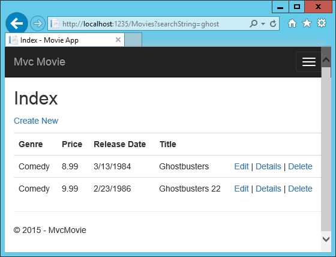

# 添加搜索

作者： [Rick Anderson](https://twitter.com/RickAndMSFT)

翻译： [魏美娟(初见)](http://github.com/ChujianA)

校对： [谢炀（Kiler）](https://github.com/kiler398/) 、[张仁建(第二年.夏)](https://github.com/stoneniqiu)  、[孟帅洋(书缘)](https://github.com/mengshuaiyang) 、[高嵩](https://github.com/jack2gs) 

在本节中，你可以为 `Index` 方法添加查询功能，使其能够根据电影的 *genre* 或 *name* 进行查找。

更新 `Index` 方法来开启搜索功能：

<!--
[!code-html[Main](../../tutorials/first-mvc-app/start-mvc/sample/MvcMovie/Views/Shared/_Layout.cshtml?highlight=7,31)]
-->

[!code-csharp[Main](../../tutorials/first-mvc-app/start-mvc/sample/MvcMovie/Controllers/MoviesController.cs?name=snippet_1stSearch)]

 `Index` 方法的第一行代码创建了一个 [LINQ](http://msdn.microsoft.com/en-us/library/bb397926.aspx) 查询，用来查找符合条件的电影：

```csharp
var movies = from m in _context.Movie
             select m;
```
这个查询 *仅仅只是* 在这里被定义出来，但是 **并未** 在数据库中执行。

如果 `searchString` p参数包含一个字符串，movies 查询将会添加对应查询过滤条件（ *译者注* 本例为 Title 包含 `searchString` p查询条件），代码如下：

[!code-csharp[Main](../../tutorials/first-mvc-app/start-mvc/sample/MvcMovie/Controllers/MoviesController.cs?name=snippet_SearchNull)]

代码中的 `s => s.Title.Contains()` 是一个  [Lambda 表达式](http://msdn.microsoft.com/library/bb397687.aspx) ，Lambda 表达式被用在基于方法的 [LINQ](http://msdn.microsoft.com/en-us/library/bb397926.aspx) 查询（例如：上面代码中的 `Where <http://msdn.microsoft.com/en-us/library/system.linq.enumerable.where.aspx>`__ 方法 或者 ``Contains``）中当做参数来使用。LINQ 语句在定义或调用类似 `Where` 、 `Contains` 或者 `OrderBy` 的方法进行修改的时候不会执行，相反的，查询会延迟执行，这意味着一个赋值语句直到迭代完成或调用  `ToListAsync` 方法才具备真正的值。更多关于延时查询的信息。请参考  [查询执行](http://msdn.microsoft.com/en-us/library/bb738633.aspx) 。

Note: [Contains](http://msdn.microsoft.com/library/bb155125.aspx) 方法是在数据库中运行的，并非在上面的 C# 代码中。在数据库中， [Contains](http://msdn.microsoft.com/library/bb155125.aspx) 方法被翻译为不区分大小写的 [SQL LIKE](http://msdn.microsoft.com/library/ms179859.aspx) 脚本。

运行应用程序，并导航到 `/Movies/Index`，在 URL 后面添加一个查询字符串，例如 `?searchString=Ghost` ，被过滤后的电影列表如下：



如果你修改 `Index` 方法签名使得方法包含一个名为 `id` 的参数，那么 `id` 参数将会匹配 *Startup.cs* 文件中的默认路由中的可选项 {id} 。

[!code-csharp[Main](../../tutorials/first-mvc-app/start-mvc/sample/MvcMovie/Startup.cs?highlight=5&name=snippet_1)]