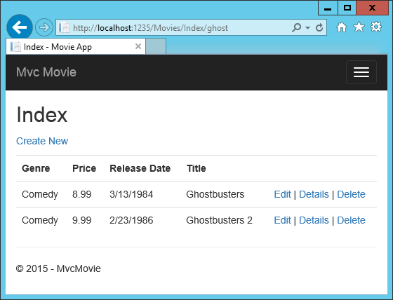
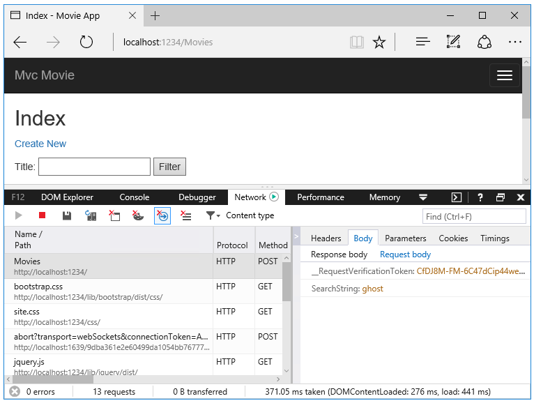

<!--
[!code-html[Main](../../tutorials/first-mvc-app/start-mvc/sample/MvcMovie/Views/Shared/_Layout.cshtml?highlight=7,31)]

[!code-csharp[Main](../../tutorials/first-mvc-app/start-mvc/sample/MvcMovie/Controllers/MoviesController.cs?name=snippet_1stSearch)]

[!code-csharp[Main](../../tutorials/first-mvc-app/start-mvc/sample/MvcMovie/Controllers/MoviesController.cs?name=snippet_SearchNull)]

[!code-csharp[Main](../../tutorials/first-mvc-app/start-mvc/sample/MvcMovie/Startup.cs?highlight=5&name=snippet_1)]

--> 

修改前的 `Index` 方法：

[!code-csharp[Main](../../tutorials/first-mvc-app/start-mvc/sample/MvcMovie/Controllers/MoviesController.cs?highlight=1,8&name=snippet_1stSearch)]

修改后的带 `id` 参数的 `Index` 方法:

[!code-csharp[Main](../../tutorials/first-mvc-app/start-mvc/sample/MvcMovie/Controllers/MoviesController.cs?highlight=1,8&name=snippet_SearchID)]

修改完成以后，我们可以通过路由数据（URL 区块）来传递标题搜索条件而非查询字符串：

然而，你不能指望用户每次都通过修改URL来查找电影，因此你需要在界面上帮助他们过滤数据。如果你想要修改 `Index` 方法的签名并测试了路由绑定是如何传递 `ID` 参数，现在再把它改成原来的参数   `searchString` 。

[!code-csharp[Main](../../tutorials/first-mvc-app/start-mvc/sample/MvcMovie/Controllers/MoviesController.cs?highlight=1&name=snippet_1stSearch)]

打开 *Views/Movies/Index.cshtml* 文件， 添加高亮的 `<form>` 标签到下面：

[!code-HTML[Main](../../tutorials/first-mvc-app/start-mvc/sample/MvcMovie/Views/Movies/IndexForm1.cshtml?highlight=10-16&range=4-21)]

HTML `<form>` 标签使用 [Form Tag Helper](../../mvc/views/working-with-forms.md) 生成，所以当你提交表单的时候，过滤字符串都被传到了 movies 控制器的 `Index` 方法。保存你的修改并测试过滤。

然而 `Index` 方法并没有你所希望的 `[HttpPost]`重载。你也不需要，因为方法并不会修改应用程序的状态，仅仅只是过滤数据。

你可以添加下面的 `[HttpPost] Index` 方法。

[!code-csharp[Main](../../tutorials/first-mvc-app/start-mvc/sample/MvcMovie/Controllers/MoviesController.cs?highlight=1&name=snippet_SearchPost)]

`notUsed` 参数用创建 `Index` 方法重载。我们在后续教程中会讨论。

如果你添加了这个方法。action 会调用匹配 `[HttpPost] Index` 的方法， `[HttpPost] Index` 方法运行结果如下所示。

然而，尽管添加了 `[HttpPost]` 版的 `Index` 方法，在实现的时候仍然存在一些局限性。设想你想将一个比较详细的查询添加书签，或者你想将查询结果以链接形式发送给朋友以便于你的朋友可以看到同样的过滤结果的电影，注意观察 HTTP POST 请求的时候，URL 是没有改变的（仍然是 localhost:xxxxx/Movies/Index），这个地址本身不包含查询信息。现在，查询信息是作为  [表单数据](https://developer.mozilla.org/en-US/docs/Web/Guide/HTML/Forms/Sending_and_retrieving_form_data) 发送到服务器的，你可以通过浏览器开发者工具或者优秀的抓包工具[Fiddler 工具](http://www.telerik.com/fiddler)来验证，图片展示了使用Chrome浏览器开发者工具 ：

你可以在请求正文中看到查询参数和上一个教程中提到的 [XSRF](../../security/anti-request-forgery.md) 令牌。  [Form Tag Helper](../../mvc/views/working-with-forms.md)  生成  [XSRF](../../security/anti-request-forgery.md) 反伪造令牌。我们没有修改数据，所以无需在控制器方法中验证令牌。

因为查询参数在请求正文中而不是 Url 里，所以你在书签里面无法保存查询参数并共享给他人，为了解决这个问题我们必须把请求指定为 `HTTP GET`。注意智能感知将帮我们更新标签。
 