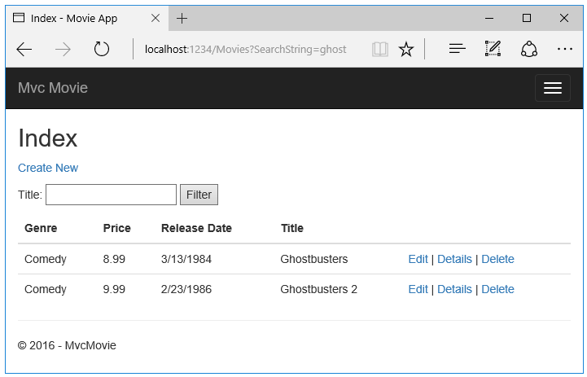

<!--
[!code-html[Main](../../tutorials/first-mvc-app/start-mvc/sample/MvcMovie/Views/Shared/_Layout.cshtml?highlight=7,31)]


[!code-csharp[Main](../../tutorials/first-mvc-app/start-mvc/sample/MvcMovie/Controllers/MoviesController.cs?name=snippet_1stSearch)]

[!code-csharp[Main](../../tutorials/first-mvc-app/start-mvc/sample/MvcMovie/Controllers/MoviesController.cs?name=snippet_SearchNull)]


[!code-csharp[Main](../../tutorials/first-mvc-app/start-mvc/sample/MvcMovie/Startup.cs?highlight=5&name=snippet_1)]

--> 

当你提交检索的时候，URL 包含查询条件，如果存在 `HttpGet Index` 方法，查询会跳转到 `HttpPost Index` 方法。



下面的代码显示如何修改 `form` 标签：

```html
<form asp-controller="Movies" asp-action="Index" method="get">
   ```

## 添加按照 Genre 查询

在 *Models* 目录添加下面的 `MovieGenreViewModel` 类：

[!code-csharp[Main](../../tutorials/first-mvc-app/start-mvc/sample/MvcMovie/Models/MovieGenreViewModel.cs)]

move-genre 视图模型包含：

   * 电影列表
   * 包含 genre 列表的 `SelectList` 。允许用户从列表中选择 genre 。
   * `movieGenre`，包含选中的 genre

用下面的代码替换 `MoviesController.cs` 中的 `Index` 方法：

[!code-csharp[Main](../../tutorials/first-mvc-app/start-mvc/sample/MvcMovie/Controllers/MoviesController.cs?name=snippet_SearchGenre)]

下面代码是通过 `LINQ` 语句从数据库中检索所有 genre 数据。

[!code-csharp[Main](../../tutorials/first-mvc-app/start-mvc/sample/MvcMovie/Controllers/MoviesController.cs?name=snippet_LINQ)]

`SelectList` 的 genres 通过 Distinct 方法投影查询创建（我们不想选择列表中出现重复的数据）。

```csharp
movieGenreVM.genres = new SelectList(await genreQuery.Distinct().ToListAsync())
   ```

## 在 Index 视图中添加通过 genre 检索

按照下面的方式更新 `Index.cshtml` ：

[!code-HTML[Main](../../tutorials/first-mvc-app/start-mvc/sample/MvcMovie/Views/Movies/IndexFormGenreNoRating.cshtml?highlight=1,15,16,17,28,31,34,37,43)]

测试程序并分别通过 genre 或者电影标题以及两个条件同时进行检索