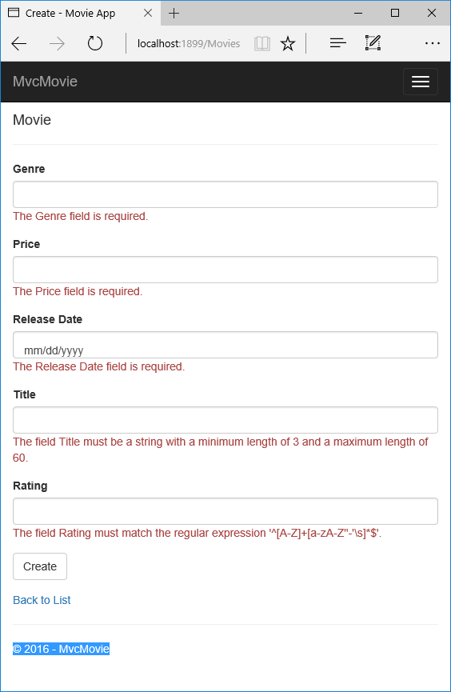
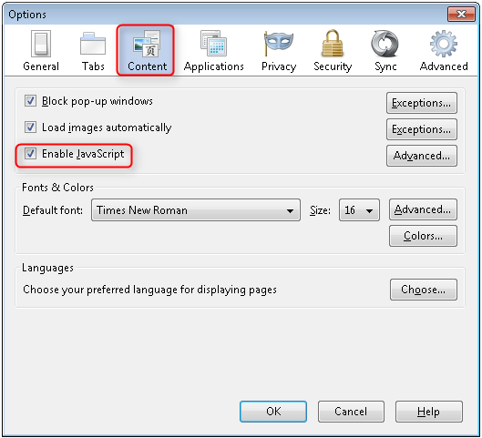
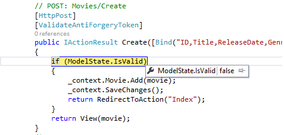

# 添加验证

作者 [Rick Anderson](https://twitter.com/RickAndMSFT)

翻译 [谢炀（Kiler）](https://github.com/kiler398/) 

校对 [孟帅洋（书缘](https://github.com/mengshuaiyang)、[娄宇(Lyrics)](https://github.com/xbuilder)、[许登洋(Seay)](https://github.com/SeayXu)

在本章节中你将为 `Movie` 模型类添加验证逻辑，以确保用户在试图创建或编辑影片数据时强制执行验证规则。

## 保持DRY原则

ASP.NET MVC 的核心原则之一是 [DRY](http://en.wikipedia.org/wiki/Don%27t_repeat_yourself) （"不要重复自己"）。ASP.NET MVC 鼓励你只指定一次行为或者功能，然后可以在应用程序里面到处使用，这样大大的减少了需要编写的代码量，并且使你编写不容易出错，更容易测试，以及更容易维护的代码。

ASP.NET MVC 和 Entity Framework Core Code First 中的验证功能，是 DRY 原则实际应用的一个很好的实例。你可以在某个位置（模型类）声明指定方式的验证规则，验证规则可以在整个应用程序中生效。 

## 向 Movie 模型中添加验证规则

打开 *Movie.cs* 文件。DataAnnotations 提供了一组内置的验证特性，你可以对任何类或属性应用。（它也同时包含了一些格式化特性比如 `DataType` 用来帮你格式化数据而非提供验证功能。) 

现在修改 `Movie` 类，利用内置的 `Required`, `StringLength`, `RegularExpression`, 以及 `Range`验证特性。

[!code-csharp[Main](../../tutorials/first-mvc-app/start-mvc//sample/MvcMovie/Models/MovieDateRatingDA.cs?name=snippet1)]

验证特性指定了你想要应用到模型属性上的验证行为。 `Required` 以及 `MinimumLength` 特性表示属性不能为空，但无法阻止用户用填写空格的方式来满足此验证条件。 `RegularExpression` 特性用来限制用户输入的文字类型。 在上面的例子中， `Genre` 以及 `Rating` 只能输入字母（不允许输入空格、数字以及特殊字符）。 `Range` 特性限制值在指定的范围内。 `StringLength` 特性可以设置字符串最大长度，以及最小长度（可选）。值类型（如decimal， int， float， DateTime）本身是必须的，并不需要 `[Required]` 特性。

ASP.NET 自动执行的验证规则将有助于使你的应用程序更加健壮。它还确保提醒你不要忘记验证数据，让非法数据进入到数据库中。

## MVC 中的验证错误 UI

运行程序并导航到 Movies controller。 

点击 **Create New** 链接创建一个新的 Movie。在表单中填写一些无效的数据，jQuery 客户端验证马上就会发现错误，立刻呈现到界面上。



> [!NOTE]
> 你也许无法在 `Price` 字段中输入小数点或者逗号。为了让 [jQuery validation](http://jqueryvalidation.org/) 支持非英语环境使用逗号（","）代替小数点，以及非美式英语日期格式，你必须采取措施国际化你的应用程序。参考 [额外的资源](#additional-resources)  获取更多信息。 现在仅仅输入整数，比如 10。

你也许无法在 `Price` 字段中输入小数点或者逗号。为了让 [jQuery validation](http://jqueryvalidation.org/) 支持非英语环境使用逗号（","）代替小数点，以及非美式英语日期格式，你必须采取措施国际化你的应用程序。参考 [额外的资源](#additional-resources)  获取更多信息。 现在仅仅输入整数，比如 10。

请注意，表单在包含无效值的每个字段下自动呈现一个适当的验证错误消息。错误包括客户端（使用 JavaScript 和 jQuery ）和服务器端（以防用户已禁用 JavaScript）。

一个显而易见的好处是，你并不需要改变 `MoviesController` 类或者 *Create.cshtml* 视图中的一行代码，就可以实现验证界面。你在本教程前面创建的控制器和视图，自动使用你指定的 `Movie` 模型类的属性上的验证特性的验证规则。使用 `Edit` 操作方法测试验证，（与Create 方法）同样的验证生效。

表单数据不会被发送到服务器直到没有客户端验证错误。你可以在 `HTTP Post` 方法中设置断点，并通过使用 [Fiddler 工具](http://www.telerik.com/fiddler) 或者 [F12 开发者工具](https://dev.windows.com/en-us/microsoft-edge/platform/documentation/f12-devtools-guide/) 访问这个方法来验证这一点。

## 验证模块是如何工作的

也许你会好奇生成的控制器或视图中的代码没有任何更新的情况下验证界面是如何产生的。下一个清单显示的是两个 `Create` 方法。

[!code-csharp[Main](../../tutorials/first-mvc-app/start-mvc//sample/MvcMovie/Controllers/MoviesController.cs?name=snippetCreate)]

第一个（HTTP GET） `Create` 的操作方法显示初始创建表单。第二个（`[HttpPost]`）版本的操作方法负责处理 post 请求。第二个 `Create` 的方法（HttpPost 版本）调用 `ModelState.IsValid` 检查是否有任何验证错误。调用该方法将检查任何已应用到对象属性上的验证。如果对象的 `Create` 方法验证错误，重新显示表单。如果没有错误，该方法在数据库中保存新的 movie。在我们的 movie 例子中，在客户端验证检测到错误时，表单将不会发送到服务器，第二个  `Create` 方法不会被调用。如果你的浏览器禁用了JavaScript，客户端验证被禁用，HTTP POST 版本的 `Create` 方法调用 `ModelState.IsValid` ，以检查是否存在任何验证错误。

你可以在 `[HttpPost] Create` 方法中设置一个断点，用来验证该方法不会被调用，客户端验证发现错误时将不提交表单数据。如果你的浏览器禁用了 JavaScript ，然后提交有错误的表单，断点会被命中。不支持 JavaScript 的情况下，你仍然可以得到充分验证。下面的图片展示了如何在 IE 浏览器中禁用 JavaScript 脚本。

下面的图片展示了如何在 FireFox 浏览器中禁用 JavaScript 脚本。



下面的图片展示了如何在 Chrome 浏览器中禁用 JavaScript 脚本。


在禁用 JavaScript 脚本之后，post 非法数据并在调试器中单步调试。



下面是你在本教程前面用基架生成的 *Create.cshtml* 视图模板的一部分。它使用上面展示的两种 action 方法来显示初始表单并且在发生错误时重新显示。

[!code-HTML[Main](../../tutorials/first-mvc-app/start-mvc//sample/MvcMovie/Views/Movies/CreateRatingBrevity.cshtml)]

[Input Tag Helper](xref:mvc/views/working-with-forms)  消费  [DataAnnotations](http://msdn.microsoft.com/en-us/library/system.componentmodel.dataannotations.aspx)  特性和产生jQuery验证所需要在客户端生成的 HTML 属性。[Validation Tag Helper](xref:mvc/views/working-with-forms#the-validation-tag-helpers) 负责显示错误信息。更多请参考 [Validation](xref:mvc/models/validation)。

非常棒的是控制器和 `Create` 视图模板不知道实际执行的验证规则或显示的具体错误消息。只需要在 `Create` 类里指定验证规则和错误字符串，同样的验证规则会自动应用到 `Movie` 视图和任何其他视图模板，你可以创建、编辑你的模型。

如果你想更改验证逻辑，你可以限定在一处地方（在本例中，是指 `Movie` 类），为模型添加验证特性。你不需要担心应用程序的不同部分执行的规则不一致 —— 所有的验证逻辑在同一个地方定义然后在各处使用
。这样可以使得代码很干净，而且易于维护和改进。这意味着，你充分遵循了 DRY 原则。

## 使用 DataType 特性

打开 *Movie.cs* 文件，并查看 `Movie` 类。 `System.ComponentModel.DataAnnotations` 命名空间提供了除了内置的验证特性以外的一套格式化特性。我们已经应用了 ``DataType`` 枚举值到发布日期和价格字段。下面的代码显示了  `ReleaseDate` 和 `Price` 字段如何使用 `DataType` 特性。

[!code-csharp[Main](../../tutorials/first-mvc-app/start-mvc//sample/MvcMovie/Models/MovieDateRatingDA.cs?highlight=2,6&name=snippet2)]

`DataType` 特性只用于视图引擎对数据进行格式化（或者提供给诸如 `<a>` 标签 的Url或者 `<a href="mailto:EmailAddress.com">` 提供的电子邮件），你可以使用 `RegularExpression` 特性来验证数据的格式，`DataType` 特性用于指定比数据库的自带类型更为具体的数据类型，它们不是验证特性，在本示例中我们只想跟踪日期，而不需要具体时间。在 `DataType` 枚举提供了许多数据类型，如日期、时间、手机号码、货币、电子邮件地址等 `DataType` 特性一样可以让应用程序具备自动提供特定数据类型的功能。例如，一个`mailto:` 链接可以使用 `DataType.EmailAddress`数据类型创建，在支持 Html5 的浏览器中并且日期选择器可以提供   `DataType.Date` 的值。`DataType` 特性向浏览器发送 HTML 5 标签 `data-` （pronounced data dash）。`DataType` 特性 **无法**  提供任何验证。

`DataType.Date` 不指定日期的显示格式。默认情况下，数据字段默认的显示格式基于服务器的 `CultureInfo` 设置来决定的。

`DisplayFormat` 特性被用来格式化日期：

```csharp
[DisplayFormat(DataFormatString = "{0:yyyy-MM-dd}", ApplyFormatInEditMode = true)]
public DateTime ReleaseDate { get; set; }
```

`ApplyFormatInEditMode` 用来指定格式是否应用到文本框编辑。（你可能不希望在某些字段中使用这个功能——例如，对于货币值，你可能不希望在文本框中对货币符号进行编辑。）

你可以直接使用 `DisplayFormat` 特性本身，但是更好的方式是建议使用 `DataType` ， `DataType` 特性仅仅传递数据的语义，并不会通知浏览器如何呈现，如果不使用  DisplayFormat 有以下好处：

* 浏览器可以启用 HTML5 功能（例如显示日历控件，设置本地化的货币符号，电子邮件中的链接，等等）。

* 默认情况下，浏览器将基于你的 [本地环境](http://msdn.microsoft.com/en-us/library/vstudio/wyzd2bce.aspx) 使用正确的格式渲染数据。

* `DataType` 特性可以使 MVC 选择正确的字段模板来呈现数据（比如 `DisplayFormat` 如果单独使用 string 模板）。

> [!NOTE]
> 当 `Range` 特性同时使用 `DateTime` 类型的时候 jQuery 验证无法生效。例如，下面的代码将始终显示客户端验证错误，即使日期在指定范围内：


```csharp
[Range(typeof(DateTime), "1/1/1966", "1/1/2020")]
   ```

你需要禁止在 `DateTime` 上使用 `Range` 特性来进行 JQuery 日期验证。在你的模型中编译具体日期通常不是一个好的做法，所以不建议在 `Range` 特性中使用 `DateTime` 。

下面的代码展示了如何将各种验证特性合并在一行显示：

[!code-csharp[Main](../../tutorials/first-mvc-app/start-mvc//sample/MvcMovie/Models/MovieDateRatingDAmult.cs?name=snippet1)]

在下一个系列教程里面, 我们会重新审视应用程序，为自动生成的 `Details` 以及 `Delete` 方法做一些提升。

## 附加资源

* [Working with Forms](xref:mvc/views/working-with-forms)
* [全球化和本地化](xref:fundamentals/localization)
* [介绍 Tag Helpers](xref:mvc/views/tag-helpers/intro)
* [Authoring Tag Helpers](xref:mvc/views/tag-helpers/authoring)
