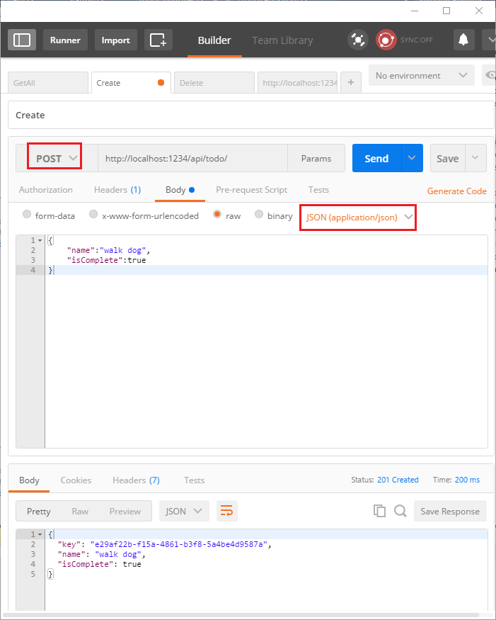
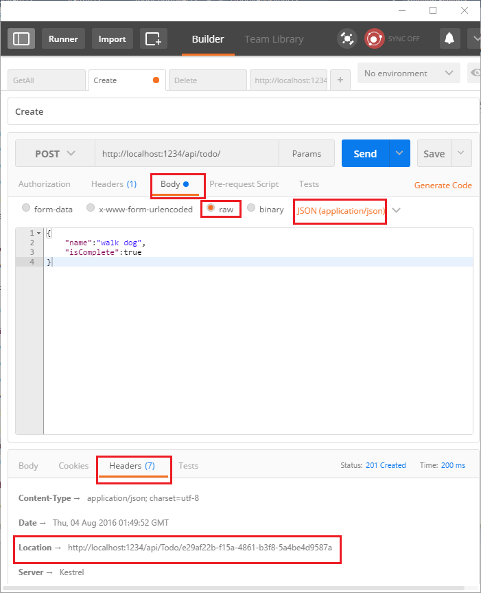

<!--## Implement the other CRUD operations-->
## 实现其他的CRUD操作

<!--We'll add `Create`, `Update`, and `Delete` methods to the controller. These are variations on a theme, so I'll just show the code and highlight the main differences. Build the project after adding or changing code.-->
最后一步是 `Create`, `Update`, 以及 `Delete`方法到 controller 。这些方法都是围绕着一个主题，所以我将只列出代码以及标注出主要的区别。

<!--### Create-->
### Create

[!code-csharp[Main](../../tutorials/first-web-api/sample/TodoApi/Controllers/TodoController.cs?name=snippet_Create)]

<!--This is an HTTP POST method, indicated by the [`[HttpPost]`](https://docs.asp.net/projects/api/en/latest/autoapi/Microsoft/AspNetCore/Mvc/HttpPostAttribute/index.html) attribute. The [`[FromBody]`](https://docs.asp.net/projects/api/en/latest/autoapi/Microsoft/AspNetCore/Mvc/FromBodyAttribute/index.html) attribute tells MVC to get the value of the to-do item from the body of the HTTP request.-->
这是一个 HTTP POST 方法, 用 [`[HttpPost]`](https://docs.asp.net/projects/api/en/latest/autoapi/Microsoft/AspNetCore/Mvc/HttpPostAttribute/index.html) 标签声明 。[`[FromBody]`](https://docs.asp.net/projects/api/en/latest/autoapi/Microsoft/AspNetCore/Mvc/FromBodyAttribute/index.html) 标签告诉 MVC 从 HTTP 请求的正文中获取 to-do 项的值 。

<!--The `CreatedAtRoute` method returns a 201 response, which is the standard response for an HTTP POST method that creates a new resource on the server. `CreatedAtRoute` also adds a Location header to the response. The Location header specifies the URI of the newly created to-do item. See [10.2.2 201 Created](http://www.w3.org/Protocols/rfc2616/rfc2616-sec10.html).-->
当通过 `CreatedAtRoute` 方法向服务器发出 HTTP POST 方法以创建新资源时，将返回标准的 201 响应。
 ``CreateAtRoute`` 还把 Location 头信息加入到了响应。 Location 头信息指定新创建的 todo 项的 URI。  查看 [10.2.2 201 Created](http://www.w3.org/Protocols/rfc2616/rfc2616-sec10.html).

<!--### Use Postman to send a Create request-->
### 使用 Postman 发送一个 Create 请求:



<!--* Set the HTTP method to `POST`
* Select the **Body** radio button
* Select the **raw** radio button
* Set the type to JSON
* In the key-value editor, enter a Todo item such as -->
* 设置 HTTP method 为 `POST`
* 选择 **Body** 单选按钮
* 选择 **raw** 单选按钮
* 设置数据类型为 JSON
* 在键值编辑器中，输入一下 Todo 数据项

```json
{
	"name":"walk dog",
	"isComplete":true
}
```

<!--* Select **Send**-->
* 点击 **Send**

<!--* Select the Headers tab in the lower pane and copy the **Location** header:-->
* 选择下方窗格中的标题选项卡，并复制 **Location** 标题：



<!--You can use the Location header URI to access the resource you just created. Recall the `GetById` method created the `"GetTodo"` named route:-->
你可以使用 Location响应头(Location header URI) 来访问你刚才创建的资源。 重新调用 `GetById` 方法创建的 `"GetTodo"` 命名路由：


```csharp
[HttpGet("{id}", Name = "GetTodo")]
public IActionResult GetById(long id)
```

### Update

[!code-csharp[Main](../../tutorials/first-web-api/sample/TodoApi/Controllers/TodoController.cs?name=snippet_Update)]

<!--`Update` is similar to `Create`, but uses HTTP PUT. The response is [204 (No Content)](http://www.w3.org/Protocols/rfc2616/rfc2616-sec9.html). According to the HTTP spec, a PUT request requires the client to send the entire updated entity, not just the deltas. To support partial updates, use HTTP PATCH.-->
`Update` 类似于 `Create` ,但是使用 HTTP PUT 。响应是 [204 (No Content)](http://www.w3.org/Protocols/rfc2616/rfc2616-sec9.html) 。
根据 HTTP 规范, PUT 请求要求客户端发送整个实体更新，而不仅仅是增量。为了支持局部更新，请使用 HTTP PATCH 。


### Delete

[!code-csharp[Main](../../tutorials/first-web-api/sample/TodoApi/Controllers/TodoController.cs?name=snippet_Delete)]

<!--The response is [204 (No Content)](http://www.w3.org/Protocols/rfc2616/rfc2616-sec9.html).-->
方法返回 [204 (No Content)](http://www.w3.org/Protocols/rfc2616/rfc2616-sec9.html)。 


