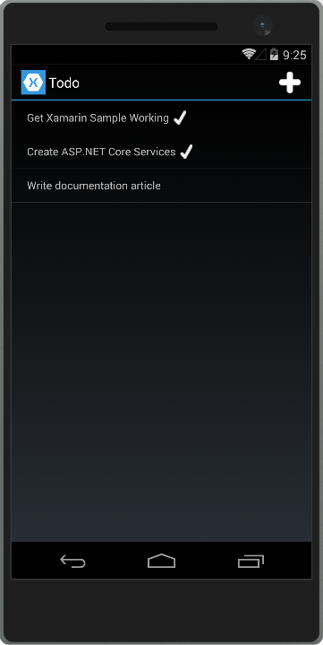
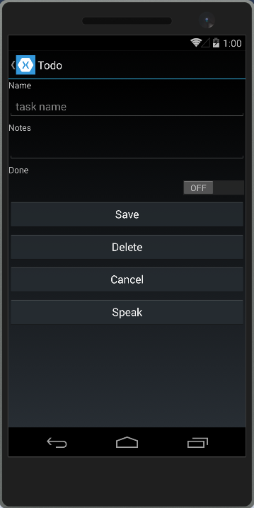
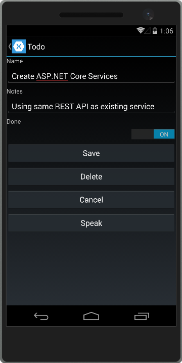
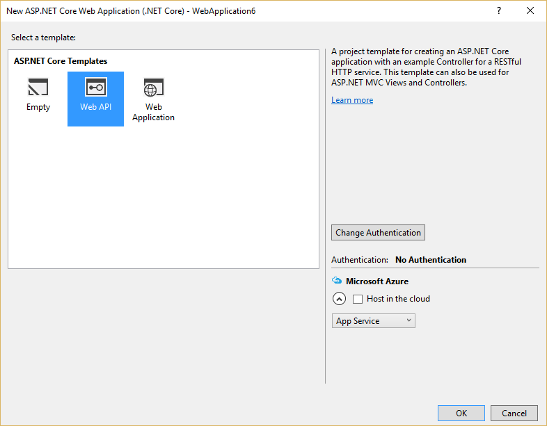
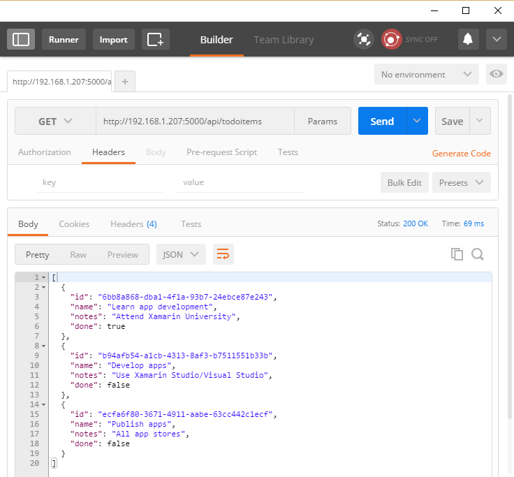
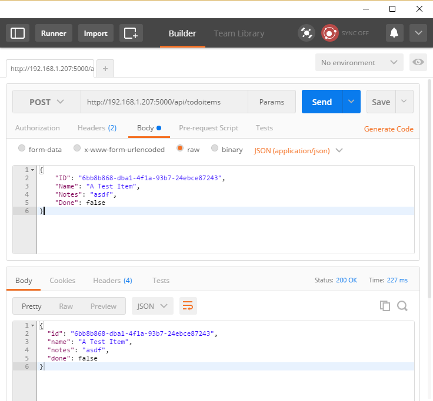
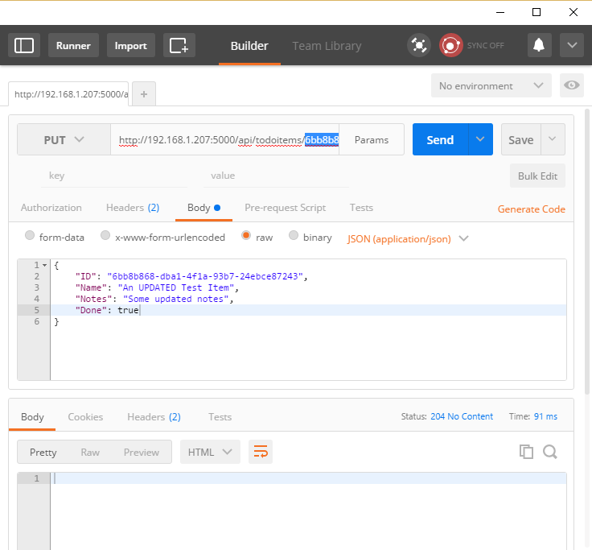
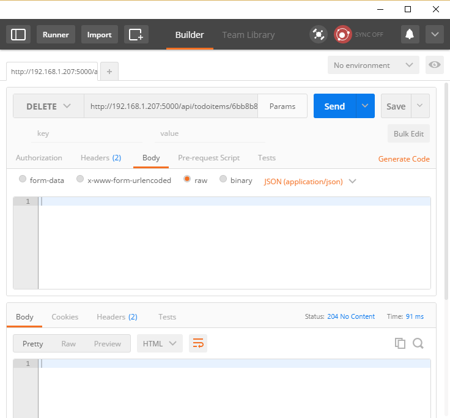

<!--# Creating Backend Services for Native Mobile Applications-->
# 为原生移动应用程序创建后端服务

作者 [Steve Smith](http://ardalis.com)

翻译 [谢炀（Kiler)](https://github.com/kiler398/)  

<!--Mobile apps can easily communicate with ASP.NET Core backend services.-->
移动应用程序可以轻松的与 ASP.NET Core 后端服务通信。

<!--[View or download sample backend services code](https://github.com/aspnet/Docs/tree/master/aspnetcore/mobile/native-mobile-backend/sample)-->
[查看下载后端服务示例代码](https://github.com/aspnet/Docs/tree/master/aspnetcore/mobile/native-mobile-backend/sample)

<!--## The Sample Native Mobile App-->
## 原生移动应用程序示例

<!--This tutorial demonstrates how to create backend services using ASP.NET Core MVC to support native mobile apps. It uses the [Xamarin Forms ToDoRest app](https://developer.xamarin.com/guides/xamarin-forms/web-services/consuming/rest/) as its native client, which includes separate native clients for Android, iOS, Windows Universal, and Window Phone devices. You can follow the linked tutorial to create the native app (and install the necessary free Xamarin tools), as well as download the Xamarin sample solution. The Xamarin sample includes an ASP.NET Web API 2 services project, which this article's ASP.NET Core app replaces (with no changes required by the client).-->
本教程演示如何使用 ASP.NET Core MVC 创建后端服务来支持原生移动应用程序。 它使用 [Xamarin Forms ToDoRest 应用程序](https://developer.xamarin.com/guides/xamarin-forms/web-services/consuming/rest/)作为其原生客户端APP，其中包括用于Android，iOS， Windows通用和Window Phone设备的各种原生客户端APP。 您可以按照链接的教程创建原生客户端APP（需要安装免费 Xamarin 工具），以及下载 Xamarin 示例解决方案。 Xamarin 示例包括一个 ASP.NET Web API 2 服务项目，会被本文的ASP.NET Core 应用程序替换（客户端不需要进行修改）。



<!--### Features-->
### 功能

<!--The ToDoRest app supports listing, adding, deleting, and updating To-Do items. Each item has an ID, a Name, Notes, and a property indicating whether it's been Done yet.-->
ToDoRest APP 应用程序支持列表、添加、删除、以及 To-Do 数据项。每条数据包含 ID, Name, Notes, 以及一个属性定于该条数据是否完成的字段。

<!--The main view of the items, as shown above, lists each item's name and indicates if it is done with a checkmark.-->
如上所示，项目的主视图列出了每个项目的名称，并指示是否使用复选标记。

<!--Tapping the `+` icon opens an add item dialog:-->
点击 `+` 图标打开一个添加项目对话框：



<!--Tapping an item on the main list screen opens up an edit dialog where the item's Name, Notes, and Done settings can be modified, or the item can be deleted:-->
在主列表界面上点击项目将打开一个编辑对话框，可以修改项目的“名称”，“注释”和“完成”设置，或者可以删除该项目：



<!--This sample is configured by default to use backend services hosted at developer.xamarin.com, which allow read-only operations. To test it out yourself against the ASP.NET Core app created in the next section running on your computer, you'll need to update the app's `RestUrl` constant. Navigate to the `ToDoREST` project and open the *Constants.cs* file. Replace the `RestUrl` with a URL that includes your machine's IP address (not localhost or 127.0.0.1, since this address is used from the device emulator, not from your machine). Include the port number as well (5000). In order to test that your services work with a device, ensure you don't have an active firewall blocking access to this port.-->
本示例默认配置为使用托管在 developer.xamarin.com 上的后端服务，该服务允许只读操作。为了测试一下接下来你自己在计算机上中创建的 ASP.NET Core 应用程序，您需要更新应用程序的 `RestUrl` 常量。 导航到 `ToDoREST` 项目并打开 *Constants.cs* 文件。 将 `RestUrl` w替换为包含机器IP地址的URL（不是本地主机或127.0.0.1，因为该地址是从设备模拟器使用的，而不是来自您的机器）。 还包括端口号（5000）。 为了测试您的服务与设备的一致性，请确保您没有主动防火墙阻止对该端口的访问。

<!-- literal_block {"ids": [], "names": [], "highlight_args": {}, "backrefs": [], "dupnames": [], "linenos": false, "classes": [], "xml:space": "preserve", "language": "csharp"} -->

```csharp
// URL of REST service (Xamarin ReadOnly Service)
//public static string RestUrl = "http://developer.xamarin.com:8081/api/todoitems{0}";

// use your machine's IP address
public static string RestUrl = "http://192.168.1.207:5000/api/todoitems/{0}";
```

<!--## Creating the ASP.NET Core Project-->
## 创建的 ASP.NET Core 应用程序

<!--Create a new ASP.NET Core Web Application in Visual Studio. Choose the Web API template and No Authentication. Name the project *ToDoApi*.-->
在 Visual Studio 中创建一个新的 ASP.NET Core Web应用程序。 选择 Web API 模板，然后选择无验证。 命名项目 *ToDoApi*。



<!--The application should respond to all requests made to port 5000. Update *Program.cs* to include `.UseUrls("http://*:5000")` to achieve this:-->
应用程序会响应所有对端口5000的请求。通过更新 *Program.cs* 包含 `.UseUrls（"http://*:5000"）` 来实现：

[!code-csharp[Main](native-mobile-backend/sample/ToDoApi/src/ToDoApi/Program.cs?range=10-16&highlight=3)]

<!--> [!NOTE]
> Make sure you run the application directly, rather than behind IIS Express, which ignores non-local requests by default. Run `dotnet run` from a command prompt, or choose the application name profile from the Debug Target dropdown in the Visual Studio toolbar.-->
> [!NOTE]
> 确保您是直接运行应用程序的，而不是在 IIS Express 之后，默认情况下会忽略非本地请求。 在命令提示符运行 `dotnet run` ，或从 Visual Studio 工具栏的 Debug Target 下拉列表中选择应用程序名称配置文件。

<!--Add a model class to represent To-Do items. Mark required fields using the `[Required]` attribute:-->
添加一个模型类来表示待办事项。 使用 `[Required]` 属性来标记必填的字段：

[!code-csharp[Main](native-mobile-backend/sample/ToDoApi/src/ToDoApi/Models/ToDoItem.cs)]

<!--The API methods require some way to work with data. Use the same `IToDoRepository` interface the original Xamarin sample uses:-->
API 方法需要一些处理数据的方法。 使用原始 Xamarin 示例使用的相同的 `IToDoRepository` 接口：

[!code-csharp[Main](native-mobile-backend/sample/ToDoApi/src/ToDoApi/Interfaces/IToDoRepository.cs)]

<!--For this sample, the implementation just uses a private collection of items:-->
对于本示例，实现只使用了私有的项目集合：

[!code-csharp[Main](native-mobile-backend/sample/ToDoApi/src/ToDoApi/Services/ToDoRepository.cs)]

<!--Configure the implementation in *Startup.cs*:-->
在 *Startup.cs* 中的配置实现：

[!code-csharp[Main](native-mobile-backend/sample/ToDoApi/src/ToDoApi/Startup.cs?highlight=6&range=29-35)]

<!--At this point, you're ready to create the *ToDoItemsController*.-->
此时，您已准备好创建 *ToDoItemsController*。

<!--> [!TIP]
> Learn more about creating web APIs in [Building Your First Web API with ASP.NET Core MVC and Visual Studio](../tutorials/first-web-api.md).-->
> [!TIP]
> 了解更多如何创建 web APIs的信息请参考 [使用 ASP.NET Core MVC 和 Visual Studio 创建你的第一个 Web API ](../tutorials/first-web-api.md)。

<!--## Creating the Controller-->
## 创建控制器

<!--Add a new controller to the project, *ToDoItemsController*. It should inherit from Microsoft.AspNetCore.Mvc.Controller. Add a `Route` attribute to indicate that the controller will handle requests made to paths starting with `api/todoitems`. The `[controller]` token in the route is replaced by the name of the controller (omitting the `Controller` suffix), and is especially helpful for global routes. Learn more about [routing](../fundamentals/routing.md).-->
向项目添加一个新的控制器 *ToDoItemsController*。 它应该继承自 Microsoft.AspNetCore.Mvc.Controller 。 添加一个 `Route` 属性来指示控制器将处理以 `api/todoitems` 开头的路径的请求。 路由中的 `[controller]` 令牌被控制器的名称所取代（省略了 `Controller` 后缀），对全局路由特别有用。 参考 [routing](../fundamentals/routing.md) 了解更多信息。

<!--The controller requires an `IToDoRepository` to function; request an instance of this type through the controller's constructor. At runtime, this instance will be provided using the framework's support for [dependency injection](../fundamentals/dependency-injection.md).-->
控制器需要一个 `IToDoRepository` 才能正常运行; 通过控制器的构造函数请求此类型的实例。 在运行时，将使用框架内置的[依赖注入](../fundamentals/dependency-injection.md) 支持来提供此实例。


[!code-csharp[Main](native-mobile-backend/sample/ToDoApi/src/ToDoApi/Controllers/ToDoItemsController.cs?range=1-17&highlight=9,14)]

<!--This API supports four different HTTP verbs to perform CRUD (Create, Read, Update, Delete) operations on the data source. The simplest of these is the Read operation, which corresponds to an HTTP GET request.-->
该 API 支持四种不同的 HTTP 谓词来对数据源执行 CRUD（创建，读取，更新和删除）操作。 其中最简单的是读操作，它对应于 HTTP GET 请求。

<!--### Reading Items-->
### 读取数据

<!--Requesting a list of items is done with a GET request to the `List` method. The `[HttpGet]` attribute on the `List` method indicates that this action should only handle GET requests. The route for this action is the route specified on the controller. You don't necessarily need to use the action name as part of the route. You just need to ensure each action has a unique and unambiguous route. Routing attributes can be applied at both the controller and method levels to build up specific routes.-->
通过对 `List` 方法的 GET请求来获取项目列表。 `List` 方法中的 `[HttpGet]` 属性表示此操作只能处理 GET 请求。 此操作的路由是在控制器上指定。 您不一定需要使用 action 名称作为路径的一部分。 你只需要确保每个action 都有一个独特和明确的路径。 路由属性可以在控制器和方法级别应用，来建立特定的路由。

[!code-csharp[Main](native-mobile-backend/sample/ToDoApi/src/ToDoApi/Controllers/ToDoItemsController.cs?range=19-23)]

<!--The `List` method returns a 200 OK response code and all of the ToDo items, serialized as JSON.-->
 `List` 方法返回 200 OK 响应代码和所有 ToDo 项并序列化为JSON。

<!--You can test your new API method using a variety of tools, such as [Postman](https://www.getpostman.com/docs/), shown here:-->
您可以使用各种工具测试您的新的 API 方法，例如[Postman](https://www.getpostman.com/docs/)，如下所示：



<!--### Creating Items-->
### 创建项目

<!--By convention, creating new data items is mapped to the HTTP POST verb. The `Create` method has an `[HttpPost]` attribute applied to it, and accepts an ID parameter and a `ToDoItem` instance. The HTTP verb attributes, like `[HttpPost]`, optionally accept a route template string (`{id}` in this example). This has the same effect as adding a `[Route]` attribute to the action. Since the `item` argument will be passed in the body of the POST, this parameter is decorated with the `[FromBody]` attribute.-->
按照惯例，创建新的数据项被映射到 HTTP POST 谓词 `Create` 方法应用了一个n `[HttpPost]` 属性，并接受一个ID参数和一个 `ToDoItem` 对象实例。 HTTP谓词属性，如 `[HttpPost]` ，可选地接受一个路由模板字符串（在这个例子中为`{id}`）。 这与将 `[Route]` 属性添加到操作中具有同样的效果。 由于 `item` 参数将在POST的主体中传递，所以这个参数用 `[FromBody]` 属性装饰。

<!--Inside the method, the item is checked for validity and prior existence in the data store, and if no issues occur, it is added using the repository. Checking `ModelState.IsValid` performs [model validation](../mvc/models/validation.md), and should be done in every API method that accepts user input.-->
在方法内，检查项目的有效性和数据先前是否存在，如果没有发生问题，则使用存储库添加该项。 检查 `ModelState.IsValid` 执行[模型验证](../mvc/models/validation.md)，并且应该在接受用户输入的每个 API 方法中完成。

[!code-csharp[Main](native-mobile-backend/sample/ToDoApi/src/ToDoApi/Controllers/ToDoItemsController.cs?range=25-46)]

<!--The sample uses an enum containing error codes that are passed to the mobile client:-->
该示例使用枚举包含错误代码传递给移动客户端：

[!code-csharp[Main](native-mobile-backend/sample/ToDoApi/src/ToDoApi/Controllers/ToDoItemsController.cs?range=91-99)]

<!--Test adding new items using Postman by choosing the POST verb providing the new object in JSON format in the Body of the request. You should also add a request header specifying a `Content-Type` of `application/json`.-->
测试使用 Postman 添加新项目，通过选择在请求正文中以 JSON 格式提供新对象的 POST 谓词。 您还应该添加一个请求头，指定 `Content-Type` 为  `application/json`。



<!--The method returns the newly created item in the response.-->
该方法在响应中返回新创建的项目。

<!--### Updating Items-->
### 更新项目

<!--Modifying records is done using HTTP PUT requests. Other than this change, the `Edit` method is almost identical to `Create`. Note that if the record isn't found, the `Edit` action will return a `NotFound` (404) response.-->
使用 HTTP PUT 请求修改记录。 除了这种变化， `Edit` 方法与 `Create`几乎相同。 请注意，如果没有找到记录，则 `Edit` 操作将返回`NotFound` (404) 响应。

[!code-csharp[Main](native-mobile-backend/sample/ToDoApi/src/ToDoApi/Controllers/ToDoItemsController.cs?range=48-69)]

<!--To test with Postman, change the verb to PUT and add the ID of the record being updated to the URL. Specify the updated object data in the Body of the request.-->
要用 Postman 测试，将verb更改为 PUT ，并将要更新的记录的 ID 添加到 URL。 在请求的正文中指定更新的对象数据。



<!--This method returns a `NoContent` (204) response when successful, for consistency with the pre-existing API.-->
该方法在成功时返回 `NoContent` (204) 响应，以便与预先存在的 API 保持一致。

<!--### Deleting Items-->
### 删除项目

<!--Deleting records is accomplished by making DELETE requests to the service, and passing the ID of the item to be deleted. As with updates, requests for items that don't exist will receive `NotFound` responses. Otherwise, a successful request will get a `NoContent` (204) response.-->
删除记录是通过对服务执行DELETE请求并传递要删除的项目的ID来实现的。 与更新一样，对不存在的项目的请求将收到 `NotFound` 响应。 否则，成功的请求将得到一个`NoContent` (204) 响应。

[!code-csharp[Main](native-mobile-backend/sample/ToDoApi/src/ToDoApi/Controllers/ToDoItemsController.cs?range=71-88)]

<!--Note that when testing the delete functionality, nothing is required in the Body of the request.-->
请注意，在测试删除功能时，请求正文中不需要任何内容。



<!--## Common Web API Conventions-->
## 常见的 Web API 约定

<!--As you develop the backend services for your app, you will want to come up with a consistent set of conventions or policies for handling cross-cutting concerns. For example, in the service shown above, requests for specific records that weren't found received a `NotFound` response, rather than a `BadRequest` response. Similarly, commands made to this service that passed in model bound types always checked `ModelState.IsValid` and returned a `BadRequest` for invalid model types.-->
当您为你的应用程序开发后端服务时，您将需要制定一套统一的约定或策略来处理横切关注点。 例如，在上面显示的服务中，未找到的特定记录的请求收到 `NotFound` 响应，而不是 `BadRequest` 响应。 类似地，通过模型绑定类型传递给该服务的命令总是检查 `ModelState.IsValid` ，并为无效的模型类型返回一个 `BadRequest` 。

<!--Once you've identified a common policy for your APIs, you can usually encapsulate it in a [filter](../mvc/controllers/filters.md). Learn more about [how to encapsulate common API policies in ASP.NET Core MVC applications](https://msdn.microsoft.com/en-us/magazine/mt767699.aspx).-->
一旦确定好了 API 的通用策略，您可以将其封装在[filter](../mvc/controllers/filters.md)中。 了解更多详细信息请参考[如何在 ASP.NET Core MVC 应用程序中封装通用 API 策略](https://msdn.microsoft.com/en-us/magazine/mt767699.aspx)。
