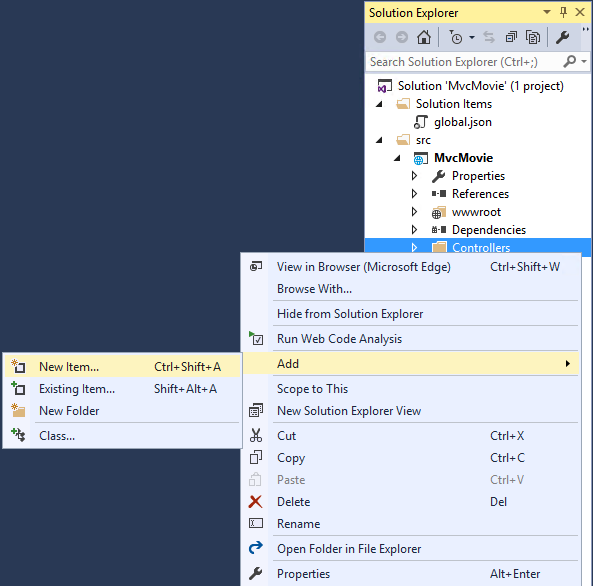
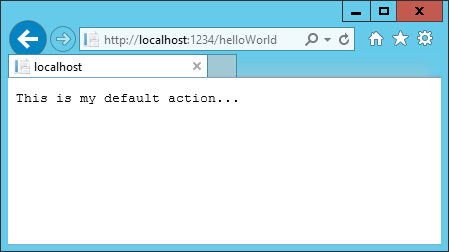
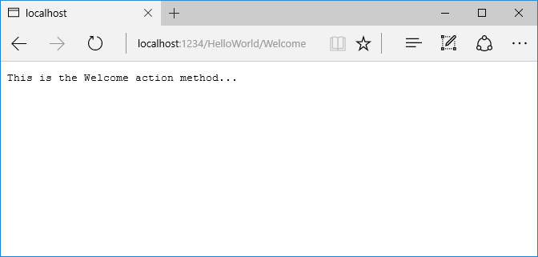
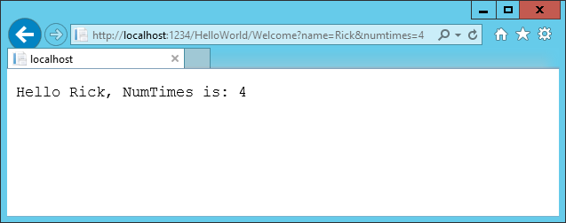
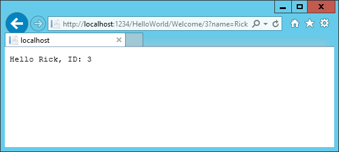

# 添加控制器
 
作者： [Rick Anderson](https://twitter.com/RickAndMSFT)

翻译： [娄宇(Lyrics)](http://github.com/xbuilder) 

校对： [刘怡(AlexLEWIS)](https://github.com/alexinea) 、[何镇汐](https://github.com/UtilCore) 、[夏申斌](https://github.com/xiashenbin) 、[孟帅洋(书缘)](https://github.com/mengshuaiyang)  

Model-View-Controller (MVC) 架构模式将一个应用程序分离成三个主要的组件： **M**\odel、**V**\iew 以及 **C**\ontroller 。 MVC 模式帮助你创建可测试的应用程序，比传统的单块应用程序更加容易维护和更新。基于 MVC 的应用程序包含：

* **M**\odels：应用程序中用来表示数据的类，并使用验证逻辑来执行该数据业务规则。通常，模型（Model）对象从数据库查询和存储 Model 状态。在本教程	``Movie`` 模型（Model）从数据库查询电影数据用来显示或更新。更新后的数据写入 SQL Server 数据库。

* **V**\iews：视图是显示用户界面（UI）的组件。通常，UI 用于显示模型（Model）数据。

* **C**\ontrollers：一种类（Class），用于处理浏览器请求，查询模型（Model）数据，以及将指定视图模板作为响应返回给浏览器。在 MVC 应用程序中，视图（View）仅仅显示信息； 控制器（Controller）处理和响应用户的输入和交互。例如， 控制器（Controller）处理路由数据和查询字符串值，然后将这些值传递给模型（Model），模型（Model）可以使用这些值去查询数据库。

MVC 模式帮助你创建一个分离不同方面的应用程序(输入逻辑，业务逻辑，以及 UI 逻辑)，同时这些元素之间是松耦合的。该模式指定在应用程序中的每一种逻辑应该位于何处。 UI 逻辑属于视图（View）。输入逻辑属于控制器（Controller）。业务逻辑属于模型（Model）。当你构建一个应用程序时，这样的分离帮助你管理应用程序的复杂性，因为它使你编写一个方面的代码时不会影响其他(方面)的代码。比如，你可以编写视图（View）代码而不需要依赖于业务逻辑代码。

我们会在本系列教程中涵盖所有这些概念，并告诉你如何使用它们构建一个简单的电影应用程序。下面的图片展示了 MVC 项目中的 *Controllers* 、 *Views* 文件夹。*Models* 文件夹会在后面的章节添加。

* 在 **解决方案资源管理器（Solution Explorer）** 中，鼠标右键点击 **Controllers > 添加（Add） > 新建项...（New Item...） > MVC 控制器类（MVC Controller Class）**

* 选择 **MVC Controller Class**
* 在 **添加新项（Add New Item）** 对话框，输入 **HelloWorldController**。

用下面的代码替换 *Controllers/HelloWorldController.cs* 中的内容：

[!code-csharp[Main](start-mvc/sample/MvcMovie/Controllers/HelloWorldController.cs?name=snippet_1)]

控制器（Controller）的每个 `public` 方法都可作为 HTTP 端点。在上面的例子中，两个方法都返回 string，注意它们的注释：

HTTP 端点是 Web 应用程序中的可定位 URL，例如 `http://localhost:1234/HelloWorld`，并结合使用的协议：HTTP，Web服务器的网络位置（包括TCP端口） `localhost:1234` 和目标URI `HelloWorld`。

第一条注释指出这是一个通过在 URL 后添加 "/HelloWorld/" 调用的 [HTTP GET](http://www.w3schools.com/tags/ref_httpmethods.asp) 方法，。第二条指出这是一个通过在 URL 后添加 "/HelloWorld/Welcome/" 调用的 [HTTP GET](http://www.w3.org/Protocols/rfc2616/rfc2616-sec9.html) 方法 。之后的教程我们将使用基架引擎来生成e `HTTP POST` 方法。

Run the app in non-debug mode (press Ctrl+F5) and append "HelloWorld" to the path in the address bar. (In the image below, `http://localhost:5000/HelloWorld` is used, but you'll have to replace *5000* with the port number of your app.) The `Index` method returns a string. You told the system to return some HTML, and it did!

使用非调试模式(Ctrl+F5)运行应用程序，并在浏览器地址栏路径后添加 "HelloWorld" (在下面的图片中，使用了 `http://localhost:5000/HelloWorld`，但是你必须用你的应用程序端口替换 *1234* )。 `Index` 方法返回一段字符串，系统将这段字符串转换为 HTML 返回给浏览器。

MVC 调用的控制器（Controller）类 (以及它们的 Action 方法) 取决于传入的 URL 。MVC 的默认 [URL 路由逻辑](../../mvc/controllers/routing.md) 采用类似下面规则格式来决定代码的调用：

`/[Controller]/[ActionName]/[Parameters]`

你可以在 *Startup.cs* 文件中设置路由规则。

[!code-csharp[Main](start-mvc/sample/MvcMovie/Startup.cs?name=snippet_1&highlight=5)]

当你运行应用程序且不提供任何 URL 段时，它将默认访问在上面模板中高亮行指定的 "Home" Controller 中的 "Index" Action 方法。

第一个 URL 段决定运行哪个控制器（Controller）。所以 `localhost:xxxx/HelloWorld`映射到 `HelloWorldController` 类。URL 段的第二部分决定类里的 Action 方法。所以 `localhost:xxxx/HelloWorld/Index` 将运行  `HelloWorldController` 中的 `Index` 方法。请注意，我们只需要浏览 `localhost:xxxx/HelloWorld` ，默认会调用 `Index` 方法。这是因为在没有指定方法名时， `Index`  是默认方法。URL 段的第三部分 ( `id`) 是路由数据。我们之后将在本教程中了解路由数据。

浏览 `http://localhost:xxxx/HelloWorld/Welcome`。 `Welcome` 方法运行并返回 "This is the Welcome action method..." 。对于这个 URL ， 控制器（Controller）是 `HelloWorld` ， Action 方法是 `Welcome` 。我们还没有使用 URL 中的 `[Parameters]` 部分。

 
让我们稍微修改一下例子，使我们能够通过 URL 传递一些参数信息到控制器（Controller）(例如，  `/HelloWorld/Welcome?name=Scott&numtimes=4` )。如下所示修改 `Welcome` 方法使其包含两个参数。请注意，代码利用 C# 的可选参数特性指明在没有传递参数的情况下， `numTimes` 参数默认为1。

[!code-csharp[Main](start-mvc/sample/MvcMovie/Controllers/HelloWorldController.cs?name=snippet_2)]

上面的代码使用 `HtmlEncoder.Default.Encode` 来保护应用程序免受恶意输入(即 JavaScript)。同时也使用了 [内插字符串](https://docs.microsoft.com/dotnet/articles/csharp/language-reference/keywords/interpolated-strings)。

在 Visual Studio 2015 中，当你在 IIS Express 以非调试模式 (Ctl+F5) 运行，你不需要在修改代码后生成应用程序。只需要保存文件，刷新你的浏览器就可以看到改变。

运行你的应用程序并浏览：

   `http://localhost:xxxx/HelloWorld/Welcome?name=Rick&numtimes=4`

(用你的端口替换 xxxx。) 你可以在 URL 中对 `name` 和 `numtimes` 尝试不同的值。 MVC [模型绑定](../../mvc/models/model-binding.md) 系统自动将地址栏里查询字符串中有名字的参数映射到你方法中的参数。查看 [模型绑定](../../mvc/models/model-binding.md)获得更多的信息。

在上面的示例中， URL 段 (`Parameters`) 没有被使用， `name` 和 `numTimes` 参数作为 [查询字符串](http://en.wikipedia.org/wiki/Query_string) 被传递。 上面 URL 中的  `?` (问号) 是一个分隔符，后面跟查询字符串。  `&` 字符分割查询字符串。

用下面的代码替换 `Welcome` 方法：

[!code-csharp[Main](start-mvc/sample/MvcMovie/Controllers/HelloWorldController.cs?name=snippet_3)]

运行应用程序然后输入 URL ： `http://localhost:xxx/HelloWorld/Welcome/3?name=Rick`

这次第三个 URL 段匹配上了路由参数 `id`。 `Welcome` 方法包含一个与 `MapRoute` 内的 URL 模板相匹配的 `id` 参数。跟随的 `?` ( `id?`) 表示 `id` 参数是可选的。

[!code-csharp[Main](start-mvc/sample/MvcMovie/Startup.cs?name=snippet_1&highlight=5)]

在这些例子中，控制器（Controller）一直在做 MVC 中的 "VC" 部分，就是视图（View）和控制器（Controller）部分的工作。这个控制器（Controller）直接返回 HTML 。一般来说你不想让控制器（Controller） 直接返回 HTML ，因为这让编码和维护变得非常麻烦。所以，我们通常会使用一个单独的 Razor 视图模板文件来帮助生成 HTML 响应。 我们将在下一个教程中介绍这部分。

>[!div class="step-by-step"]
[上一节](start-mvc.md)
[下一节](adding-view.md)  
