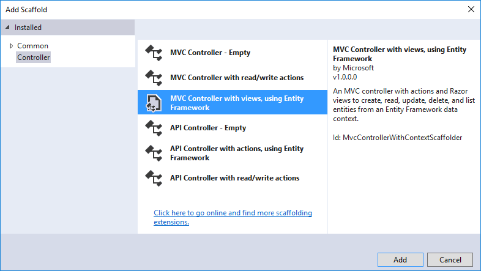
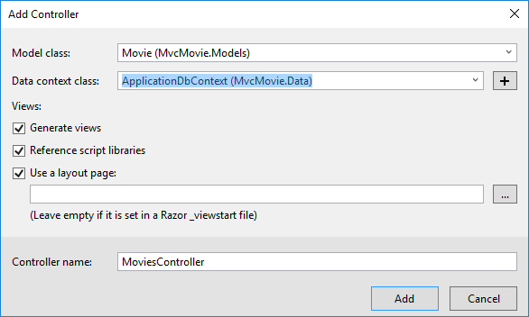
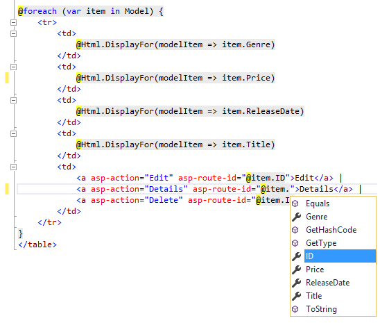

[!INCLUDE[adding-model](../../includes/mvc-intro/adding-model1.md)]
 
在解决方案资源管理器中，右击 **MvcMovie** 项目 > **Add** > **New Folder** （新建文件夹）。 把文件夹命名为 *Models*。
 
在解决方案资源管理器中，右键点击 *Models* 文件夹 > **添加** > **类** 。将类名命名为 **Movie** 并且添加以下属性：

[!code-csharp[Main](../../tutorials/first-mvc-app/start-mvc/sample/MvcMovie/Models/MovieNoEF.cs?name=snippet_1)]

`ID` 字段需要用来作为数据库主键

编译项目并且检查是否有错误，最后我们成功的把 **M**odel 添加到了你的 **M**VC 应用程序。

## 通过基架生成一个控制器（Controller）

在 **解决方案资源管理器** 中，右键点击 *Controllers* 文件夹 **> 添加 > 控制器**


在 **Add MVC Dependencies** （添加MVC依赖） 对话框中，select **Minimal Dependencies** （最小依赖） ，点击 **添加** 。


Visual Studio 会自动添加基架控制器所需的依赖，但是控制器本身并没有被创建，下一步点击 **> Add > Controller** 创建控制器。

在 **解决方案资源管理器** 中，右键点击 *Controllers* 文件夹 **> 添加 > 控制器**


在 **添加基架** 对话框中，点击 **MVC Controller with with views, using Entity Framework > 添加** 。



完成 **添加控制器（Add Controller）** 对话框

* **模型类（Model class）：** *Movie(MvcMovie.Models)*
* **数据上下文类 (Data context class):** 点击 **+** 图标添加默认 **MvcMovie.Models.MvcMovieContext**


* **Views:** 保持默认的选项
* **Controller name:** 保持默认的 *MoviesController*
* 点击 **Add**



Visual Studio 基架引擎创建的东西如下：

* Entity Framework Core [数据库上下文类](xref:data/ef-mvc/intro#create-the-database-context) (*Models/MvcMovieContext*)
* 一个电影控制器（Controller）（*Controllers/MoviesController.cs*）
* Create、Delete、Details、Edit 以及 Index 的 Razor 视图文件（Views/Movies）


Visual Studio 为你自动创建 数据库上下文以及 [CRUD](https://en.wikipedia.org/wiki/Create,_read,_update_and_delete)（创建、读取、更新以及删除）Action 方法和视图（View）（自动创建 CRUD Action 方法和 View 视图被称为 *搭建基架（scaffolding）*）。很快你将拥有一个可以让你创建、查看、编辑以及删除电影条目的完整功能的 Web 应用程序。

如果你运行这个应用程序并且点击 **Mvc Movie** 链接。你将遇到以下错误：

```
An unhandled exception occurred while processing the request.
SqlException: Cannot open database "MvcMovieContext-<GUID removed>" 
requested by the login. The login failed.
Login failed for user Rick
```

你必须要创建数据，你可以使用 EF Core 的 [Migrations](xref:data/ef-mvc/migrations) 功能来完成这个工作。Migrations 允许你根据数据模型自动创建数据库，并且当你的数据模型发生变化的时候更新数据库的结构。

## 添加 EF 工具来做迁移（Migration）

- 在解决方案资源管理器中，右击 ***MvcMovie** 项目 > **Edit MvcMovie.csproj**。

   

- 添加 `"Microsoft.EntityFrameworkCore.Tools.DotNet"` NuGet 包：

[!code-xml[Main](start-mvc/sample/MvcMovie/MvcMovie.csproj?range=22-25&highlight=3)] 

注意: 上述版本号在写入的时候是正确的.

保存修改。 

[!INCLUDE[adding-model](../../includes/mvc-intro/adding-model2.md)]

[!INCLUDE[adding-model](../../includes/mvc-intro/adding-model3.md)]



## 其他资源

* [Tag Helpers](xref:mvc/views/tag-helpers/intro)
* [全球化与本地化](xref:fundamentals/localization)

>[!div class="step-by-step"]
[上一节 添加视图](adding-view.md)
[下一节 处理SQL](working-with-sql.md)  
