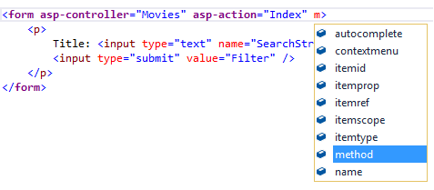

[!INCLUDE[adding-model](../../includes/mvc-intro/search1.md)]

你可以使用 **rename** 操作快速的把 `searchString` 参数重命名为 `id` ，在 `searchString` 上右击  **> Rename** 。

会被重命名的代码会高亮显示。

修改参数为 `id` ，其他引用到 `searchString` 的地方也会自动变更为 `id` 。

[!INCLUDE[adding-model](../../includes/mvc-intro/search2.md)]

注意智能感知将帮我们更新标签。

请注意， `<form>` 标签中的专有标记。这种专有标记表示的标签是由 [Tag Helpers](../../mvc/views/tag-helpers/intro.md) 支持的。

[!INCLUDE[adding-model](../../includes/mvc-intro/search3.md)]

>[!div class="step-by-step"]
[上一节](controller-methods-views.md)
[下一节](new-field.md)  
