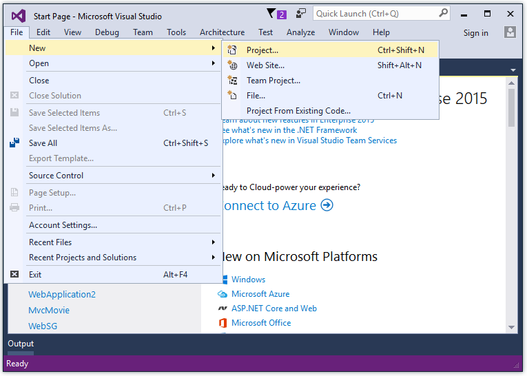
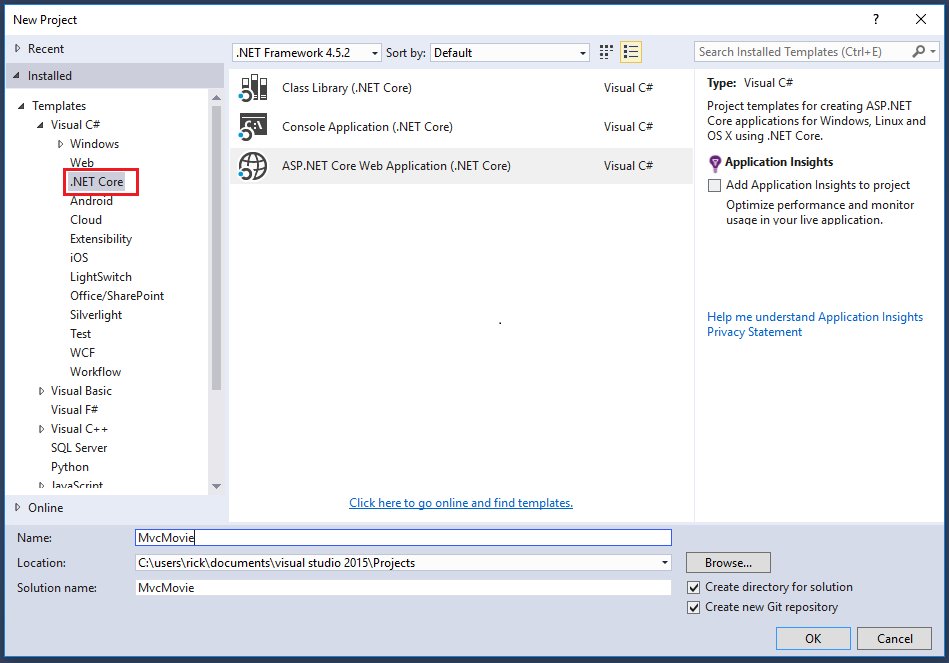
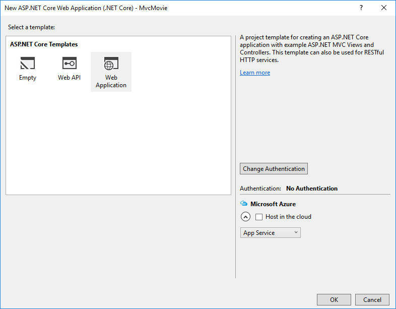
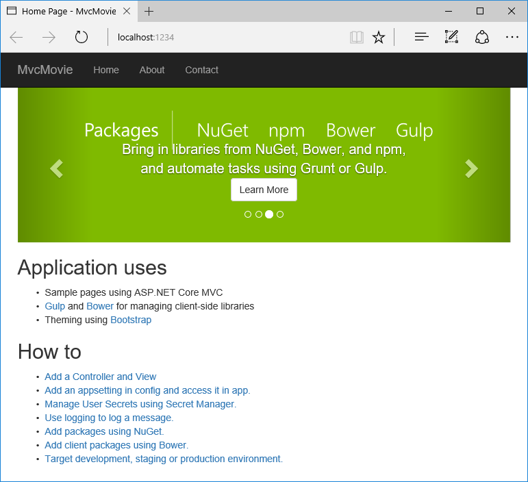
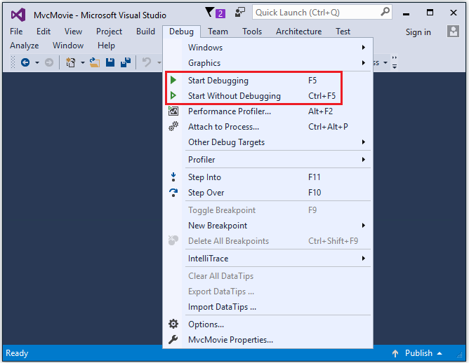

# ASP.NET Core MVC 和 Visual Studio 入门

作者 [Rick Anderson](https://twitter.com/RickAndMSFT)

翻译： [娄宇(Lyrics)](https://github.com/xbuilder) 

校对： [刘怡(AlexLEWIS)](https://github.com/alexinea)、[夏申斌](https://github.com/xiashenbin)、[张硕(Apple)](#)  

这篇教程将告诉你如何使用 [Visual Studio 2017](https://www.visualstudio.com/) 构建一个 ASP.NET Core MVC Web 应用程序的基础知识。

> [!NOTE]
> 参考 [用 Visual Studio Code 在 mac 上创建首个 ASP.NET Core 应用程序](../your-first-mac-aspnet.md) 做为 Mac 系统开发教程。

如果需要 Visual Studio 2015 版本的教程，参考 [VS 2015 版本ASP.NET Core 文档 PDF 格式](https://github.com/aspnet/Docs/blob/master/aspnetcore/common/_static/aspnet-core-project-json.pdf).

## 安装 Visual Studio 和 .NET Core

安装 Visual Studio Community 2017。选择社区版下载。如果你已经安装了 Visual Studio 2017 ，略过这一步。

  * [Visual Studio 2017 主页安装程序](https://www.visualstudio.com/en-us/visual-studio-homepage-vs.aspx)

运行安装程序安装一下模块：
 - **ASP.NET and web development** (在 **Web & Cloud** 目录)
 - **.NET Core cross-platform development** (在 **Other Toolsets** 目录)

## 创建 Web 应用程序

在 Visual Studio 中, 选择  **File > New > Project**.

按以下步骤完成  **New Project** 对话框设置：

* 在右侧面板,点击 **.NET Core**
* 在中间面板，点击 **ASP.NET Core Web Application (.NET Core)**
* 项目命名为 "MvcMovie" (请确保项目名必须是 "MvcMovie"， 这样当你拷贝代码的时候， 名称空间可以保持一致。)
* Tap **OK**

按以下步骤完成  **New ASP.NET Core Web Application (.NET Core) - MvcMovie** 对话框设置：

* 在版本选择下拉框中选择 **ASP.NET Core 1.1**
* 点击 **Web Application**
* 保持默认 **No Authentication** 选项
* 店家 **OK**.

Visual Studio 给刚才创建的 MVC 项目提供了默认模板，输入项目名并选择一些选项后便可得到一个应用程序。这就是一个简单的起步项目，一个很好的开始。

按下 **F5** 以 Debug 模式运行这个应用程序，或者按下 **Ctrl+F5** 以非 Debug 模式运行。
<!-- These images are also used by uid: tutorials/first-mvc-app-xplat/start-mvc -->

* Visual Studio 启动 [IIS Express](http://www.iis.net/learn/extensions/introduction-to-iis-express/iis-express-overview) 并且运行你的应用程序。注意地址栏显示的 `localhost:端口#` 而不是像 `example.com`。 那是因为 `localhost`  总是指向本地计算机，在本例中也就是运行你这个应用程序的计算机。当 Visual Studio 创建一个 Web 项目，Web 服务器使用随机的端口。如上图所示，端口号是 5000。当你运行这个应用程序，你可能会看到不同的端口号。
* 通过 **Ctrl+F5** (非调试模式)启动这个应用程序允许你进行代码更改，保存文件，刷新浏览器，之后查看代码改变。许多开发者更倾向于使用非调试模式来快速启动应用程序和查看变化。
* 你可以通过 **Debug** 菜单项选择以调试模式或者非调试模式启动应用程序：

* 你可以通过点击 **IIS Express** 按钮调试应用程序

默认的模板提供  **Home, About** 以及 **Contact** 链接。下面的浏览器图片没有显示这些链接。根据您的浏览器的尺寸，您可能需要点击导航图标来显示他们。

如果你当前在调试模式运行， 可以点击 **Shift-F5** 停止调试。

我们将在本教程下一节中学习 MVC 并尝试写些代码。

>[!div class="step-by-step"]
[下一节](adding-controller.md)  
