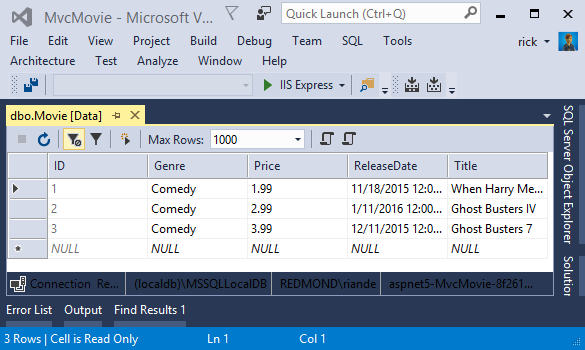
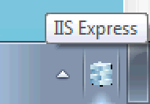
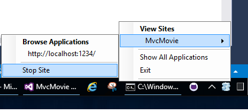

# 使用 SQL Server LocalDB

作者： [Rick Anderson](https://twitter.com/RickAndMSFT)

翻译： [魏美娟(初见)](http://github.com/ChujianA) 

校对： [孟帅洋(书缘)](https://github.com/mengshuaiyang) 、[张硕(Apple)](https://github.com/RockFishChina)、[许登洋(Seay)](https://github.com/SeayXu)

`MvcMovieContext` 类负责连接数据库并将 `Movie` 对象和数据记录进行映射。 *Startup.cs* 文件中，数据库上下文是在 `ConfigureServices` 方法中用 [依赖注入](xref:fundamentals/dependency-injection) 容器进行注册的。

[!code-csharp[Main](start-mvc/sample/MvcMovie/Startup.cs?name=snippet_cs&highlight=7)]

ASP.NET Core  [配置](xref:fundamentals/configuration)系统读取 `ConnectionString`。在本地开发模式下，它会从 *appsettings.json* 文件中获取连接字符串。

[!code-javascript[Main](start-mvc/sample/MvcMovie/appsettings.json?highlight=2&range=8-10)]

当你部署应用程序到测试服务器或者生产服务器时，你可以使用环境变量或者另一种方法来设置实际 SQL Server 数据库的连接字符串。更多参考 [配置](xref:fundamentals/configuration) 。

## SQL Server Express LocalDB

LocalDB是针对程序开发阶段使用的一个SQL Server Express轻量级版本的数据库引擎。 因为LocalDB在用户模式下启动、执行，所以它没有复杂的配置。默认情况下，LocalDB数据库创建的 "\*.mdf" 文件在 *C:/Users/<user>* 目录下。

* 从 **View** 菜单中，打开 **SQL Server对象资源管理器（SQL Server Object Explorer ）** （SSOX）

  

* 右击 `Movie` 表 **> 视图设计器（View Designer）**

  

  

注意钥匙图标后面的 `ID`。默认情况下，EF将命名为 `ID` 的属性作为主键。

* 右击 `Movie` 表  **> 查看数据（View Data）**

  

  

## 填充数据库

在 *Models* 文件夹中创建一个名叫 `SeedData` 的新类。用以下代码替换生成的代码。

[!code-csharp[Main](start-mvc/sample/MvcMovie/Models/SeedData.cs?name=snippet_1)]

注意，如果数据库中存在movies，填充初始化器返回。

```csharp
if (context.Movie.Any())
{
    return;   // DB has been seeded.
}
```

在 *Startup.cs* 文件中的 `Configure` 方法最后添加填充初始化器。

[!code-csharp[Main](start-mvc/sample/MvcMovie/Startup.cs?highlight=9&name=snippet_seed)]

测试一下

* 删除数据库中的所有记录。你可以直接在浏览器中点击删除链接或者在 SSOX（SQL Server对象资源管理器）中做这件事。
* 强制应用程序初始化（在 `Startup` 类中调用方法），这样填充方法会自动运行。为了强制初始化，IIS Express必须先停止，然后重新启动。可以用下列的任何一个方法来实现：

  * 在通知区域右键点击 IIS Express 系统托盘图标，点击 **Exit**或者or **Stop Site**

    

    

   * 如果你在 VS 的非调试模式， 按下 F5 进入调试模式
   * 如果你在 VS 的调试模式，停止调试并按下 F5
   
应用程序显示了被填充的数据。


>[!div class="step-by-step"]
[上一节](adding-model.md)
[下一节](controller-methods-views.md)  
