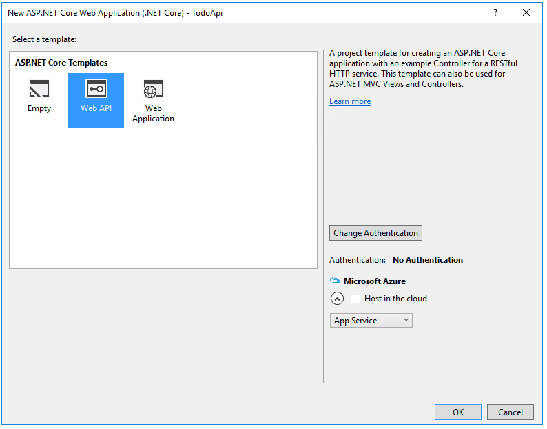

<!--#Create a web API with ASP.NET Core MVC and Visual Studio for Windows-->
#在 Windows 系统中使用 Visual Studio 以及 ASP.NET Core 开发 Web API 项目

<!-- WARNING: The code AND images in this doc are used by uid: tutorials/web-api-vsc, tutorials/first-web-api-mac and tutorials/first-web-api. If you change any code/images in this tutorial, update uid: tutorials/web-api-vsc -->

[!INCLUDE[intro to web API](../includes/webApi/intro.md)]

<!--## Create the project-->
## 创建项目

<!--From Visual Studio, select **File** menu, > **New** > **Project**.-->
启动 Visual Studio 。 从 **File** 菜单, 选择 **New** > **Project** 。

<!--Select the **ASP.NET Core Web Application (.NET Core)** project template. Name the project `TodoApi` and select **OK**.-->
选择 **ASP.NET Core Web Application (.NET Core)** 项目模版.项目命名为 ``TodoApi`` 并且点击 **OK** 。


<!--In the **New ASP.NET Core Web Application (.NET Core) - TodoApi** dialog, select the **Web API** template. Select **OK**. Do **not** select **Enable Docker Support**.-->
在 **New ASP.NET Core Web Application (.NET Core) - TodoApi** 对话框中, 选择 **Web API** 模版. 点击 **OK**，不要勾上 **Enable Docker Support**。



<!--### Launch the app-->
### 启动程序

<!--In Visual Studio, press CTRL+F5 to launch the app. Visual Studio launches a browser and navigates to `http://localhost:port/api/values`, where *port* is a randomly chosen port number. If you're using Chrome, Edge or Firefox, the `ValuesController` data will be displayed:-->
在 Visual Studio 中, 点击 CTRL+F5 启动项目. Visual Studio 启动浏览器并导航到 `http://localhost:port/api/values`,  *port* 是一个随机数. 如果你使用 Chrome, Edge 或者 Firefox 浏览器, `ValuesController` 的数据将会被显示：

```
["value1","value2"]
``` 

<!--If you're using IE, you are prompted to open or save the *values.json* file.-->
如果你使用 IE, IE 将会弹出窗口提示要求打开或者保存 *values.json* 文件.

<!--### Add support for Entity Framework Core-->
### 添加 Entity Framework Core 支持

<!--Install the [Entity Framework Core InMemory](https://docs.microsoft.com/en-us/ef/core/providers/in-memory/) database provider. This database provider allows Entity Framework Core to be used with an in-memory database.-->
安装 [Entity Framework Core InMemory](https://docs.microsoft.com/en-us/ef/core/providers/in-memory/) database provider。这个 database provider 允许 Entity Framework Core 使用内存数据库。

<!--Edit the *TodoApi.csproj* file. In Solution Explorer, right-click the project. Select **Edit TodoApi.csproj**. In the `ItemGroup` element, add "Microsoft.EntityFrameworkCore.InMemory":-->
再解决方案浏览器中编辑 *TodoApi.csproj* 文件。 右击项目。 选择 **Edit TodoApi.csproj**。在 `ItemGroup` 元素中，添加 "Microsoft.EntityFrameworkCore.InMemory":

[!code-xml[Main](first-web-api/sample/TodoApi/TodoApi.csproj?highlight=15)]

<!--### Add a model class-->
### 添加模型类

<!--A model is an object that represents the data in your application. In this case, the only model is a to-do item.-->
模型表示应用程序中的数据的对象。在本示例中，唯一使用到的模型是一个 to-do 项

<!--Add a folder named "Models". In Solution Explorer, right-click the project. Select **Add** > **New Folder**. Name the folder *Models*.-->
添加一个名为 "Models" 的目录. 在解决方案浏览器中, 右击项目. 选择 **Add** > **New Folder**. 把目录名命名为 *Models* 。

<!--Note: You can put model classes anywhere in your project, but the *Models* folder is used by convention.-->
Note: 你可以把模型类放到项目的任何地方, 但是 *Models* 是约定的默认目录 。

<!--Add a `TodoItem` class. Right-click the *Models* folder and select **Add** > **Class**. Name the class `TodoItem` and select **Add**.-->
下一步, 添加一个  `TodoItem` 类. 右击 *Models* 目录并选择 **Add** > **New Item** 。命名类为 `TodoItem` 并点击 **OK** 。

<!--Replace the generated code with:-->
将生成代码替换为:

[!code-csharp[Main](first-web-api/sample/TodoApi/Models/TodoItem.cs)]

<!--### Create the database context-->
### 创建数据库上下文类

<!--The *database context* is the main class that coordinates Entity Framework functionality for a given data model. You create this class by deriving from the `Microsoft.EntityFrameworkCore.DbContext` class.-->
*数据库上下文* 是 Entity Framework 用来协调数据模型的主要类。您可以从 `Microsoft.EntityFrameworkCore.DbContext` 类派生来创建此类。

<!--Add a `TodoContext` class. Right-click the *Models* folder and select **Add** > **Class**. Name the class `TodoContext` and select **Add**.-->
添加 `TodoContext` 类. 右击 *Models* 目录并且选择 **Add** > **Class**。将类命名为 `TodoContext` 并且点击 **Add**.

[!code-csharp[Main](first-web-api/sample/TodoApi/Models/TodoContext.cs)]

[!INCLUDE[Register the database context](../includes/webApi/register_dbContext.md)]

<!--## Add a controller-->
## 添加控制器

<!--In Solution Explorer, right-click the *Controllers* folder. Select **Add** > **New Item**. In the **Add New Item** dialog, select the **Web  API Controller Class** template. Name the class `TodoController`.-->
在解决方案浏览器中, 右击 *Controllers* 目录. 选择 **Add** > **New Item** 。 在 **Add New Item** 对话框中, 选择 **Web  API Controller Class** 模版. 命名为  `TodoController`。


<!--Replace the generated code with the following:-->
将生成的代码替换为如下代码:

[!INCLUDE[code and get todo items](../includes/webApi/getTodoItems.md)]
  
<!--### Launch the app-->
### 启动程序

<!--In Visual Studio, press CTRL+F5 to launch the app. Visual Studio launches a browser and navigates to `http://localhost:port/api/values`, where *port* is a randomly chosen port number. If you're using Chrome, Edge or Firefox, the data will be displayed. If you're using IE, IE will prompt to you open or save the *values.json* file. Navigate to the `Todo` controller we just created `http://localhost:port/api/todo`.-->
在 Visual Studio 中, 点击 CTRL+F5 启动项目. Visual Studio 启动浏览器并导航到 `http://localhost:port/api/values`,  *port* 是一个随机数. 如果你使用 Chrome, Edge 或者 Firefox 浏览器, 数据将会被显示. 如果你使用 IE, IE 将会弹出窗口提示要求打开或者保存 *values.json* 文件.导航到我们刚刚创建的 `Todo` 控制器  `http://localhost:port/api/todo`。


[!INCLUDE[last part of web API](../includes/webApi/end.md)]

[!INCLUDE[next steps](../includes/webApi/next.md)]

