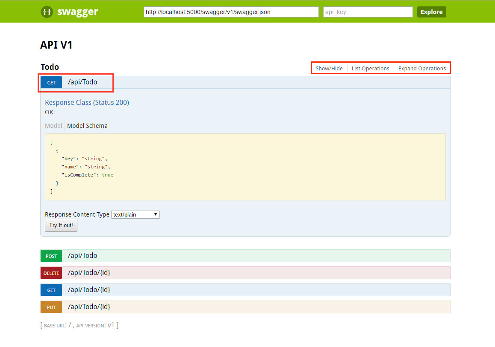
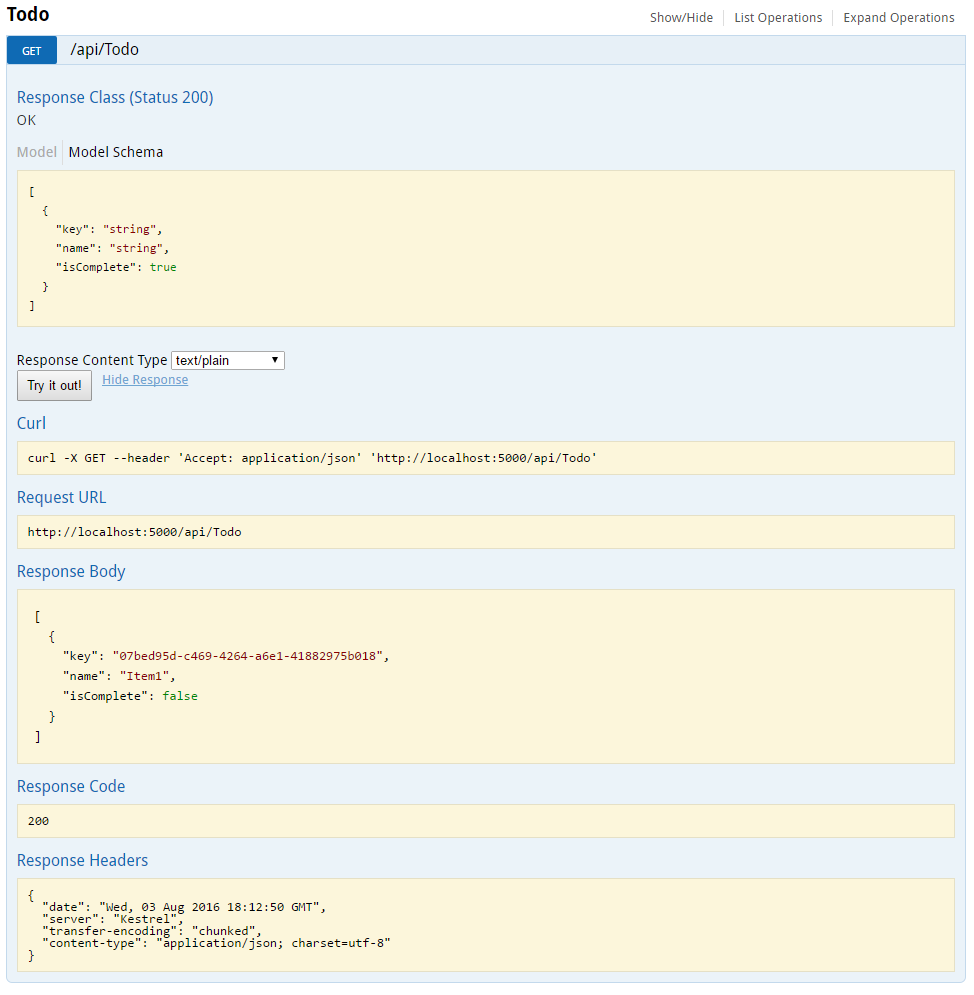
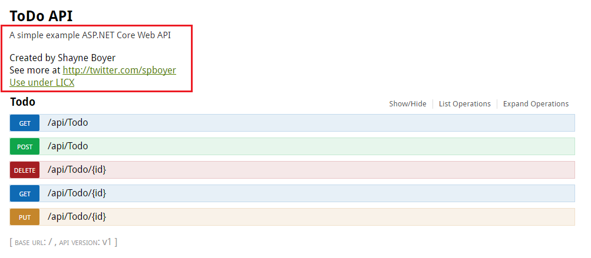
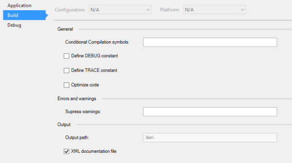
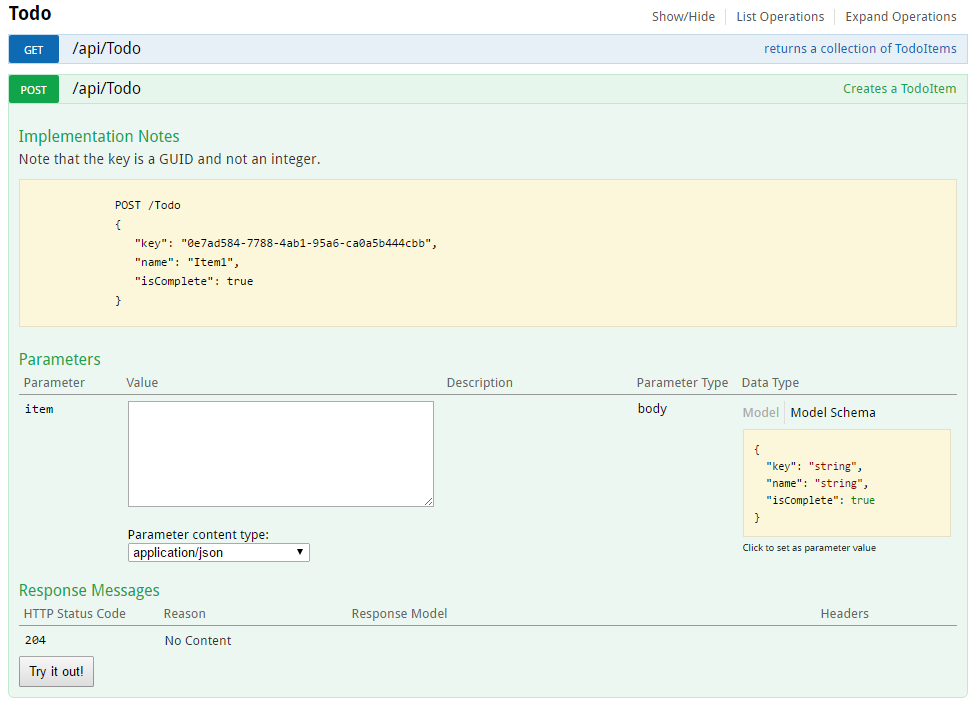
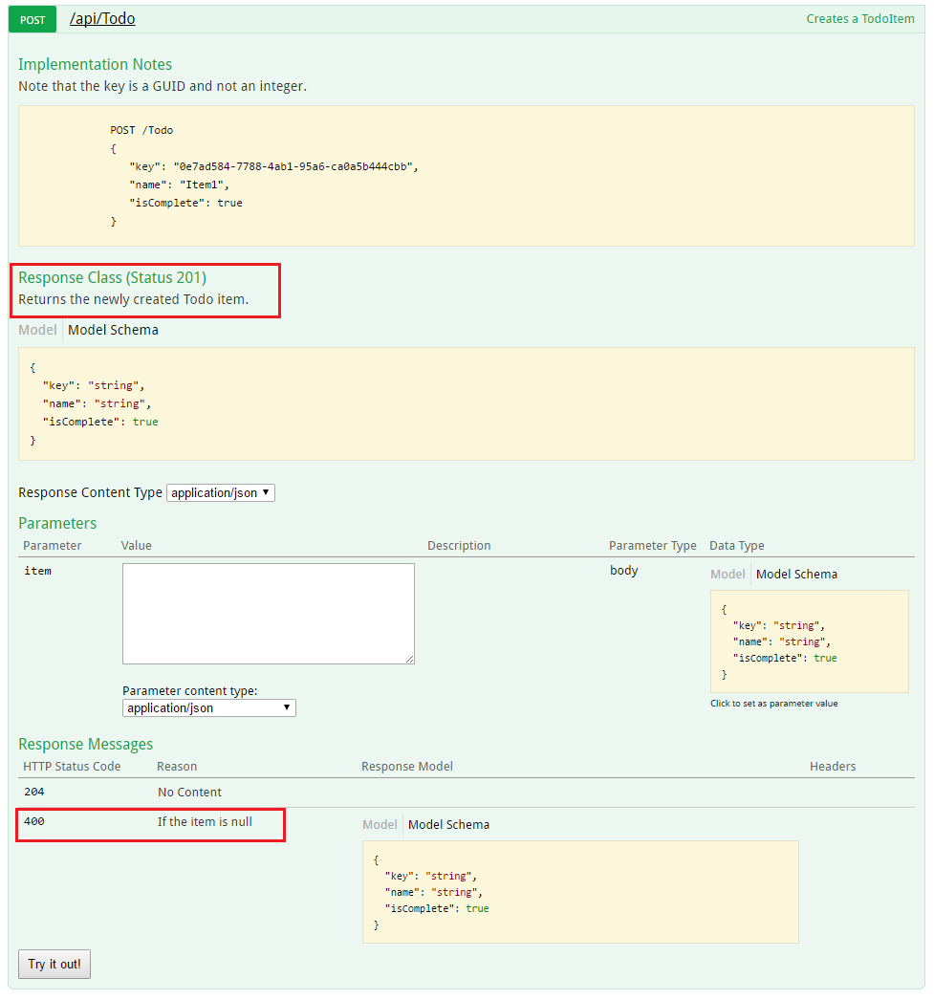
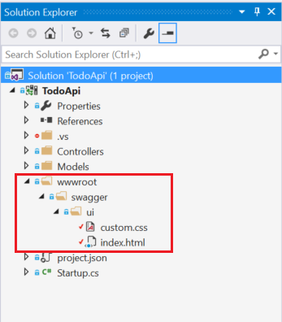
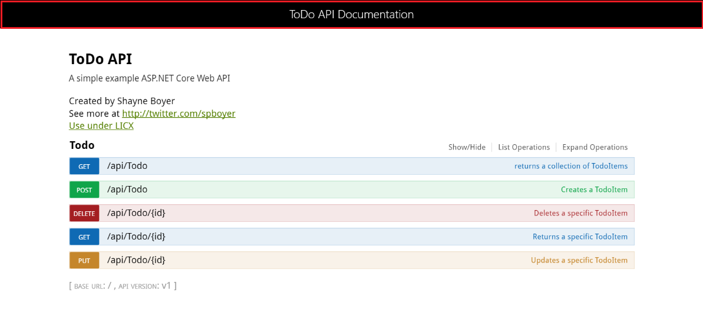

<!--# ASP.NET Web API Help Pages using Swagger-->
# 使用 Swagger 生成 ASP.NET Web API 在线帮助测试文档

<a name=web-api-help-pages-using-swagger></a>

作者 [Shayne Boyer](https://twitter.com/spboyer)

翻译 [谢炀（Kiler)](https://github.com/kiler398/)  

校对 [许登洋(Seay)](https://github.com/SeayXu)  

<!--Understanding the various methods of an API can be a challenge for a developer when building a consuming application.-->
对于开发人员来说，构建一个消费应用程序时去了解各种各样的 API 是一个巨大的挑战。

<!--Generating good documentation and help pages as a part of your Web API using [Swagger](http://swagger.io) with the .NET Core implementation [Swashbuckle.AspNetCore](https://github.com/domaindrivendev/Swashbuckle.AspNetCore) is as easy as adding a couple of NuGet packages and modifying the *Startup.cs*.-->
在你的 Web API 项目中使用 [Swagger](http://swagger.io) 的 .NET Core 封装 [Swashbuckle.AspNetCore](https://github.com/domaindrivendev/Swashbuckle.AspNetCore) 可以帮助你创建良好的文档和帮助页面。[Swashbuckle.AspNetCore](https://github.com/domaindrivendev/Swashbuckle.AspNetCore) 可以通过修改 *Startup.cs* 作为一组 NuGet 包方便的加入项目。

<!--* [Swashbuckle.AspNetCore](https://github.com/domaindrivendev/Swashbuckle.AspNetCore) is an open source project for generating Swagger documents for Web APIs that are built with ASP.NET Core MVC.-->
* [Swashbuckle.AspNetCore](https://github.com/domaindrivendev/Swashbuckle.AspNetCore) 是一个开源项目，为使用 ASP.NET Core MVC 构建的 Web APIs 生成 Swagger 文档。

<!--* [Swagger](http://swagger.io) is a machine readable representation of a RESTful API that enables support for interactive documentation, client SDK generation and discoverability.-->
* [Swagger](http://swagger.io) 是一个机器可读的 RESTful API 表现层，它可以支持交互式文档、客户端 SDK 的生成和可被发现。

<!--This tutorial builds on the sample on [Building Your First Web API with ASP.NET Core MVC and Visual Studio](first-web-api.md). If you'd like to follow along, download the sample at [https://github.com/aspnet/Docs/tree/master/aspnetcore/tutorials/first-web-api/sample](https://github.com/aspnet/Docs/tree/master/aspnetcore/tutorials/first-web-api/sample).-->
本教程基于 [Building Your First Web API with ASP.NET Core MVC and Visual Studio](first-web-api.md) 文档的例子构建。如果需要对应的代码，在这里 [https://github.com/aspnet/Docs/tree/master/aspnetcore/tutorials/first-web-api/sample](https://github.com/aspnet/Docs/tree/master/aspnetcore/tutorials/first-web-api/sample) 下载示例。

<!--## Getting Started-->
## 开始入门

<!--There are three main components to Swashbuckle-->
Swashbuckle 有三个核心的组件

<!--* *Swashbuckle.AspNetCore.Swagger* : a Swagger object model and middleware to expose SwaggerDocument objects as JSON endpoints.-->
* *Swashbuckle.AspNetCore.Swagger* ： Swagger 对象模型和中间件用把 Swagger 文档对象导出为 JSON 终端。

<!--* *Swashbuckle.AspNetCore.SwaggerGen* : a Swagger generator that builds SwaggerDocument objects directly from your routes, controllers and models. Typically combined with the Swagger endpoint middleware to automatically expose Swagger JSON.-->
* *Swashbuckle.AspNetCore.SwaggerGen* : Swagger 生成器直接从 路由，控制器和模型构建 SwaggerDocument 对象。 通常会结合 Swagger 端点中间件自动公开 Swagger JSON。

<!--* *Swashbuckle.AspNetCore.SwaggerUI* : an embedded version of the Swagger UI tool which interprets Swagger JSON to build a rich customizable experience for describing the Web API functionality, and includes built in test harness capabilities for the public methods.-->
* *Swashbuckle.AspNetCore.SwaggerUI* : 是一个嵌入式版本的 Swagger UI 工具，使用 Swagger UI 强大的富文本表现形式来可定制化的来描述 Web API 的功能，并且包含内置的公共方法测试工具。

<!--## NuGet Packages-->
## NuGet 包

<!--You can add Swashbuckle with any of the following approaches:-->
您可以使用以下任何方法添加 Swashbuckle ：

<!--* From the Package Manager Console:-->
* 在 Package Manager Console（包管理控制台） 中：

```bash
Install-Package Swashbuckle.AspNetCore
   ```

<!--* In Visual Studio:-->
* 在 Visual Studio 中：

     <!--* Right click your project in Solution Explorer > Manage NuGet Packages
     * Enter Swashbuckle.AspNetCore in the search box
     * Set the Package source to nuget.org
     * Tap the Swashbuckle.AspNetCore package and then tap Install-->
	 * 右击你的项目 Solution Explorer > Manage NuGet Packages
	 * 在搜索框中输入 Swashbuckle.AspNetCore  
	 * 点击 "Include prerelease"
	 * 设置 Package source 为 nuget.org
	 * 点击 Swashbuckle.AspNetCore 包并点击 Install

<!--## Add and configure Swagger to the middleware-->
## 在中间件中添加并配置 Swagger

<!--Add SwaggerGen to the services collection in the Configure method, and in the ConfigureServices method, enable the middleware for serving generated JSON document and the SwaggerUI.-->
在 Configure 方法里面把 SwaggerGen 添加到 services 集合，并且在 ConfigureServices 方法中，允许中间件提供和服务生成 JSON 文档以及 SwaggerUI。

<!-- literal_block {"ids": [], "linenos": false, "xml:space": "preserve", "language": "csharp", "highlight_args": {"hl_lines": [12, 21, 24]}} -->

```csharp
public void ConfigureServices(IServiceCollection services)
{
    // Add framework services.
    services.AddMvc();

    services.AddLogging();

    // Add our repository type
    services.AddSingleton<ITodoRepository, TodoRepository>();

    // Register the Swagger generator, defining one or more Swagger documents
    services.AddSwaggerGen(c =>
    {
        c.SwaggerDoc("v1", new Info { Title = "My API", Version = "v1" });
    });
}

// This method gets called by the runtime. Use this method to configure the HTTP request pipeline.
public void Configure(IApplicationBuilder app, IHostingEnvironment env, ILoggerFactory loggerFactory)
{
    app.UseMvcWithDefaultRoute();

    // Enable middleware to serve generated Swagger as a JSON endpoint.
    app.UseSwagger();

    // Enable middleware to serve swagger-ui (HTML, JS, CSS etc.), specifying the Swagger JSON endpoint.
    app.UseSwaggerUI(c =>
    {
        c.SwaggerEndpoint("/swagger/v1/swagger.json", "My API V1");
    });
}
```

<!--In Visual Studio, press ^F5 to launch the app and navigate to `http://localhost:<random_port>/swagger/v1/swagger.json` to see the document generated that describes the endpoints.-->
在 Visual Studio 中, 点击 ^F5 启动应用程序并导航到 ``http://localhost:<random_port>/swagger/v1/swagger.json`` 页面可以看成生成的终端描述文档。

<!--> [!NOTE]
> Microsoft Edge, Google Chrome and Firefox display JSON documents natively.  There are extensions for Chrome that will format the document for easier reading. *Example below reduced for brevity.*-->
> [!NOTE]
> Microsoft Edge，Google Chrome 以及 Firefox 原生支持显示 JSON 文档。 Chrome 的扩展会格式化文档使其更易于阅读。 *下面的例子是简化版的。*

```javascript
{
   "swagger": "2.0",
   "info": {
       "version": "v1",
       "title": "API V1"
   },
   "basePath": "/",
   "paths": {
       "/api/Todo": {
       "get": {
           "tags": [
           "Todo"
           ],
           "operationId": "ApiTodoGet",
           "consumes": [],
           "produces": [
           "text/plain",
           "application/json",
           "text/json"
           ],
           "responses": {
           "200": {
               "description": "OK",
               "schema": {
               "type": "array",
               "items": {
                   "$ref": "#/definitions/TodoItem"
               }
               }
           }
           },
           "deprecated": false
       },
       "post": {
           ...
       }
       },
       "/api/Todo/{id}": {
       "get": {
           ...
       },
       "put": {
           ...
       },
       "delete": {
           ...
   },
   "definitions": {
       "TodoItem": {
       "type": "object",
       "properties": {
           "key": {
           "type": "string"
           },
           "name": {
           "type": "string"
           },
           "isComplete": {
           "type": "boolean"
           }
       }
       }
   },
   "securityDefinitions": {}
   }
   ```

<!--This document is used to drive the Swagger UI which can be viewed by navigating to `http://localhost:<random_port>/swagger`-->
这个文档用来驱动 Swagger UI，可以通过访问 `http://localhost:<random_port>/swagger` 页面来查看。



<!--Each of the methods in the ToDo controller can be tested from the UI. Tap a method to expand the section, add any necessary parameters and tap "Try it out!".-->
所有的 ToDo controller 的方法都是可以在 UI 上面进行测试。点击方法可以展开对应的区域，输入所需的参数并且点击 "Try it out!" 。



<!--## Customization & Extensibility-->
## 自定义与可扩展性

<!--Swagger is not only a simple way to represent the API, but has options for documenting the object model, as well as customizing the interactive UI to match your look and feel or design language.-->
Swagger 不仅是显示 API 的一个简单方法，而且有可选项：文档对象模型，以及自定义交互 UI 来满足你的视觉感受或者设计语言。

<!--### API Info and Description-->
### API 信息和描述

<!--The config. action passed to the `AddSwaggerGen` method can be used to add information such as the author, license, description.-->
config. action 使用 `AddSwaggerGen` 方法用来添加文档信息。例如：作者，版权，描述。

```csharp
services.AddSwaggerGen(c =>
{
	c.SwaggerDoc("v1", new Info
	{
		Version = "v1",
		Title = "ToDo API",
		Description = "A simple example ASP.NET Core Web API",
		TermsOfService = "None",
		Contact = new Contact { Name = "Shayne Boyer", Email = "", Url = "https://twitter.com/spboyer"},
		License = new License { Name = "Use under LICX", Url = "https://example.com/license" }
	});
});
```

<!--The following image shows the Swagger UI displaying the version information added.-->
下图展示了 Swagger UI 显示添加的版本信息



<!--### XML Comments-->
### XML 注释

<!--To enable XML comments, right click the project in Visual Studio and select **Properties** and then check the **XML Documentation file** box under the **Output Settings** section.-->
为了启用 XML 注释， 在 Visual Studio 中右击项目并且选择 **Properties** 在 **Output Settings** 区域下面点击 **XML Documentation file** 。



<!--Configure Swagger to use the generated XML file.-->
配置 Swagger 使用生成的 XML 文件。

<!--> [!NOTE]
> For Linux or non-Windows operating systems, file names and paths can be case sensitive. So `ToDoApi.XML` would be found on Windows but not CentOS for example.-->
> [!NOTE]
> 对于 Linux 或者 非 Windows 操作系统，文件名和路径是大小写敏感的。 所以本例中的 `ToDoApi.XML` 在 Windows 上可以找到但是 CentOS 就无法找到。

[!code-csharp[Main](../tutorials/web-api-help-pages-using-swagger/sample/src/TodoApi/Startup.cs?name=snippet_Configure&highlight=29,33)]

<!--In the code above, ApplicationBasePath gets the base path of the app, which is needed to set the full path to the XML comments. `TodoApi.xml` only works for this example, the name of the generated XML comments file is based on the name of your application.-->
在上面的代码中，ApplicationBasePath 获取到应用程序的根路径，是需要设置 XML 注释文件的完整路径。 `TodoApi.xml` 仅适用于本例，生成的XML注释文件的名称是基于你的应用程序名称。

<!--Adding the triple slash comments to the method enhances the Swagger UI by adding the description to the header of the section.-->
为方法添加的三斜线注释（C# 文档注释格式）文字会作为描述显示在 Swagger UI 对应方法的头区域。

[!code-csharp[Main](../tutorials/web-api-help-pages-using-swagger/sample/src/TodoApi/Controllers/TodoController.cs?name=Delete_Method&highlight=2)]


<!--Note that the UI is driven by the generated JSON file, and these comments are also in that file as well.-->
请注意，UI 是由生成的 JSON 文件驱动的，这些注释也会包含在文件中。

<!-- literal_block {"ids": [], "linenos": false, "xml:space": "preserve", "language": "javascript", "highlight_args": {"hl_lines": [5]}} -->

```javascript
"delete": {
  "tags": [
    "Todo"
  ],
  "summary": "Deletes a specific TodoItem",
  "operationId": "ApiTodoByIdDelete",
  "consumes": [],
  "produces": [],
  "parameters": [
    {
      "name": "id",
      "in": "path",
      "description": "",
      "required": true,
      "type": "string"
    }
  ],
  "responses": {
    "204": {
      "description": "No Content"
    }
  },
  "deprecated": false
}
```

<!--Here is a more robust example, adding `<remarks />` where the content can be just text or adding the JSON or XML object for further documentation of the method.-->
这是一个更强大的例子，加入 `<remarks />` 那里面的内容可以是文字或添加的 JSON 或 XML 对象的方法为进一步描述方法文档而服务。

[!code-csharp[Main](../tutorials/web-api-help-pages-using-swagger/sample/src/TodoApi/Controllers/TodoController.cs?name=Create_Method&highlight=4-14)]

<!--Notice the enhancement of the UI with these additional comments.-->
请注意下面是这些附加注释的在用户界面的增强效果。



<!--### DataAnnotations-->
### DataAnnotations

<!--You can decorate the API controller with `System.ComponentModel.DataAnnotations` to help drive the Swagger UI components.-->
你可以使用 `System.ComponentModel.DataAnnotations` 来标注 API controller ，帮助驱动 Swagger UI 组件。

<!--Adding the `[Required]` annotation to the `Name` property of the `TodoItem` class will change the ModelSchema information in the UI. `[Produces("application/json")]`, `RegularExpression` validators and more will further detail the information delivered in the generated page.  The more metadata that is in the code produces a more desciptive UI or API help page.  -->
在 TodoItem 类的 `Name` 属性上添加`[Required]` 标注会改变 UI 中的模型架构信息。 `[Produces("application/json")]` ，正则表达式验证器将更进一步细化生成页面传递的详细信息。代码中使用的元数据信息越多 API 帮助页面上的描述信息也会越多。

[!code-csharp[Main](../tutorials/web-api-help-pages-using-swagger/sample/src/TodoApi/Models/TodoItem.cs?highlight=10)]


<!--### Describing Response Types-->
### 描述响应类型

<!--Consuming developers are probably most concerned with what is returned; specifically response types, error codes (if not standard). These are handled in the XML comments and DataAnnotations.-->
API 使用开发者最关心的东西是的返回结果；具体响应类型，错误代码（如果不是标准错误码）。这些都在 XML 注释 和 DataAnnotations 中处理。

<!--Take the `Create()` method for example, currently it returns only "201 Created" response by default. That is of course if the item is in fact created, or a "204 No Content" if no data is passed in the POST Body.  However, there is no documentation to know that or any other response. That can be fixed by adding the following piece of code.-->
以 `Create()` 方法为例，目前它仅仅返回 "201 Created" 默认响应。如果数据实际创建了或者 POST 正文没有传递数据返回 "204 No Content" 错误，这是理所当然的。但是，如果没有文档知道它的存在或者存在任何其他响应，则可以通过添加下面的代码段是修复这个问题。

[!code-csharp[Main](../tutorials/web-api-help-pages-using-swagger/sample/src/TodoApi/Controllers/TodoController.cs?name=Create_Method&highlight=17,18,20,21)]



<!--### Customizing the UI-->
### 自定义 UI

<!--The stock UI is very functional as well as presentable, however when building documentation pages for your API you want it to represent your brand or look and feel.-->
stock UI 是一个非常实用的展示方案，如果你想在生成 API 文档页面的时候想把你的标题做的更好看点。

<!--Accomplishing that task with the Swashbuckle components is simple but requires adding the resources to serve static files that would not normally be included in a Web API project and then building the folder structure to host those files.-->
完成与 Swashbuckle 组件相关的任务很简单，但服务需要添加的资源来通常不会被包含在 Web API 项目中，所以必须建立对应的的文件夹结构来承载这些静态资源文件。

<!--Add the `"Microsoft.AspNetCore.StaticFiles": "1.0.0-*"` NuGet package to the project.-->
在项目中添加 ``"Microsoft.AspNetCore.StaticFiles": "1.0.0-*"`` NuGet 包。

<!--Enable static files middleware.-->
在中间件中启用 static files 服务。

<!-- literal_block {"ids": [], "linenos": false, "xml:space": "preserve", "language": "csharp", "highlight_args": {"hl_lines": [4]}} -->

```csharp
// This method gets called by the runtime. Use this method to configure the HTTP request pipeline.
   public void Configure(IApplicationBuilder app, IHostingEnvironment env, ILoggerFactory loggerFactory)
   {
       // Enable static files middleware.
       app.UseStaticFiles();

       app.UseMvcWithDefaultRoute();

        // Enable middleware to serve generated Swagger as a JSON endpoint.
        app.UseSwagger();

        // Enable middleware to serve swagger-ui (HTML, JS, CSS etc.), specifying the Swagger JSON endpoint.
        app.UseSwaggerUI(c =>
        {
            c.SwaggerEndpoint("/swagger/v1/swagger.json", "My API V1");
        });
   }
   ```

<!--Acquire the core *index.html* file used for the Swagger UI page from the `Github repository <https://github.com/domaindrivendev/Swashbuckle.AspNetCore/blob/1.0.0-rc1/test/WebSites/CustomIndexHtml/wwwroot/swagger/index.html>`_ and put that in the `wwwroot/swagger` folder and also create a new `custom.css` file in the same folder.-->
从 [Github repository](https://github.com/domaindrivendev/Swashbuckle.AspNetCore/blob/1.0.0-rc1/test/WebSites/CustomIndexHtml/wwwroot/swagger/index.html) 上获取 Swagger UI 页面所需的 *index.html* 核心文件，把他放到 `wwwroot/swaggerui` 目录下，并在在同一个文件夹创建一个新的 `custom.css` 文件。



<!--Reference *custom.css* in the *index.html* file.-->
在 *index.html* 文件中引用 *custom.css* 。

```html
<link href='custom.css' media='screen' rel='stylesheet' type='text/css' />
```

<!--The following CSS provides a simple sample of a custom header title to the page.-->
下面的 CSS 提供了一个自定义页面标题的简单的示例。

<!--*custom.css file*-->
*custom.css 文件*

[!code-css[Main](web-api-help-pages-using-swagger/sample/src/TodoApi/wwwroot/swagger/custom.css)]

<!--*index.html body*-->
*index.html 正文*

```html
<body class="swagger-section">
   <div id="header">
    <h1>ToDo API Documentation</h1>
   </div>

   <div id="message-bar" class="swagger-ui-wrap" data-sw-translate>&nbsp;</div>
   <div id="swagger-ui-container" class="swagger-ui-wrap"></div>
</body>
```



<!--There is much more you can do with the page, see the full capabilities for the UI resources at the [Swagger UI Github repository](https://github.com/swagger-api/swagger-ui).-->
你可以在这个页面有更多改进的东西，请在 [Swagger UI Github repository](https://github.com/swagger-api/swagger-ui) 参阅完整的 UI 资源。
