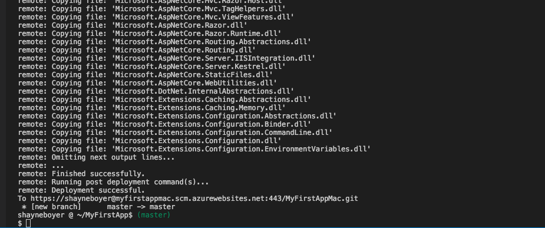
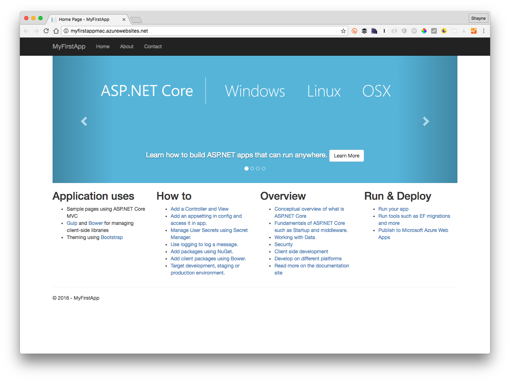
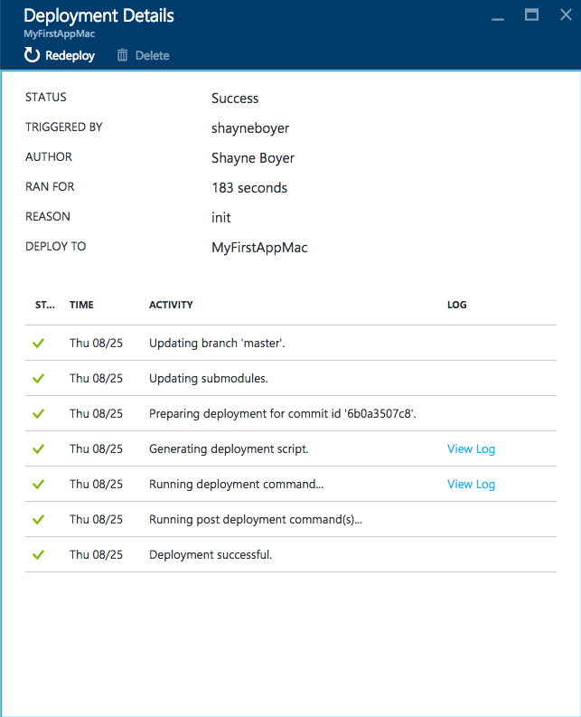

# 用 Visual Studio Code 在 mac 或者 linux 上创建首个 ASP.NET Core 应用程序

翻译 [赵志刚](https://github.com/rdzzg)

校对 [何镇汐](https://github.com/UtilCore)、[刘怡(AlexLEWIS)](http://github.com/alexinea)

本节将展示如何在 macOS 或者 Linux 平台上创建首个 ASP.NET Core 应用程序。

## 配置开发环境

在开发机中下载并安装 [.NET Core](https://microsoft.com/net/core) 以及 [Visual Studio Code](https://code.visualstudio.com) 并且安装 [C# 扩展](https://marketplace.visualstudio.com/items?itemName=ms-vscode.csharp).

## 使用 dotnet new 来构建程序基架

我们可以使用 `dotnet new` 调用 "Empty Web Template" 模版来生成一个新的 Web 应用程序。 在你的项目中创建一个名为 *firstapp* 的工作目录。跳转到 *firstapp*。

启动 Visual Studio Code 并且代开 *firstapp* 目录。 点击 Ctrl + '\`' (反引号字符) 打开 VS Code 内置终端。 你也可以使用独立终端窗口。
运行 `dotnet new` 命令创建一个新闻Web 应用程序， 传递 `mvc` 参数作为模版类型。

```console
dotnet new mvc
```

如果你运行 `dotnet new mvc` 时遇到错误，安装最新的 [.NET Core](https://microsoft.com/net/core)。当 CLI 命令运行完毕以后， 会产生以下输出和文件：

```console
Content generation time: 79.6691 ms
The template "Empty ASP.NET Core Web Application" created successfully.
```
<!-- the ~ format is perferred but not working on DocFX. It does work on OPS. See bug https://mseng.visualstudio.com/DefaultCollection/VSChina/_workitems#_a=edit&id=959814
[!INCLUDE[template files](~/includes/template-files.md)]
-->

[!INCLUDE[template files](../includes/template-files.md)]

## 使用 Visual Studio Code 在 Mac 或者 Linux 环境下开发 ASP.NET Core 应用程序

使用 Visual Studio Code (VS Code) 打开项目目录选择 *Startup.cs* 文件。 VS Code 会弹出需要还原项目依赖以及添加 build/debug 依赖。点击 **Yes** 来添加 build 以及 debug 附件，点击 **Restore** 来还原项目依赖。


除了 **Restore**， 你也可以在终端使用 `dotnet restore` 或者像如下所示在VS Code输入 `⌘⇧P` 或 `Ctrl+Shift+P` 点击 `.NET` ：


VS Code 提供了一个用于处理文件的流式，简洁的界面和高效的编码环境。

在右侧导航栏，有5个图标，代表5个面板：

* 浏览
* 搜索
* Git
* 调试
* 扩展

浏览面板提供你打开的文件目录导航。如果你有未保存文件会显示一个徽章。你可以在视图中创建新的文件和文件夹. 当鼠标移动到上面的时候你可以选择 **Save All** 菜单。

搜索面板允许你查询当前打开的目录树中的文件。 支持检索文件名和文件内容。

如果你的系统中安装了 GIT *VS Code* 会自动集成。 你可以在 Git 面板中初始化代码仓库，提交修改，推送变更。


调试面板支持应用程序的交互式调试。

VS Code 的编辑器还提供了一些非常棒的特性，比如你会注意到未使用的 using 语句会带有下划线，当出现电灯图标时可使用 `⌘ .` 或者 `Ctrl + .` 自动移除之。类和方法同样可显示在本项目中的引用次数。

更多编辑器请参考 [Visual Studio Code](https://code.visualstudio.com).

## 使用 VS Code 调试

本示例配置使用 [Kestrel](../fundamentals/servers/kestrel.md) 作为 Web 服务器。

在调试面板中运行应用程序：

* 在右侧面板视图栏点击调试图标

* 点击 "运行 (F5)" 图标来启动程序


你的浏览器会自动启动并且导航到 `http://localhost:5000`


* 停止运行程序， 可以关闭浏览器并点击调试栏的 "停止" 图标


### 使用 dotnet 命令

* 运行 `dotnet run` 命令从 终端/bash 启动应用程序

* 浏览 `http://localhost:5000`

* 按下 `⌃+C` or `Ctrl+C` 停止 Web 服务。

## 发布到  Azure

一旦在 Microsoft Azure 部署了你的应用程序，你便可轻松地通过 Visual Studio Code 中集成的 GIT 功能将产品的更新推送到生产环境。

### 初始化 Git

为你的工作文件夹初始化 GIT。切换到Git视图 然后点击 Initialize Git repository 按钮。


填写提交信息并点击提交，或点击复选框来提交暂存文件。


GIT 会跟踪变更，所以如果你更新了文件，Git 面板将显示上次提交之后修改过的文件。

### Initialize Azure Website

通过 git 将应用程序直接部署到 Azure。

* 如果你没有 Azure 账号，你可以[免费创建一个试用账号](http://azure.microsoft.com/en-us/pricing/free-trial/)。

在 Azure 门户中创建一个 Web 应用来托管你的新的应用程序。


配置 Azure Web 应用程序支持[使用 Git 持续部署](https://azure.microsoft.com/en-us/documentation/articles/app-service-deploy-local-git/)。

将此 Web 应用程序在 Azure 中的 Git URL 记录下来:


在终端窗口中，用之前记下的 Git URL 新建一个名为 `azure`的远程主机。

`git remote add azure https://shayneboyer@myfirstappmac.scm.azurewebsites.net:443/MyFirstAppMac.git`

推送到 master 分支。部署： `git push azure master`。

   

浏览刚才部署的 Web 应用程序。



在 Azure 门户中查看部署细节，你可以看到每个步骤的时间以及分支被提交了一次。



## 其他资源

* [Visual Studio Code](https://code.visualstudio.com)
* [原理](../fundamentals/index.md)
